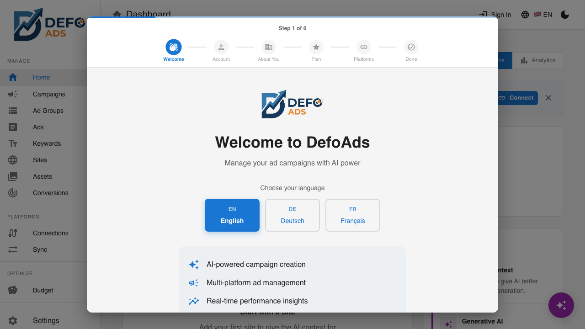
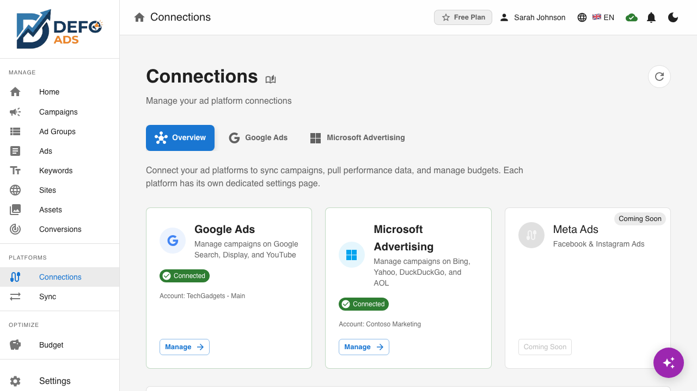
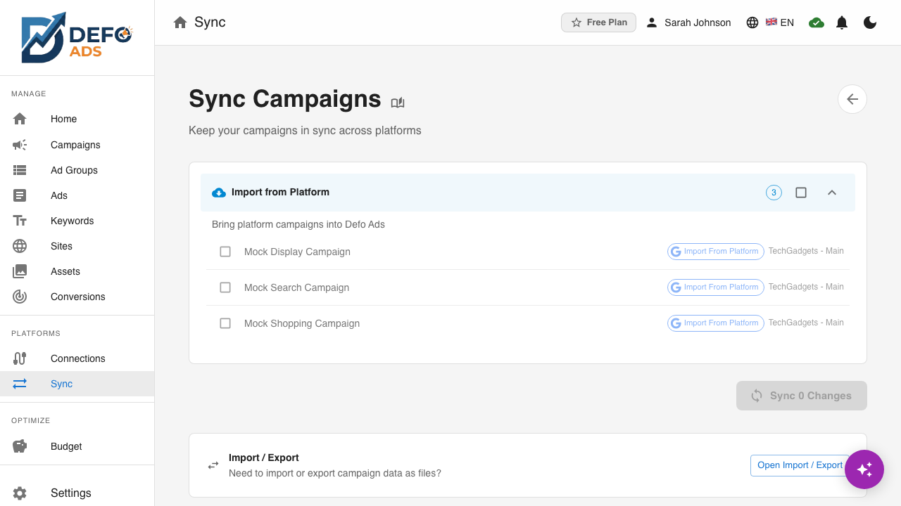

  

<h1 align="center">Defo Ads</h1>

  <strong>AI-powered ad campaign management for Google Ads and Microsoft Advertising</strong> 
  Create, optimize, and sync campaigns across platforms — with AI that writes your ad copy, generates keywords, and manages your budget.

  <a href="getting-started/quick-start-free.md">Quick Start (Free)</a> &bull;
  <a href="getting-started/quick-start-premium.md">Quick Start (Premium)</a> &bull;
  <a href="getting-started/free-vs-premium.md">Compare Plans</a>

---

## Why Defo Ads?

**Stop switching between tabs.** Defo Ads brings Google Ads and Microsoft Advertising into one workspace — with AI that actually understands advertising.

- **AI writes your ads** — Headlines, descriptions, and keywords generated from your website content
- **Multi-platform sync** — Push campaigns to Google Ads and Microsoft Advertising in one click
- **Works offline** — Free version runs entirely in your browser, no account needed
- **Budget intelligence** — AI-powered budget advisor with cap controls and allocation strategies

---

## See It in Action

### Your Campaign Workspace

Everything you need in one clean dashboard — campaigns, ads, keywords, sites, and real-time performance stats.

### AI Campaign Wizard

Tell the AI about your business and goals. It generates complete campaigns with ad groups, keywords, and ad copy — ready to launch.

### AI Assistant

Chat with your AI assistant to manage campaigns using natural language. Context-aware suggestions help you take the right action at the right time.

### Multi-Platform Connections

Connect Google Ads and Microsoft Advertising, then sync campaigns bidirectionally. Import existing campaigns or push new ones live.

### Campaign Sync

Push, pull, and remove campaigns across platforms with a clear section-based layout. Every sync produces a detailed record so you know exactly what changed.

---

## Two Ways to Use Defo Ads

| | **Free (Open Source)** | **Premium** |
|---|---|---|
| **AI** | Bring your own OpenAI key | Managed AI — no key needed |
| **Storage** | Browser localStorage | Cloud sync across devices |
| **Platforms** | Export to CSV/JSON | Direct Google Ads & Microsoft Ads sync |
| **Collaboration** | Single user | Teams with shared campaigns |
| **Analytics** | Manual tracking | Real-time performance dashboard |
| **Price** | Free forever | Free trial, then from $29/mo |

[Full comparison](getting-started/free-vs-premium.md)

---

## Getting Started

1. **[Quick Start — Free](getting-started/quick-start-free.md)** — Up and running in 2 minutes, no account needed
2. **[Quick Start — Premium](getting-started/quick-start-premium.md)** — Connect your ad platforms and start syncing
3. **[Onboarding Wizard](getting-started/onboarding-wizard.md)** — Step-by-step walkthrough of the 6-step setup

---

## Documentation

### Guides

| Guide | What You'll Learn |
|-------|-------------------|
| [Dashboard](guides/dashboard.md) | Your workspace overview, stats cards, and quick actions |
| [Campaigns](guides/campaigns.md) | Create, edit, duplicate, and manage campaigns |
| [Campaign Details](guides/campaign-details.md) | Budget, bidding strategy, targeting, and the Budget Advisor |
| [Ad Groups](guides/ad-groups.md) | Organize ads and keywords within campaigns |
| [Ads](guides/ads.md) | Write ad copy with AI assistance, preview, and translate |
| [Keywords](guides/keywords.md) | Keyword management with detail pages and AI generation |
| [Sites](guides/sites.md) | Add websites for AI context, with auto-analysis and target groups |
| [AI Features](guides/ai-features.md) | Overview of every AI-powered feature |
| [AI Assistant](guides/ai-assistant.md) | Chat-based campaign management with suggestion chips |
| [Import & Export](guides/import-export.md) | CSV and JSON import/export |
| [Settings](guides/settings.md) | AI provider, language, theme, and preferences |
| [Validation](guides/validation.md) | Check campaigns for errors before going live |

### Premium Features

| Feature | Description |
|---------|-------------|
| [Connections](premium/integrations.md) | Connect and manage Google Ads and Microsoft Advertising |
| [Conversions](premium/conversions.md) | Create, track, and export conversion actions |
| [Sync](premium/sync.md) | Bidirectional campaign sync with detailed records |
| [Quick Sync](premium/quick-sync.md) | One-click sync for daily use |
| [Scheduled Sync](premium/scheduled-sync.md) | Automatic background synchronization |
| [Performance Dashboard](premium/performance-dashboard.md) | Cross-platform analytics and KPIs |
| [Budget Advisor](guides/campaign-details.md) | AI budget optimization with cap and allocation |
| [Subscription & Billing](premium/subscription.md) | Plans, trials, and billing management |
| [User Profile](premium/user-profile.md) | Account details and usage statistics |
| [Asset Library](premium/asset-library.md) | Upload and manage campaign images |
| [Team Collaboration](premium/team-collaboration.md) | Invite members and share campaigns |

### Reference

- [Ad Specifications](reference/ad-specifications.md) — Character limits and format requirements
- [Campaign Types](reference/campaign-types.md) — Search, Display, Video, Shopping, Performance Max
- [Keyword Match Types](reference/keyword-match-types.md) — Broad, Phrase, and Exact match explained
- [Limits & Quotas](reference/limits-and-quotas.md) — Free vs Premium limits
- [Supported Languages](reference/supported-languages.md) — English, Deutsch, Francais

### Troubleshooting

- [Common Issues](troubleshooting/common-issues.md) — Frequently encountered problems
- [AI Issues](troubleshooting/ai-issues.md) — API key, rate limiting, and generation problems
- [Sync Errors](troubleshooting/sync-errors.md) — Authentication, validation, and sync failures
