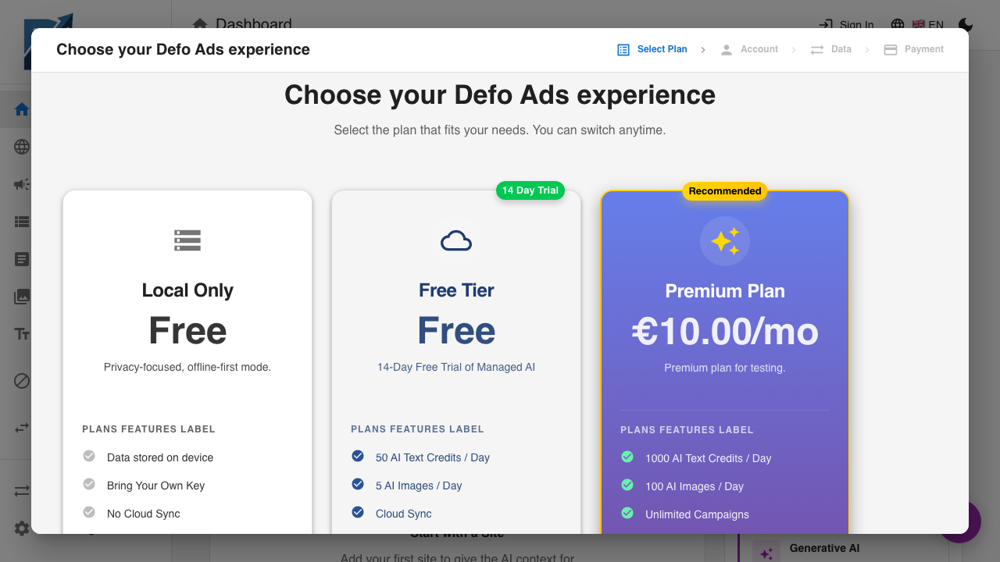

[Home](../README.md) > Quick Start (Free)

# Quick Start — Free & Open Source

Get up and running with Defo Ads in minutes. The free version runs entirely in your browser — no account, no server, no cost.

---

## What You Get

- Full campaign management (campaigns, ad groups, ads, keywords, sites)
- AI-powered content generation (bring your own OpenAI API key)
- Import/export with Google Ads Editor (CSV) and JSON backup
- Dark mode, multi-language support, and customizable AI prompts
- 100% private — your data never leaves your browser

---

## Step 1: Welcome Wizard

When you first open Defo Ads, a setup wizard walks you through:

1. **Welcome** — Overview of what Defo Ads does
2. **Terms & Conditions** — Accept to continue (your data stays local)
3. **API Key Setup** — Enter your OpenAI API key (optional — you can add it later in Settings)
4. **Backup Reminder** — Since data is stored in your browser, regular backups are important

> **Tip:** Don't have an OpenAI API key? You can get one at [platform.openai.com](https://platform.openai.com). Defo Ads stores it locally and never sends it to any server.

---

## Step 2: Create Your First Site

A **site** represents the website you want to advertise. It gives AI the context it needs to generate relevant ad content.

1. Click **"Load Website"** from the sidebar or dashboard
2. Enter your website URL (e.g., `https://www.example.com`)
3. Click **"Analyze with AI"** — Defo Ads will scan your site and extract:
   - A description of your business
   - SEO keywords
   - Sitelinks (internal pages)
   - Logo (auto-detected)
4. Review the results and click **"Create"**

---

## Step 3: Create Your First Campaign

1. Click **"New Campaign"** from the campaigns page or dashboard
2. Follow the wizard:

| Step | What You Do |
|------|------------|
| **Type** | Choose: Search, Display, Video, Shopping, or Performance Max |
| **Site** | Select the site you just created |
| **Location** | Pick target countries/regions (or go global) |
| **Goals** | Describe your campaign goals in plain language |
| **Generate** | AI creates ad groups, keywords, and ad copy for you |
| **Review** | Name your campaign, set budget, review everything, and create |

> **Tip:** You can choose what AI generates — ad groups only, keywords only, ads only, or all three.

---

## Step 4: Review and Edit

After creation, you can fine-tune everything:

- **Campaign Details** — Adjust budget, status, locations, networks
- **Ad Groups** — Rename, add/remove keywords and ads
- **Ads** — Edit headlines and descriptions, preview how they'll look in Google Search
- **Validation** — Check for errors and warnings before exporting

---

## Step 5: Export to Google Ads

When your campaigns are ready:

1. Go to **Import / Export** in the sidebar
2. Click **Export**
3. Choose your format:
   - **CSV** — Compatible with Google Ads Editor for direct upload
   - **JSON** — Full backup of all your data
4. Download and upload to Google Ads Editor

---

## Keeping Your Data Safe

Your data lives in your browser's local storage. If you clear your browser data, **your campaigns will be deleted**.

**Backup regularly:**
- Go to **Import / Export** → **Export** → **JSON**
- Save the file somewhere safe
- You can restore from this file anytime using **Import**

---

## Next Steps

- [AI Features](../guides/ai-features.md) — Learn about AI-powered generation and optimization
- [Settings](../guides/settings.md) — Configure your API key and AI prompts
- [Campaigns Guide](../guides/campaigns.md) — Deep dive into campaign management
- [Free vs Premium](free-vs-premium.md) — See what Premium adds

---

*Need help? Check the [Troubleshooting](../troubleshooting/common-issues.md) guide.*
