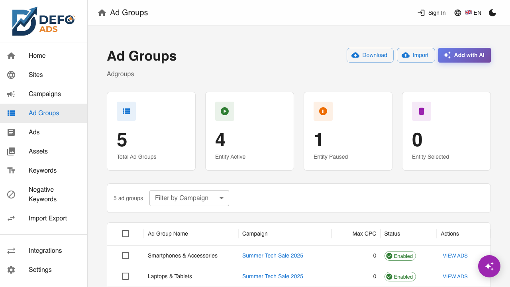
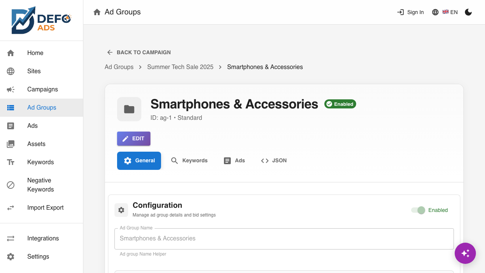
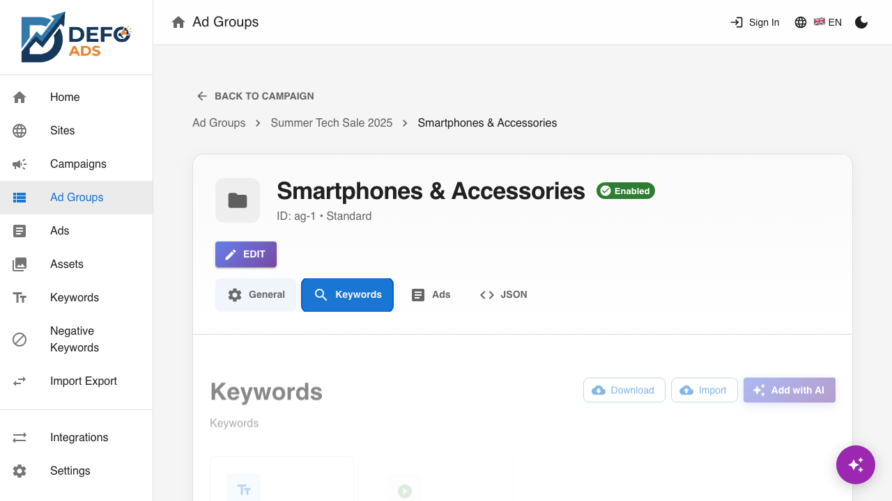
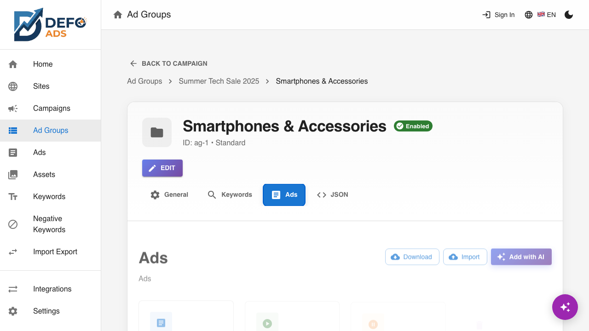

[Home](../README.md) > [Guides](../README.md#guides) > Ad Groups

# Ad Groups

Ad groups are containers within a campaign that hold related keywords and ads. They let you organize your advertising around specific themes, products, or audiences so that each ad is shown for the most relevant searches.

---

## What Are Ad Groups?

Think of a campaign as a folder and ad groups as subfolders. Each ad group focuses on a specific topic:

```
Campaign: "Running Shoes - UK"
  ├── Ad Group: "Trail Running Shoes"
  │     ├── Keywords: trail running shoes, off-road running shoes, ...
  │     └── Ads: Trail-focused headlines and descriptions
  ├── Ad Group: "Road Running Shoes"
  │     ├── Keywords: road running shoes, pavement running shoes, ...
  │     └── Ads: Road-focused headlines and descriptions
  └── Ad Group: "Running Shoe Sale"
        ├── Keywords: running shoes sale, cheap running shoes, ...
        └── Ads: Sale-focused headlines and descriptions
```

When someone searches for "trail running shoes," Google matches that search to the "Trail Running Shoes" ad group and shows one of its ads. This structure ensures your ads are relevant to what people are actually searching for.

---

## Ad Groups List View

Navigate to **Ad Groups** in the sidebar to see all ad groups across all your campaigns.


### What You See

| Column | Description |
|--------|-------------|
| **Name** | Ad group name |
| **Campaign** | The parent campaign this ad group belongs to |
| **Status** | Enabled or Paused |
| **Keywords** | Number of keywords in this ad group |
| **Ads** | Number of ads in this ad group |
| **Max CPC** | Maximum cost-per-click bid |

### Filtering

- **Search** — Filter ad groups by name using the search bar
- **Filter by Campaign** — Use the campaign dropdown to show ad groups from a specific campaign only


### Bulk Actions

Select multiple ad groups using the checkboxes to:

- **Delete** — Remove the selected ad groups and all their keywords and ads

---

## Creating an Ad Group

You can create ad groups in two ways:

### Manually

1. Navigate to a campaign's detail view and open the **Ad Groups** tab
2. Click **"Add Ad Group"**
3. Fill in the details:
   - **Name** — A descriptive name for the ad group theme
   - **Status** — Enabled or Paused
   - **Max CPC Bid** — The maximum amount you are willing to pay per click
4. Click **"Save"**



### With AI

1. From the campaign detail view's Ad Groups tab, click **"Generate with AI"**
2. Optionally provide instructions (e.g., "Focus on premium trail running shoes" or "Create ad groups for each product category")
3. AI generates themed ad groups, each with relevant keywords and ads
4. Review and save the generated ad groups


> **Tip:** AI uses the campaign's linked site and goals to generate relevant ad groups. The more context you provide, the better the results.

---

## Ad Group Detail View

Click any ad group in the list to open its detail view.

### Breadcrumb Navigation

The detail page includes breadcrumb navigation showing the full hierarchy:

**Campaigns** > **[Campaign Name]** > **[Ad Group Name]**

Click any level to navigate up.


### Tabs

The ad group detail view has five tabs:

| Tab | Purpose |
|-----|---------|
| **General** | Name, status, and bid settings |
| **Keywords** | Keywords in this ad group |
| **Ads** | Ads in this ad group |
| **Validation** | Errors and warnings for this ad group |
| **JSON** | Raw data view |

---

### General Tab

The General tab displays the core ad group settings:

| Field | Description |
|-------|-------------|
| **Name** | The ad group name |
| **Status** | Enabled or Paused |
| **Max CPC Bid** | Maximum cost-per-click — the most you will pay when someone clicks your ad |



#### Max CPC Bid

The Max CPC (cost-per-click) bid sets the upper limit for how much you pay per click for keywords in this ad group. Individual keywords can override this with their own bid if needed.

- Enter the amount in your account currency
- Higher bids increase the likelihood of your ad appearing, but also increase cost
- Google Ads may charge less than your max bid depending on competition

---

### Keywords Tab

Lists all keywords assigned to this ad group.



| Column | Description |
|--------|-------------|
| **Keyword** | The keyword text |
| **Match Type** | Broad, Phrase, or Exact |
| **Status** | Enabled or Paused |

#### Adding Keywords

- **Manually** — Click **"Add Keyword"**, enter the keyword text, and select a match type
- **Generate with AI** — Click **"Generate with AI"** to have AI suggest keywords based on the ad group theme and campaign context

#### Deleting Keywords

Select keywords using the checkboxes and click **Delete**, or click the delete icon on individual rows.

For a full guide on keywords and match types, see [Keywords](keywords.md).

---

### Ads Tab

Lists all ads in this ad group.



| Column | Description |
|--------|-------------|
| **Headlines** | Preview of the ad's headlines |
| **Status** | Enabled or Paused |
| **Final URL** | The landing page URL |

#### Adding Ads

- **Manually** — Click **"Add Ad"** to create a new responsive search ad
- **Generate with AI** — Click **"Generate with AI"** to have AI write ad copy based on the ad group's keywords and campaign context

#### Deleting Ads

Select ads using the checkboxes and click **Delete**, or click the delete icon on individual rows.

For a full guide on creating and editing ads, see [Ads](ads.md).

---

### Validation Tab

Shows errors and warnings specific to this ad group. Common issues include:

| Issue | Type | Description |
|-------|------|-------------|
| No keywords | Error | The ad group has no keywords assigned |
| No ads | Warning | The ad group has no ads |
| Low keyword count | Warning | Fewer than 5 keywords — consider adding more |

Each issue includes a **"Fix"** link to navigate directly to the problem.

---

### JSON Tab

Displays the raw JSON data for this ad group, including all its keywords and ads. Useful for debugging and advanced inspection.

---

## Generating Ad Groups with AI

AI can generate complete ad groups with keywords and ads in one step. Here is how to get the best results:

### From the Campaign Detail View

1. Open a campaign and go to the **Ad Groups** tab
2. Click **"Generate with AI"**
3. Optionally provide specific instructions
4. The AI creates themed ad groups based on:
   - The campaign's linked site (description, keywords, sitelinks)
   - The campaign's goals
   - Your custom instructions
5. Review the generated ad groups, keywords, and ads
6. Save the ones you want to keep

### Tips for Better AI Generation

- **Specific instructions work best.** Instead of "create ad groups," try "create 3 ad groups focusing on different product categories: shoes, accessories, and apparel."
- **Site context matters.** Make sure your campaign has a linked site with a good description and keywords.
- **Iterate.** Generate, review, adjust, and generate again for the best results.

---

## Navigating the Hierarchy

Defo Ads makes it easy to move between campaigns, ad groups, and their contents:

| From | To | How |
|------|----|-----|
| Campaigns list | Campaign detail | Click the campaign row |
| Campaign detail | Ad group detail | Click an ad group in the Ad Groups tab |
| Ad group detail | Campaign detail | Click the campaign name in the breadcrumb |
| Ad group detail | Keyword detail | Click a keyword in the Keywords tab |
| Ad group detail | Ad detail | Click an ad in the Ads tab |
| Ad groups list | Ad group detail | Click any ad group row |


<!-- TODO: Add screenshot or diagram showing the campaign > ad group > keywords/ads hierarchy -->

---

## Best Practices

- **Theme your ad groups tightly.** Each ad group should focus on a single product, service, or topic. This ensures ads are highly relevant to the keywords triggering them.
- **Use 5-20 keywords per ad group.** Too few keywords limits reach; too many dilutes relevance.
- **Have at least 2-3 ads per ad group.** Google rotates ads and optimizes for the best performer.
- **Set appropriate CPC bids.** Start conservative and adjust based on performance data.
- **Name ad groups descriptively.** Clear names make management much easier as your account grows.

---

## Deleting Ad Groups

Deleting an ad group also deletes all its keywords and ads. This action cannot be undone.

1. From the campaigns detail view or the ad groups list, select the ad groups to delete
2. Click **Delete**
3. Confirm the deletion

> **Note:** If you are using the free version, consider exporting a backup before deleting ad groups.

---

**Related:**
- [Campaigns](campaigns.md) — Create and manage campaigns
- [Campaign Details](campaign-details.md) — Campaign settings and ad group management
- [Keywords](keywords.md) — Manage keywords and match types
- [Ads](ads.md) — Create and edit responsive search ads
