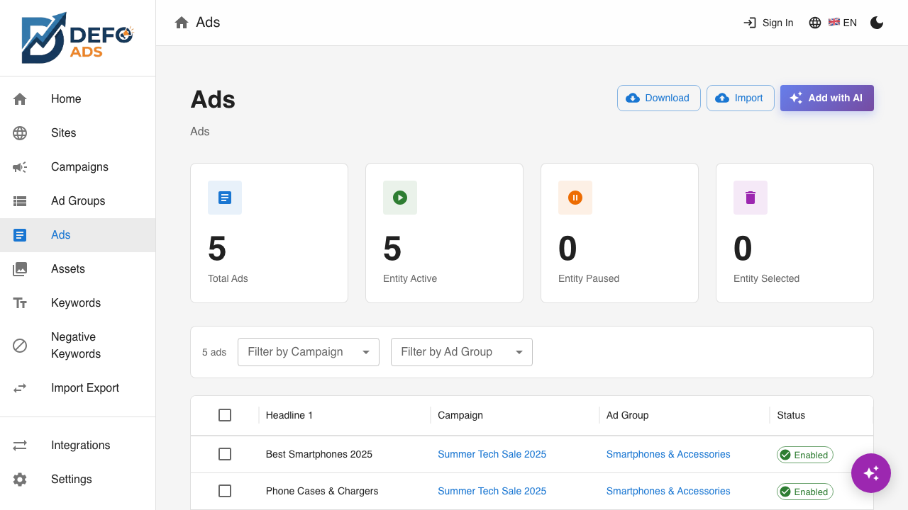
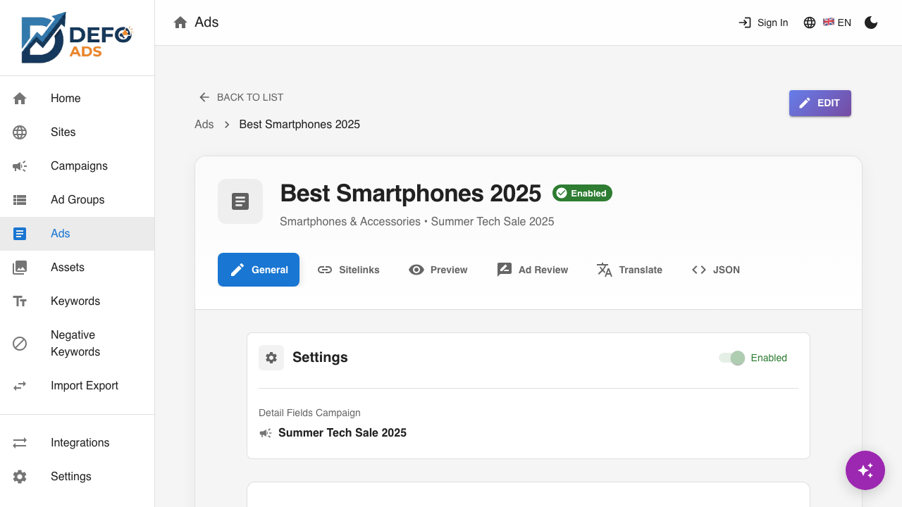
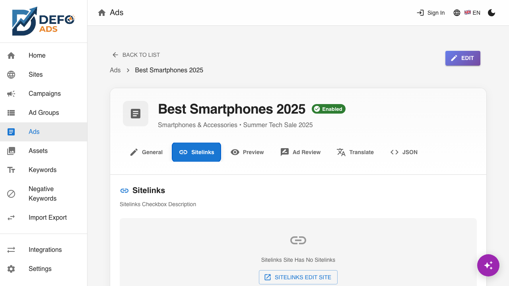
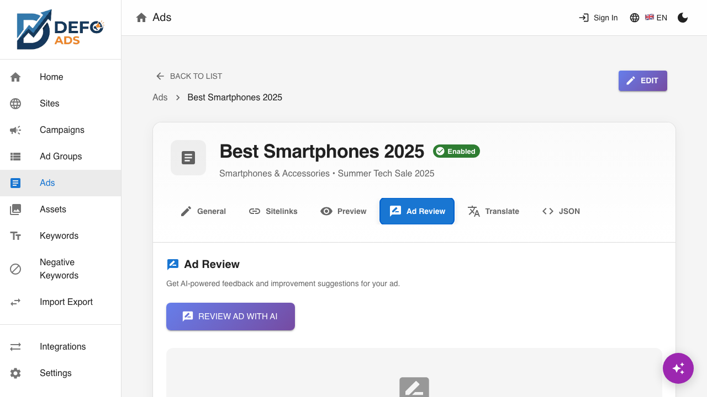
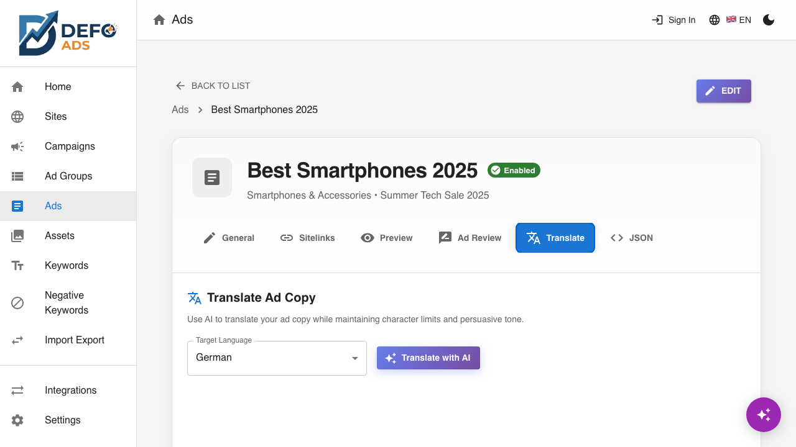
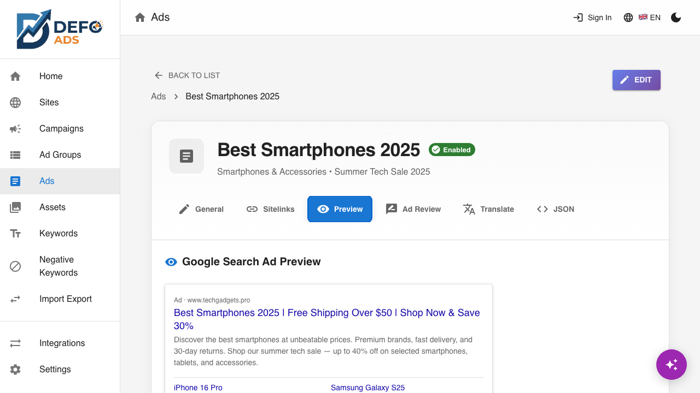
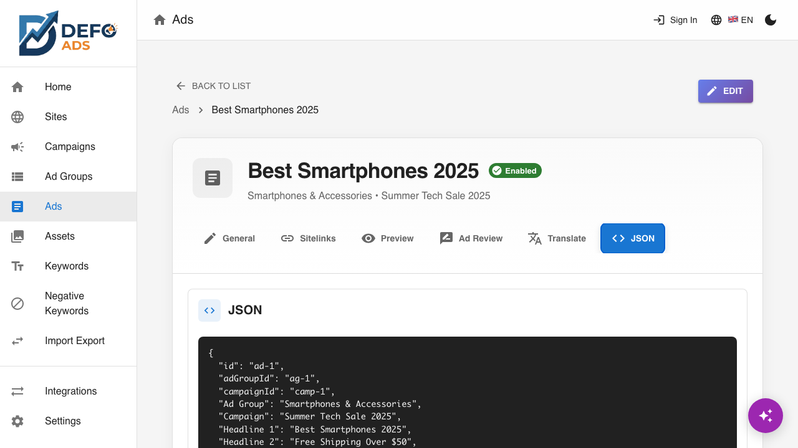

[Home](../README.md) > [Guides](../README.md#guides) > Ads

# Ads

Ads are the actual content your audience sees in Google Search results. Defo Ads helps you create responsive search ads with AI-powered writing, real-time preview, and built-in review tools to maximize performance.

---

## What Are Responsive Search Ads?

Responsive Search Ads (RSAs) are Google's primary ad format. Instead of writing a single fixed ad, you provide multiple headlines and descriptions. Google then tests different combinations and learns which ones perform best for each search query.

Each responsive search ad contains:

| Component | Count | Max Characters |
|-----------|-------|---------------|
| **Headlines** | Up to 15 (minimum 3) | 30 characters each |
| **Descriptions** | Up to 4 (minimum 2) | 90 characters each |
| **Final URL** | 1 | The landing page users reach after clicking |
| **Display Path** | 2 fields | 15 characters each (appended to your domain in the ad) |

Defo Ads focuses on the essential fields: 3 headlines, 2 descriptions, a final URL, and path fields — the minimum you need for a complete, effective ad.

---

## Ads List View

Navigate to **Ads** in the sidebar to see all ads across all campaigns and ad groups.



### What You See

| Column | Description |
|--------|-------------|
| **Headlines** | Preview of the ad's headline text |
| **Campaign** | The parent campaign |
| **Ad Group** | The parent ad group |
| **Status** | Enabled or Paused |
| **Final URL** | The landing page URL |

### Filtering

- **Search** — Filter ads by headline text
- **Filter by Campaign** — Show ads from a specific campaign
- **Filter by Ad Group** — Further narrow to a specific ad group


---

## Ad Detail View

Click any ad in the list to open its detail view. The ad detail page has multiple tabs for different aspects of the ad.

### Breadcrumb Navigation

**Campaigns** > **[Campaign Name]** > **[Ad Group Name]** > **[Ad]**

Click any level to navigate up the hierarchy.

---

### General Tab

The General tab shows basic ad metadata:

| Field | Description |
|-------|-------------|
| **Status** | Enabled or Paused |
| **Ad Group** | The ad group this ad belongs to |
| **Campaign** | The parent campaign |


---

### Edit Tab

The Edit tab is where you write and refine your ad copy. This is the primary workspace for ad creation.



#### Headlines

Three headline fields, each with a **30-character limit**:

- **Headline 1** — The most prominent text in your ad. Should include your main keyword or value proposition.
- **Headline 2** — Supports Headline 1 with additional context or a secondary benefit.
- **Headline 3** — Often used for a call to action or brand name.

#### Descriptions

Two description fields, each with a **90-character limit**:

- **Description 1** — Expand on your headlines with details about your product or service.
- **Description 2** — Add supporting information, guarantees, or a call to action.

#### Character Limit Indicators

Each field displays a character counter showing current usage vs. the maximum:

- **Green** — Well within the limit
- **Yellow** — Approaching the limit (80%+)
- **Red** — At or over the limit (the ad will fail validation)


#### Final URL

The web page users land on after clicking your ad. Enter the full URL including `https://`.

#### Path Fields

Two optional path fields (15 characters each) that appear in the ad's display URL. They do not affect where the user goes — they are purely cosmetic to help users understand the page content.

For example, with the domain `www.example.com` and paths `shoes` and `sale`:
```
www.example.com/shoes/sale
```

---

### Preview Tab

The Preview tab shows an approximation of how your ad will appear in Google Search results.


The preview displays:

- Your headlines joined with separators (as Google shows them)
- Your display URL with path fields
- Your descriptions

> **Note:** This is an approximation. Google may show your headlines and descriptions in different combinations and formats depending on the user's device, search query, and available space.

---

### Sitelinks Tab

Sitelinks are additional links that appear below your ad, giving users quick access to specific pages on your website.



Each ad can have up to **4 sitelinks**. Each sitelink contains:

| Field | Max Characters | Description |
|-------|---------------|-------------|
| **Link Text** | 25 characters | The clickable text |
| **Final URL** | — | The page URL |
| **Description 1** | 35 characters | First description line |
| **Description 2** | 35 characters | Second description line |

#### Managing Sitelinks

- **Add manually** — Click **"Add Sitelink"** and fill in the fields
- **Generate with AI** — Click **"Generate with AI"** and the AI will suggest sitelinks based on the campaign's site data and ad content
- **Load from Site** — Click **"Load from Site"** to import sitelinks that were defined on the campaign's linked site
- **Delete** — Click the delete icon on any sitelink

> **Tip:** Loading sitelinks from your site is the fastest way to add them. The site's sitelinks were already extracted and verified during site creation.

---

### Review Tab

The Review tab provides AI-powered feedback on your ad quality.



#### Overall Score

A score (e.g., 7/10) that represents the overall quality of your ad based on Google Ads best practices.

#### Detailed Ratings

The AI evaluates your ad across multiple dimensions:

| Dimension | What It Checks |
|-----------|---------------|
| **Relevance** | How well the ad matches the ad group's keywords |
| **Clarity** | Whether the message is clear and easy to understand |
| **Call to Action** | Whether the ad includes a compelling reason to click |
| **Keyword Usage** | Whether important keywords appear in headlines/descriptions |
| **Character Optimization** | Whether you are using the available character space effectively |

#### Improvement Suggestions

Below the ratings, the AI provides specific, actionable suggestions. Each suggestion includes:

- A description of what to improve
- The current text
- A suggested replacement
- A **"Apply"** button that updates the ad with the suggestion in one click


> **Tip:** You do not have to accept every suggestion. Use them as starting points and adjust to match your brand voice.

---

### Translate Tab

The Translate tab uses AI to translate your ad into another language while respecting character limits.



#### How It Works

1. Select the **target language** from the dropdown
2. Click **"Translate"**
3. The AI translates all headlines and descriptions, adjusting wording to fit within the character limits
4. Review the translations
5. Click **"Apply"** to replace the current ad text with the translation, or **"Create New Ad"** to save the translation as a separate ad in the same ad group

> **Note:** Translation is not just word-for-word. The AI adapts phrasing to sound natural in the target language while staying within the 30-character headline and 90-character description limits.

---

### Landing Pages Tab

The Landing Pages tab uses AI to suggest optimal landing pages for your ad.



Based on the ad content, keywords, and site data, the AI recommends specific pages on your website that would work best as landing pages. Each suggestion includes:

- The recommended URL
- Why it is a good match for this ad
- A **"Use"** button to set it as the ad's final URL

---

### JSON Tab

The JSON tab shows the raw data structure of the ad. This is read-only and useful for debugging or advanced inspection.



---

## Creating Ads

### Manually

1. Navigate to an ad group (from the ad groups list or campaign detail)
2. Go to the **Ads** tab
3. Click **"Add Ad"**
4. Fill in headlines, descriptions, final URL, and path fields
5. Click **"Save"**

### With AI

1. From the ad group's Ads tab, click **"Generate with AI"**
2. The AI creates ad copy based on:
   - The ad group's keywords
   - The campaign's linked site
   - The campaign goals
3. Review and edit the generated content
4. Save

> **Tip:** Generate first, then refine. AI gives you a strong starting point that you can adjust to perfectly match your brand and messaging.

---

## Writing Effective Ads

### Headlines

- **Include your main keyword** in at least one headline
- **Lead with value** — what benefit does the user get?
- **Use numbers and specifics** — "Save 30%" is more compelling than "Great Savings"
- **Add a call to action** — "Shop Now", "Get Free Quote", "Try Free"

### Descriptions

- **Expand on your headlines** — do not repeat the same information
- **Mention unique selling points** — free shipping, 24/7 support, money-back guarantee
- **Include a clear call to action** — tell users what to do next
- **Use all available characters** — longer descriptions tend to perform better

### Character Limit Reference

| Field | Limit |
|-------|-------|
| Headline | 30 characters |
| Description | 90 characters |
| Path field | 15 characters |
| Sitelink text | 25 characters |
| Sitelink description | 35 characters |

For the complete specification, see the [Ad Specifications Reference](../reference/ad-specifications.md).

---

**Related:**
- [Ad Groups](ad-groups.md) — Manage ad groups that contain your ads
- [AI Features](ai-features.md) — How AI generates and reviews ad content
- [Ad Specifications Reference](../reference/ad-specifications.md) — Complete character limits and field requirements
