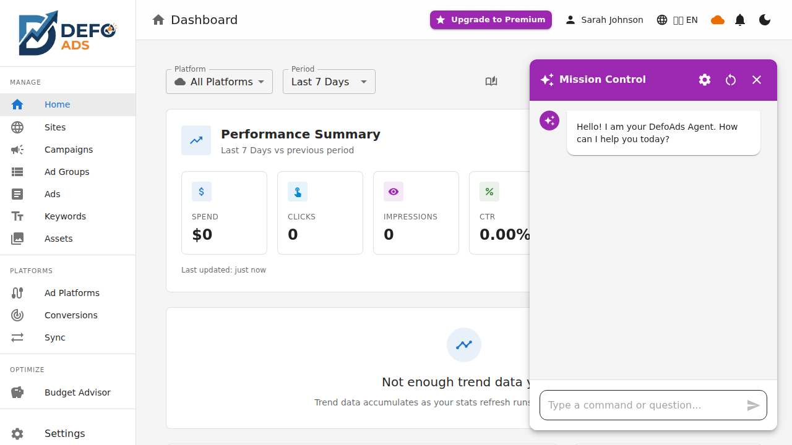

[Home](../README.md) > [Guides](../README.md) > AI Assistant

# AI Assistant

The AI Assistant is a chat-based interface that lets you manage your campaigns using natural language. Create campaigns, edit settings, get information, and ask questions — all through a conversational experience. The assistant understands your context and ensures safety through a draft-and-approve model.

---

## What Is the AI Assistant?

The AI Assistant (also called the Agentic Workspace) is an AI-powered chat interface embedded in Defo Ads. Instead of navigating menus and filling forms, you can describe what you want in plain language and the assistant handles the rest.

The assistant can:

- Create and modify campaigns, ad groups, keywords, and ads
- Look up information about your campaigns and account
- Answer questions about Defo Ads features and your subscription
- Manage sites and other resources
- Guide you through complex workflows step by step

---

## Accessing the AI Assistant

The AI Assistant is available via the **floating action button** in the bottom-right corner of the screen. Click the button to open the chat panel.

The assistant panel:

- Opens as a side panel or overlay on the current page
- Stays open as you navigate between pages
- Remembers your conversation history within the session
- Can be minimized and reopened without losing context

---

## What You Can Do

### Create Campaigns

Tell the assistant what kind of campaign you want, and it will set one up for you.

**Examples:**

- "Create a search campaign for summer shoes with a $50/day budget"
- "Set up a display campaign promoting our new product line targeting the US"
- "I need a Performance Max campaign for my online store with a focus on conversions"

The assistant gathers any missing details by asking follow-up questions, then presents a draft for your approval.

### Edit Entities

Modify existing campaigns, ad groups, keywords, or ads through conversation.

**Examples:**

- "Change the budget of my Q1 campaign to $75"
- "Pause the ad group called Winter Clearance"
- "Update the headline of the first ad in my Brand Awareness campaign"
- "Add the keyword 'best running shoes' to the Running Shoes ad group"

### Get Information

Ask about the state of your campaigns and account.

**Examples:**

- "Show me all campaigns with status paused"
- "How many active keywords does the Summer Sale campaign have?"
- "What is the budget for each of my search campaigns?"
- "List all ad groups in the Holiday Promo campaign"

### Manage Sites

Create and manage sites (website configurations used for campaign targeting).

**Examples:**

- "Create a new site for example.com"
- "Show me all my sites"
- "Update the site name for my main website"

### Ask Questions

Get answers about Defo Ads features, your subscription, or advertising best practices.

**Examples:**

- "What is my current plan?"
- "When does my trial expire?"
- "How do I connect my Google Ads account?"
- "What is a good CTR for search campaigns?"

---

## Draft and Approve Safety Model

The AI Assistant uses a draft-and-approve model to ensure you always have control over changes to your data. This is a core safety feature.

### How It Works

1. **You make a request** — For example, "Create a search campaign for winter boots"
2. **The assistant creates a draft** — It generates all the details and presents them in a structured draft card
3. **You review the draft** — The card shows all relevant fields (campaign name, type, budget, etc.)
4. **You approve or reject** — Click **Approve & Create** to proceed, or **Cancel** to discard

### What Requires Approval

Any action that **modifies data** goes through the draft-and-approve flow:

| Action Type | Requires Approval? |
|-------------|-------------------|
| Creating a campaign | Yes |
| Editing a campaign | Yes |
| Creating/editing ad groups | Yes |
| Adding/removing keywords | Yes |
| Creating/editing ads | Yes |
| Deleting entities | Yes |
| Viewing/listing data | No |
| Asking questions | No |
| Getting account info | No |

### Draft Card Details

The draft card includes all the details of the proposed change:

- **Entity type** — Campaign, ad group, keyword, ad, etc.
- **Action** — Create, update, or delete
- **All field values** — Name, budget, status, targeting, and more
- **Highlighted changes** — For updates, the card shows what is changing
- **Approve & Create button** — Executes the action
- **Cancel button** — Discards the draft with no changes made

### Read-Only Operations

Operations that only read data execute immediately without requiring approval. These include:

- Listing campaigns, ad groups, keywords, or ads
- Checking subscription status
- Viewing account information
- Answering informational questions

---

## AI Suggestion Chips

Below the chat, the assistant displays **context-aware suggestion chips** — clickable prompts that suggest relevant actions based on your current context. For example, when viewing a campaign, you might see chips like:

- "Generate keywords for this ad group"
- "Review ad copy quality"
- "Show campaign performance"

Each chip has a category icon (diagnostic, creative, structural, optimization, educational, or administrative) and shows the full suggestion text on hover. Click a chip to send it as your message — no typing needed.

Suggestion chips update as you navigate between pages and are a quick way to discover what the assistant can do in your current context.

<!-- TODO: Add screenshot of suggestion chips -->

---

## Live Activity Feed

While the AI assistant is working on your request, a **live activity feed** replaces the static "thinking..." indicator. The feed shows each step the assistant is performing in real time:

- Colored activity icons indicate the type of operation
- Platform chips show which ad platform is involved (if applicable)
- Relative timestamps (e.g., "2 seconds ago")
- Unread items are highlighted

This gives you visibility into exactly what the assistant is doing, especially during complex multi-step operations like campaign creation or sync.

<!-- TODO: Add screenshot of activity feed -->

---

## Context Awareness

The AI Assistant is aware of your current context within Defo Ads, which makes interactions more efficient and relevant.

### What the Assistant Knows

| Context | How It Helps |
|---------|--------------|
| **Current page** | If you are viewing a specific campaign, the assistant defaults to that campaign for actions |
| **Active campaign** | Refers to "this campaign" or "the current campaign" based on what you are looking at |
| **Available sites** | Knows your configured sites for targeting suggestions |
| **Subscription plan** | Can tell you about your plan limits, usage, and trial status |
| **Knowledge base** | Has access to product documentation and advertising best practices |
| **Connected platforms** | Knows which ad platforms are connected and their status |
| **Sync history** | Can look up recent sync records and their results |

### Context in Practice

If you are on the "Summer Shoes" campaign page and type "add a new ad group for sandals," the assistant:

1. Understands you mean the Summer Shoes campaign (context from current page)
2. Creates the ad group draft assigned to that campaign
3. Presents the draft for your approval

You do not need to specify the campaign name — the assistant infers it from your context.

---

## User Proficiency

The AI Assistant adapts its explanations and suggestions based on your proficiency level.

| Level | Behavior |
|-------|----------|
| **Beginner** | More detailed explanations, step-by-step guidance, definitions of advertising terms |
| **Intermediate** | Balanced explanations, practical suggestions, assumes basic knowledge |
| **Advanced** | Concise responses, technical details, assumes deep platform knowledge |

Your proficiency level can be adjusted in your account settings. The assistant uses it to calibrate how much detail to include in its responses.

---

## Example Conversations

### Creating a Campaign

> **You:** Create a search campaign for my bakery business targeting downtown Portland with a $30 daily budget.
>
> **Assistant:** I will create a search campaign for your bakery. Here is the draft:
>
> _[Draft Card]_
> - **Name:** Portland Bakery Search Campaign
> - **Type:** Search
> - **Budget:** $30.00/day
> - **Location targeting:** Portland, OR (downtown)
> - **Status:** Paused (so you can review before going live)
>
> [Approve & Create] [Cancel]
>
> **You:** _[Clicks Approve & Create]_
>
> **Assistant:** Campaign created successfully. Would you like me to add ad groups and keywords?

### Checking Campaign Status

> **You:** Which of my campaigns are currently active?
>
> **Assistant:** You have 3 active campaigns:
> 1. Summer Sale 2026 (Search) — Budget: $50/day
> 2. Brand Awareness (Display) — Budget: $25/day
> 3. Holiday Promo (Performance Max) — Budget: $100/day
>
> Would you like more details about any of these?

### Asking About Your Plan

> **You:** What is my current plan and how much AI usage do I have left today?
>
> **Assistant:** You are on the **Pro** plan. Here is your usage for today:
> - **AI tokens:** 12,450 / 50,000 used (37,550 remaining)
> - **Image generations:** 2 / 10 used (8 remaining)
> - **Daily reset:** In 6 hours and 23 minutes
>
> You are well within your daily limits.

---

## Tips for Effective Use

### Be Specific

The more details you provide, the more accurate the draft will be on the first attempt:

- Instead of "Create a campaign" → "Create a search campaign for running shoes targeting California with a $40/day budget"

### Use Natural Language

You do not need to use specific commands or syntax. Write as you would to a colleague:

- "Can you pause that ad group?" works just as well as "Pause ad group X"

### Review Drafts Carefully

The draft card is your safety net. Always review the proposed changes before approving, especially for:

- Budget amounts
- Targeting settings
- Campaign status (active vs. paused)

### Let Context Work for You

Navigate to the relevant page before making a request. If you want to edit a specific campaign, open it first and then use the assistant — it will know which campaign you mean.

### Ask for Help

If you are unsure about something, ask the assistant. It can explain features, suggest best practices, and guide you through unfamiliar workflows.

---

**Related:**
- [AI Features Overview](ai-features.md) — All AI-powered features
- [Premium Features](../premium/README.md) — Premium tier enhancements
- [Subscription & Billing](../premium/subscription.md) — Plan limits and AI quotas
- [Getting Started](../getting-started/) — Basics of using Defo Ads
