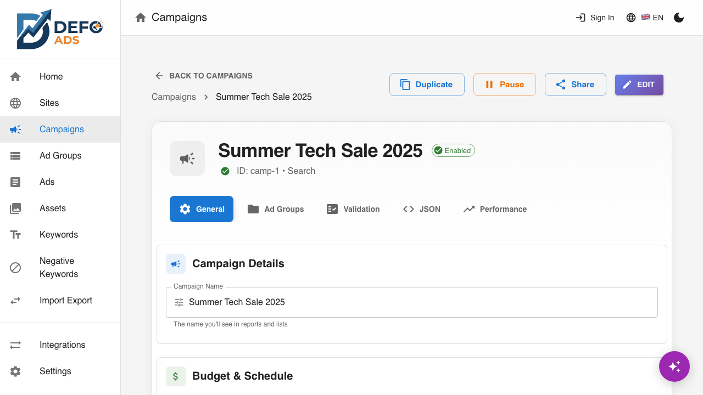
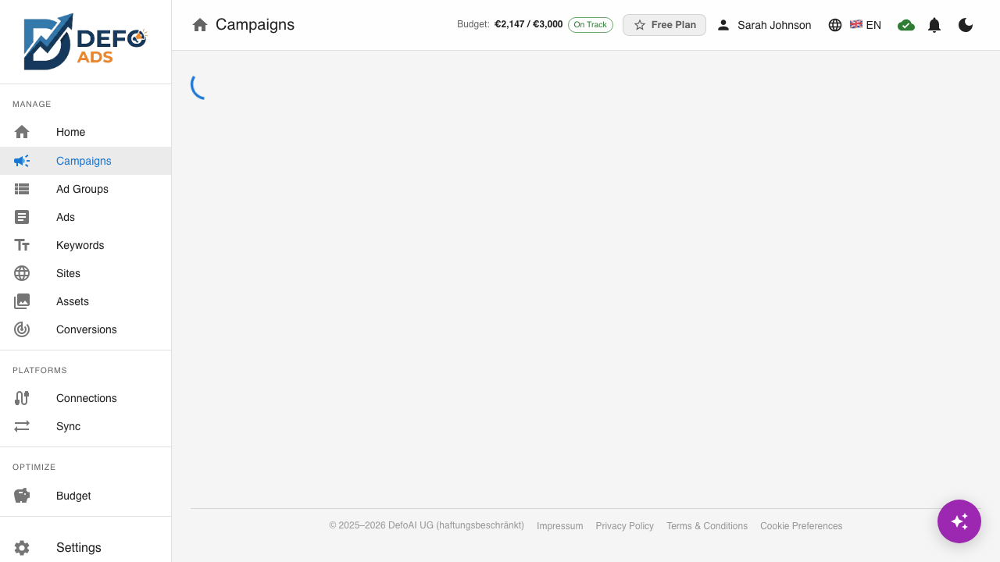
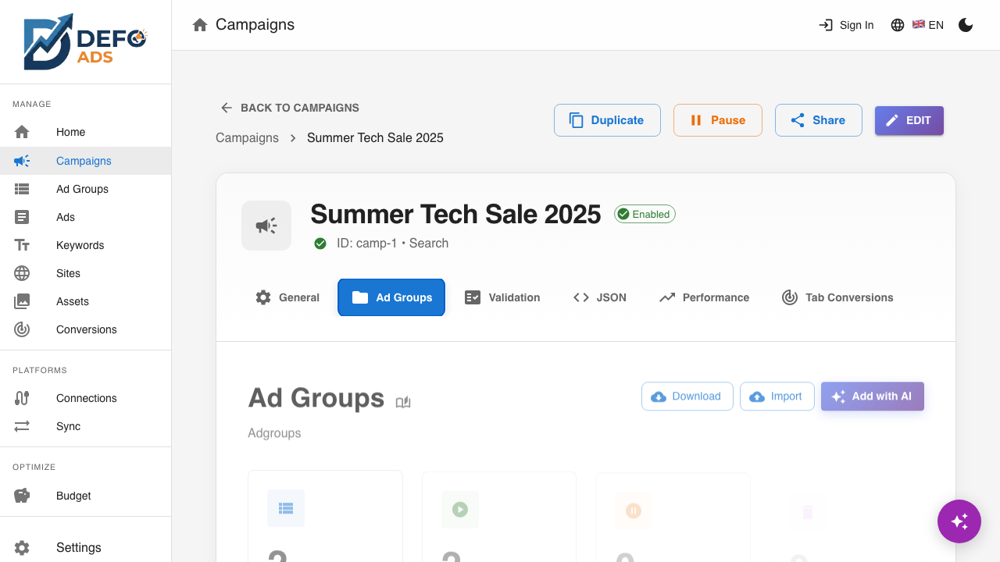
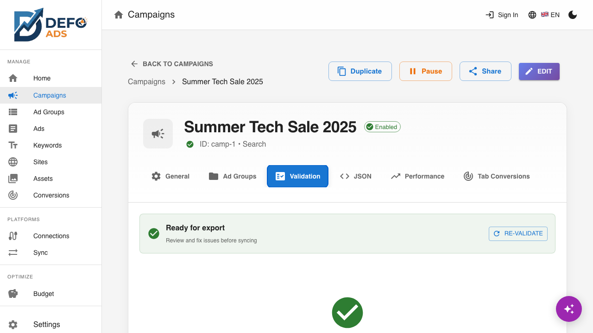
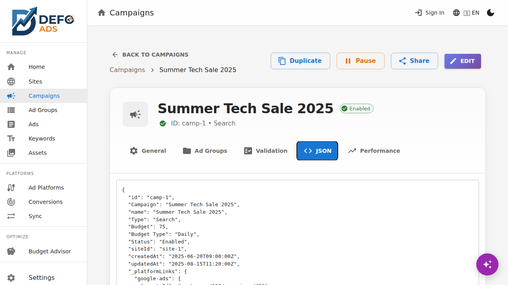

[Home](../README.md) > [Guides](../README.md#guides) > Campaign Details

# Campaign Details

The campaign detail view is where you fine-tune every aspect of a campaign — from budget and targeting to ad groups and validation. You reach it by clicking any campaign in the campaigns list.

---

## Navigation

The campaign detail page includes breadcrumb navigation at the top:

**Campaigns** > **[Campaign Name]**

Click **"Campaigns"** in the breadcrumb to return to the campaigns list.

---

## Tabs Overview

The campaign detail view is organized into tabs:

| Tab | Purpose |
|-----|---------|
| **General** | Campaign settings: name, budget, status, type, networks, locations, languages |
| **Ad Groups** | List of ad groups in this campaign |
| **Validation** | Errors and warnings that need attention |
| **JSON** | Raw data view for debugging |

---

## General Tab

The General tab contains all the core campaign settings.

### Campaign Name

The display name for your campaign. Click the name to edit it directly. Use a descriptive name that helps you identify the campaign at a glance (e.g., "UK - Running Shoes - Search" rather than "Campaign 1").

### Campaign Goal

A text field describing what this campaign aims to achieve. The AI uses this when generating ads and keywords. Be specific for better results (e.g., "Drive sign-ups for our free trial of the project management tool, targeting small business owners").

### Budget

Set your daily advertising budget:

| Field | Description |
|-------|-------------|
| **Daily Budget** | The amount you want to spend per day (in your account currency) |
| **Weekly Estimate** | Calculated automatically (daily x 7) |
| **Monthly Estimate** | Calculated automatically (daily x 30.4) |

Enter the daily amount and the weekly and monthly estimates update in real time.

> **Tip:** Ad platforms may spend up to twice your daily budget on high-traffic days, but will not exceed your monthly limit (daily budget x 30.4).

#### Global Budget (Premium)

Premium users can set a **global budget** that controls total spending across all campaigns. When a global budget is configured:

- A **context banner** appears on the campaign detail showing what percentage of your global budget this campaign uses and the remaining capacity for other campaigns
- **Validation** prevents you from setting a budget that would cause all campaigns to exceed your global cap
- In **Auto distribution mode**, editing a campaign's budget will lock it at your chosen amount — other campaigns redistribute the remaining budget automatically

For full details on setting up and managing your global budget, see [Budget Management](../premium/budget.md).

### Bidding Strategy

Select how your ad platform should bid on your behalf. The default is **Maximize Clicks**, which gets the most clicks within your budget. Available strategies:

| Strategy | Description |
|----------|-------------|
| **Manual CPC** | You set the max CPC for each keyword |
| **Maximize Clicks** | Get the most clicks within your budget (default) |
| **Maximize Conversions** | Get the most conversions within your budget |
| **Maximize Conversion Value** | Get the highest conversion value within your budget |
| **Target CPA** | Set a target cost per conversion |
| **Target ROAS** | Set a target return on ad spend |
| **Target Impression Share** | Show ads a certain percentage of the time |

### Status Toggle

Switch the campaign between **Enabled** and **Paused**.

- **Enabled** — The campaign will be active when synced to your ad platform
- **Paused** — The campaign will remain paused

When you toggle from Enabled to Paused (or vice versa), a confirmation dialog appears to prevent accidental changes.

### Campaign Type

Displays the campaign type (Search, Display, Video, Shopping, or Performance Max). This is **read-only** after creation — you cannot change a campaign's type after it has been created. If you need a different type, create a new campaign.

### Networks

Control where your ads appear:

| Network | Description |
|---------|-------------|
| **Search** | Ads appear on search results pages (Google Search, Bing, etc.) |
| **Search Partners** | Ads also appear on search partner sites |
| **Display Network** | Ads appear on websites, apps, and videos in display networks |

Toggle each network on or off depending on your strategy.

> **Note:** Not all networks are available for every campaign type. For example, Shopping campaigns do not support the Display Network toggle.

### Target Locations

Manage the geographic regions where your ads will be shown.

#### Viewing Locations

Current target locations are displayed as a list of countries, regions, or cities with remove buttons.

#### Adding Locations

1. Click **"Add Location"**
2. Search by country, region, or city name
3. Select from the search results
4. The location is added to your target list

#### Removing Locations

Click the **remove** icon next to any location to stop targeting it.

### Languages

Select the languages your target audience speaks. This helps ad platforms show your ads to users whose language settings match.

You can select multiple languages. The default is determined by your target locations.

---

## Ad Groups Tab

The Ad Groups tab lists all ad groups within this campaign.

### What You See

Each ad group entry shows:

| Column | Description |
|--------|-------------|
| **Name** | Ad group name |
| **Status** | Enabled or Paused |
| **Keywords** | Number of keywords in the ad group |
| **Ads** | Number of ads in the ad group |
| **Max CPC** | Maximum cost-per-click bid |

### Actions

- **Click an ad group** — Navigate to the ad group detail view
- **Create new** — Click **"Add Ad Group"** to create a new ad group in this campaign
- **Delete** — Select ad groups and click **Delete** to remove them
- **Generate with AI** — Click **"Generate with AI"** to have AI create new ad groups based on the campaign goals

For full details on managing ad groups, see the [Ad Groups](ad-groups.md) guide.

---

## Validation Tab

The Validation tab checks your campaign for issues that could prevent it from running properly on Google Ads.

### Error Types

| Type | Icon | Meaning |
|------|------|---------|
| **Error** | Red | Must be fixed — the campaign will not work on Google Ads with this issue |
| **Warning** | Yellow | Should be reviewed — the campaign may underperform |

### Common Validation Issues

| Issue | Type | Description |
|-------|------|-------------|
| Missing headlines | Error | Ads need at least 3 headlines |
| Missing descriptions | Error | Ads need at least 2 descriptions |
| Headline too long | Error | Headlines must be 30 characters or fewer |
| Description too long | Error | Descriptions must be 90 characters or fewer |
| No keywords | Error | Ad groups need at least one keyword |
| No ads | Warning | Ad groups should have at least one ad |
| No budget set | Warning | Campaign has no daily budget defined |
| Low keyword count | Warning | Ad groups work better with 5+ keywords |

### Click-to-Fix Navigation

Each validation issue includes a **"Fix"** link. Clicking it takes you directly to the field or item that needs attention — for example, clicking a "headline too long" error navigates you to the specific ad's edit view with the problematic headline highlighted.

### Re-Validate

Click the **"Re-Validate"** button to run validation again after making changes. Validation also runs automatically when you save changes.

For a full guide on understanding and fixing validation issues, see [Validation](validation.md).

---

## JSON Tab

The JSON tab displays the raw data structure of the campaign. This includes all settings, ad groups, ads, and keywords in JSON format.

This tab is read-only and intended for:

- **Debugging** — Verify that data is structured correctly
- **Advanced users** — Inspect the exact data that will be exported or synced
- **Support** — Share campaign data when reporting issues

The JSON is formatted with syntax highlighting for readability.

---

## Editing and Saving

### Edit Mode

Most fields on the General tab are editable. Changes are tracked but not saved until you explicitly click **"Save"**.

### Unsaved Changes Warning

If you attempt to navigate away from the campaign detail view with unsaved changes, a dialog appears:

| Option | What It Does |
|--------|-------------|
| **Discard** | Throws away your changes and navigates to the requested page |
| **Save & Continue** | Saves your changes first, then navigates |
| **Cancel** | Stays on the current page so you can continue editing |

> **Tip:** The unsaved changes indicator also appears as a dot or badge on the tab, so you can always see which sections have pending changes.

---

## Campaign Header Actions

The campaign detail header (visible on all tabs) includes quick actions:

| Action | Description |
|--------|-------------|
| **Edit / Save** | Toggle edit mode and save changes |
| **Duplicate** | Create a copy of this campaign |
| **Delete** | Delete this campaign (with confirmation) |
| **Export** | Export just this campaign as CSV or JSON |

---

## Workflow: From Creation to Export

A typical workflow through the campaign detail view:

1. **Review General settings** — Verify name, budget, locations, and networks
2. **Check Ad Groups** — Ensure each ad group has relevant keywords and ads
3. **Run Validation** — Fix any errors, review warnings
4. **Enable the campaign** — Toggle status to Enabled when ready
5. **Export or Sync** — Download for Google Ads Editor or sync via Premium

---

**Related:**
- [Campaigns](campaigns.md) — Campaign list and creation wizard
- [Ad Groups](ad-groups.md) — Manage ad groups, keywords, and ads
- [Validation](validation.md) — Understanding and fixing campaign issues
- [Import & Export](import-export.md) — Export campaigns for Google Ads
