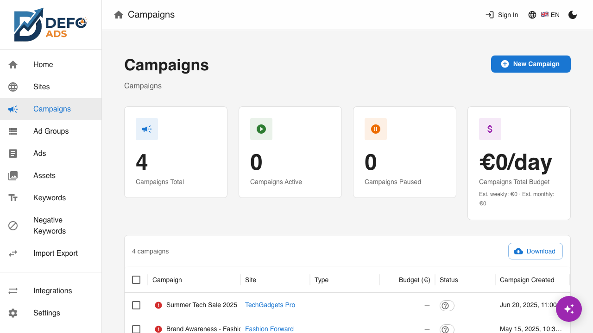
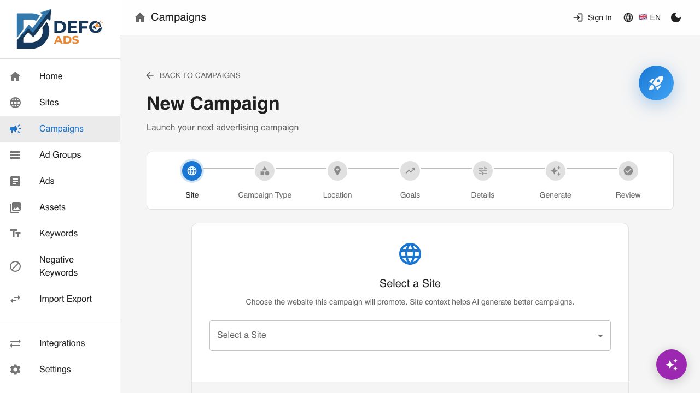

[Home](../README.md) > [Guides](../README.md#guides) > Campaigns

# Campaigns

Campaigns are the top-level container for your Google Ads advertising. Each campaign groups together ad groups, ads, and keywords around a specific marketing goal.

---

## Campaigns List View

Navigate to **Campaigns** in the sidebar to see all your campaigns.

### What You See

Each campaign in the list shows:

| Column | Description |
|--------|-------------|
| **Name** | Campaign name |
| **Type** | Campaign type (Search, Display, Video, Shopping, PMax) |
| **Status** | Enabled or Paused |
| **Ad Groups** | Number of ad groups in the campaign |
| **Ads** | Total number of ads |
| **Keywords** | Total number of keywords |
| **Budget** | Daily budget amount |

### Searching and Filtering

- **Search** — Use the search bar to find campaigns by name
- **Filter by status** — Click the status filter to show only Enabled or Paused campaigns
- **Sort** — Click any column header to sort the list

### Bulk Actions

Select multiple campaigns using the checkboxes to perform bulk actions:

- **Delete** — Permanently remove the selected campaigns and all their ad groups, ads, and keywords
- **Duplicate** — Create copies of the selected campaigns (see [Duplicating Campaigns](#duplicating-campaigns) below)

> **Note:** Deletion cannot be undone. If you are using the free version, make sure you have a backup (JSON export) before deleting campaigns.

---

## Creating a Campaign

Click **"New Campaign"** from the campaigns list or the dashboard to launch the campaign creation wizard.

### Step 1: Choose Campaign Type

Select the type of campaign you want to create:

| Type | Best For |
|------|----------|
| **Search** | Text ads on Google Search results. The most common type. |
| **Display** | Banner and image ads across Google's Display Network |
| **Video** | Video ads on YouTube and partner sites |
| **Shopping** | Product listing ads for e-commerce |
| **Performance Max** | AI-optimized ads across all Google channels |

> **Tip:** If you are unsure, start with **Search**. It is the most straightforward campaign type and works well for most businesses. See the [Campaign Types Reference](../reference/campaign-types.md) for detailed descriptions of each type.

### Step 2: Select a Site

Choose which website this campaign will advertise. The site provides context for AI generation.

- If you have already created sites, select one from the list
- If you have no sites, you can create one directly from this step
- You can also skip site selection, but AI-generated content will be less tailored

### Step 3: Target Locations

Define where your ads should appear geographically.

- **Specific locations** — Search and select countries, regions, or cities
- **Global** — Target all locations worldwide

You can add multiple locations. Each location can be searched by name.

> **Tip:** Start with a focused geographic area. You can always expand your targeting later in the campaign settings.

### Step 4: Define Goals

This is where you tell the AI what you want to achieve. You provide two things:

#### Campaign Goals (Text)

Write a plain-language description of what you want the campaign to accomplish. Be specific:

- **Good:** "Drive sign-ups for our free trial of the project management tool, targeting small business owners"
- **Less useful:** "Get more customers"

The more detail you give, the better the AI output.

#### What to Generate

Choose which components the AI should create:

| Option | What It Creates |
|--------|----------------|
| **Ad Groups** | Themed groups with names and structure |
| **Keywords** | Relevant keywords for each ad group |
| **Ads** | Responsive search ads with headlines and descriptions |
| **All** | Everything above — the recommended choice |

### Step 5: AI Generation

Click **"Generate"** and the AI gets to work. A progress screen shows what is being created:

1. **Analyzing** — AI processes your site data and goals
2. **Creating Ad Groups** — Generating themed ad groups
3. **Creating Keywords** — Generating keywords for each ad group
4. **Creating Ads** — Writing headlines and descriptions

This typically takes 15-60 seconds depending on how much content is being generated.

> **Note:** In the free version, this uses your OpenAI API key. In Premium, it uses managed AI credits included in your subscription.

### Step 6: Review and Create

The final step shows a summary of everything that was generated:

| Field | Description |
|-------|-------------|
| **Campaign Name** | Auto-generated from your goals — edit as needed |
| **Budget** | Daily budget — enter your desired amount |
| **Status** | Enabled or Paused (default: Paused) |
| **Summary** | Number of ad groups, ads, and keywords created |

Review the summary and click **"Create Campaign"** to save.

After creation, you are taken to the campaign detail view where you can fine-tune every element.

---

## Campaign Types Overview

Each campaign type is designed for a different advertising channel and format:

- **Search** — Text-based ads that appear in Google Search results when people search for your keywords
- **Display** — Visual banner ads shown across millions of websites in the Google Display Network
- **Video** — Video ads on YouTube and Google's video partner sites
- **Shopping** — Product listing ads with images, prices, and store names for e-commerce
- **Performance Max** — Google's AI-driven campaign type that runs across all channels (Search, Display, YouTube, Gmail, Maps, Discover)

For detailed information about each type, including when to use them and their specific settings, see the [Campaign Types Reference](../reference/campaign-types.md).

---

## Duplicating Campaigns

Duplication creates a copy of an existing campaign, including all its ad groups, ads, and keywords.

### How to Duplicate

1. In the campaigns list, select one or more campaigns
2. Click **"Duplicate"**
3. Each copy is created with the name format: **"[Original Name] (Copy)"**
4. The copy is set to **Paused** status by default

### AI Goal Adaptation

When you duplicate a campaign, the AI can suggest modifications to adapt the copy for a different goal:

1. Duplicate the campaign
2. Open the new copy
3. Modify the goals or target audience
4. Use AI to regenerate ad groups, keywords, or ads within the existing campaign structure

This is useful when you want to run similar campaigns for different products, audiences, or geographic regions.

---

## Campaign Status

Every campaign has a status that controls whether it will be active when uploaded to Google Ads:

| Status | Meaning |
|--------|---------|
| **Enabled** | Campaign is active and will run when uploaded to Google Ads |
| **Paused** | Campaign is paused and will not run |

> **Note:** Status in Defo Ads is a planning tool. Campaigns are not live on Google Ads until you export and upload them (free) or sync them (Premium). Changing status here prepares the campaign for its intended state in Google Ads.

New campaigns default to **Paused** so you can review and refine before enabling.

---

## What Happens After Creation

Once your campaign is created, you can:

- **Edit campaign settings** — Budget, locations, networks, status. See [Campaign Details](campaign-details.md).
- **Manage ad groups** — Add, edit, or delete ad groups. See [Ad Groups](ad-groups.md).
- **Edit ads** — Refine headlines, descriptions, preview appearance. See [Ads](ads.md).
- **Manage keywords** — Add, remove, or change match types. See [Keywords](keywords.md).
- **Validate** — Check for errors and warnings before going live. See [Validation](validation.md).
- **Export** — Download for Google Ads Editor (free) or sync to Google Ads (Premium). See [Import & Export](import-export.md).

---

## Tips for Better Campaigns

- **Start with a site.** Campaigns created with a linked site produce significantly better AI content.
- **Be specific in your goals.** "Increase online sales of running shoes to women aged 25-40 in the UK" is far better than "sell more shoes."
- **Create multiple campaigns for different goals.** Rather than one broad campaign, create focused campaigns for each product, service, or audience.
- **Review AI output.** AI-generated content is a starting point. Always review and adjust headlines, descriptions, and keywords to match your brand voice.
- **Use Paused status while building.** Keep campaigns paused until you have reviewed everything and run validation.

---

**Related:**
- [Campaign Details](campaign-details.md) — Edit campaign settings, ad groups, and validation
- [Sites](sites.md) — Add websites for better AI-generated content
- [Campaign Types Reference](../reference/campaign-types.md) — Detailed guide to each campaign type
- [AI Features](ai-features.md) — How AI generates and optimizes campaign content
