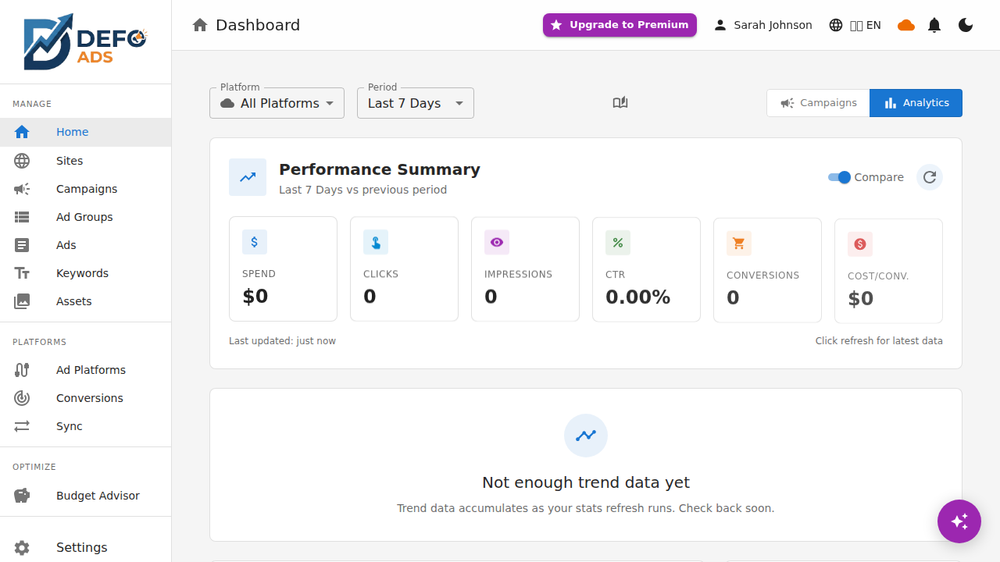
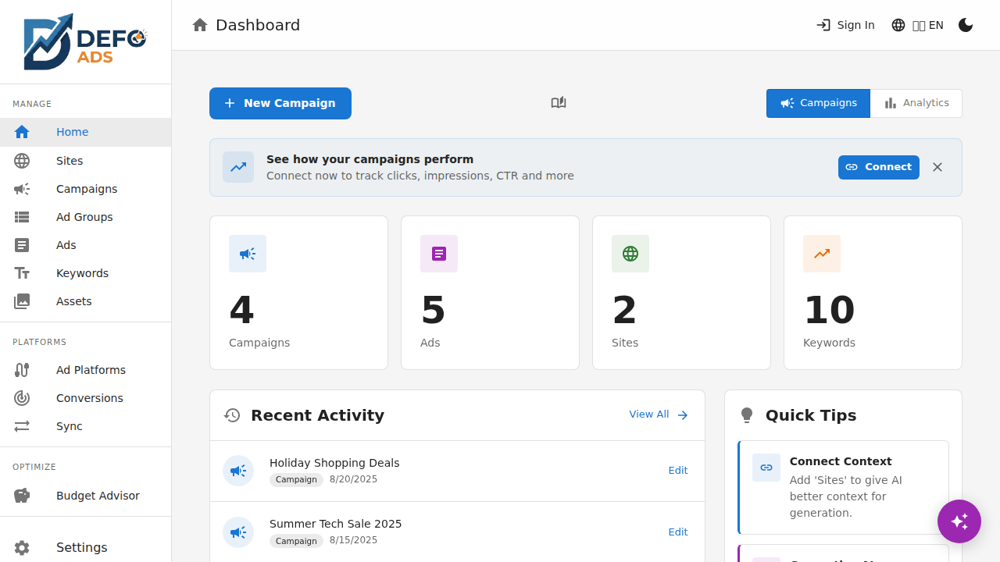
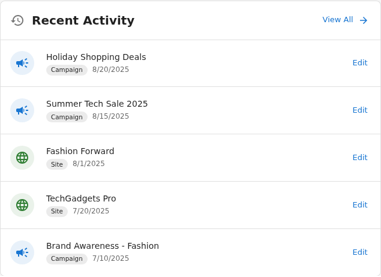
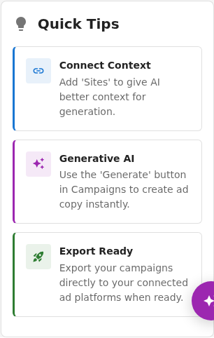
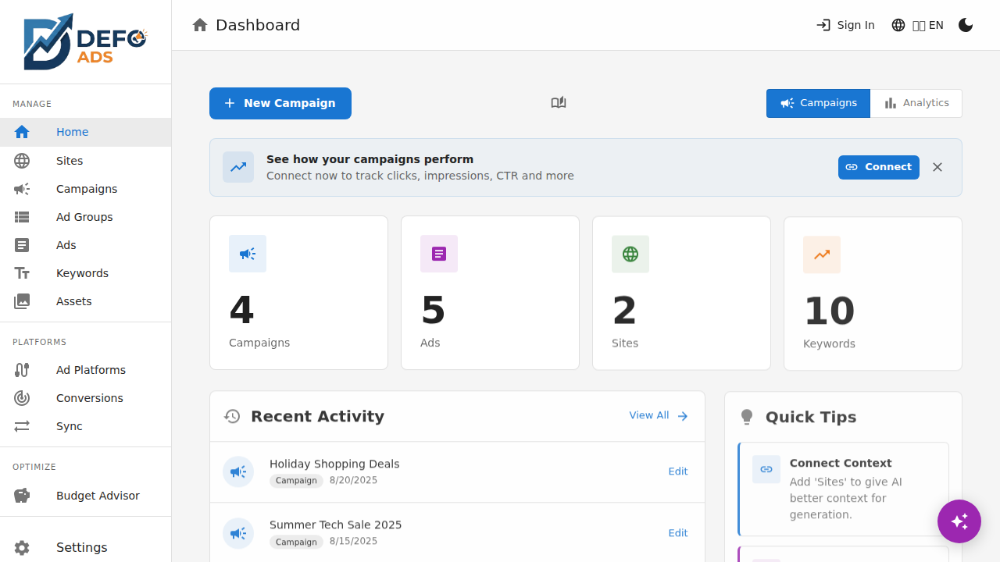

[Home](../README.md) > [Guides](../README.md#guides) > Dashboard

# Dashboard

Your home screen in Defo Ads — a quick overview of your campaigns, recent activity, and helpful tips to get the most out of the tool.

---

## Overview

The dashboard is the first thing you see after the initial setup wizard. It gives you a snapshot of your advertising workspace and quick access to the most common actions. What you see depends on whether you are using the free or premium version.

---

## Free Dashboard

The free dashboard provides a clean summary of everything in your workspace.

### Campaign Stats

At the top of the dashboard, you will see summary cards showing:

- **Campaigns** — Total number of campaigns you have created
- **Sites** — Total number of websites you have added
- **Ad Groups** — Total number of ad groups across all campaigns
- **Ads** — Total number of ads across all campaigns
- **Keywords** — Total number of keywords across all campaigns

Each card is clickable and takes you directly to the corresponding list view.

### Recent Activity Feed

Below the stats, the **Recent Activity** section shows a timeline of your latest actions:

- Campaigns created or modified
- Sites added or updated
- AI generation events
- Import and export actions

This helps you pick up where you left off, especially if you are managing multiple campaigns.

### Quick Tips

A tips section appears on the right side (or below on smaller screens) with contextual suggestions based on your workspace state:

| Tip | When It Appears |
|-----|-----------------|
| **Add a site first** | You have no sites yet |
| **Use AI to generate content** | You have a site but no campaigns |
| **Add sites for better AI context** | You have campaigns but no linked sites |
| **Export when ready** | You have campaigns with ads and keywords |
| **Review validation warnings** | Your campaigns have unresolved issues |

### Quick Actions

The dashboard includes shortcut buttons for the most common tasks:

- **New Campaign** — Opens the campaign creation wizard
- **Add Site** — Opens the site creation page
- **Import Data** — Opens the import dialog

### Upgrade to Premium Card

At the bottom of the free dashboard, a subtle card highlights what Premium offers — cloud sync, Google Ads integration, performance analytics, and managed AI. Click it to learn more or start a free trial.

> **Tip:** The upgrade card is informational only. It never blocks your workflow or interrupts what you are doing.

---

## Premium Dashboard

> **Premium Feature** — This requires a Defo Ads Premium subscription.

The premium dashboard adds a tab switcher at the top of the page, letting you toggle between two views: **Campaigns Home** and **Analytics**.

### Campaigns Home Tab

This view is similar to the free dashboard with the same stats cards, recent activity, and quick actions. Premium adds the following:

#### Platform Connection Banner

At the top of the Campaigns Home tab, a banner shows the status of your Google Ads connection:

| State | What You See |
|-------|-------------|
| **Not connected** | "Connect your Google Ads account to sync campaigns" with a **Connect** button |
| **Connected** | Your Google Ads account name, last sync time, and a **Sync Now** button |
| **Sync in progress** | A progress indicator showing the current sync operation |
| **Sync error** | An error message with a **Retry** link |

#### Cloud Sync Status

Premium users see a cloud sync indicator showing when data was last synced to the server. This replaces the backup reminders shown in the free version, since your data is automatically saved to the cloud.

### Analytics Tab

The Analytics tab provides a performance overview of your connected Google Ads campaigns. This is a summary view — for the full analytics experience, see the [Performance Dashboard](../premium/performance-dashboard.md).

#### Key Performance Indicators

A row of KPI cards shows high-level metrics for a selected date range:

- **Impressions** — How many times your ads were shown
- **Clicks** — How many times your ads were clicked
- **CTR** — Click-through rate (clicks / impressions)
- **Conversions** — Completed goal actions
- **Cost** — Total ad spend for the period
- **CPC** — Average cost per click

#### Performance Charts

Below the KPIs, interactive charts show trends over time:

- **Clicks & Impressions** — Line chart showing daily traffic
- **Cost & Conversions** — Bar chart showing spend vs results
- **Top Campaigns** — Horizontal bar chart ranking campaigns by performance

You can adjust the date range using the date picker in the top-right corner of the Analytics tab.

#### Campaign Performance Table

A summary table lists each campaign with its key metrics. Click any row to jump to that campaign's detail view.

| Column | Description |
|--------|-------------|
| Campaign Name | Name of the campaign |
| Status | Enabled or Paused |
| Impressions | Total impressions in the period |
| Clicks | Total clicks |
| CTR | Click-through rate |
| Cost | Total spend |
| Conversions | Conversion count |

> **Note:** Analytics data is only available for campaigns that have been synced from a connected Google Ads account. Locally-created campaigns that have not been synced will not appear in the Analytics tab.

---

## Navigating from the Dashboard

The dashboard is designed as a launching pad. Here are the most common paths:

| From | To | How |
|------|----|-----|
| Stats card | List view | Click the card |
| Recent activity item | Detail view | Click the item |
| Quick action button | Creation wizard | Click the button |
| Connection banner | Ad Platforms page | Click **Connect** or account name |
| Analytics campaign row | Campaign detail | Click the row |

---

## Refreshing Data

- **Free:** The dashboard loads data from your browser's local storage. It updates instantly as you make changes.
- **Premium:** Click the refresh icon in the header to pull the latest data from the cloud. The Analytics tab may take a moment to load if you have many campaigns.

---

## Customization

The dashboard layout adapts to your screen size. On desktop, stats cards and tips appear side by side. On tablet and mobile, they stack vertically.

You can control the app's appearance (dark mode, language, etc.) from the [Settings](settings.md) page. The dashboard follows your chosen theme.

---

**Related:**
- [Campaigns](campaigns.md) — Create and manage campaigns
- [Sites](sites.md) — Add websites for better AI context
- [Performance Dashboard](../premium/performance-dashboard.md) — Full analytics and reporting (Premium)
- [Free vs Premium](../getting-started/free-vs-premium.md) — Compare what each tier offers
