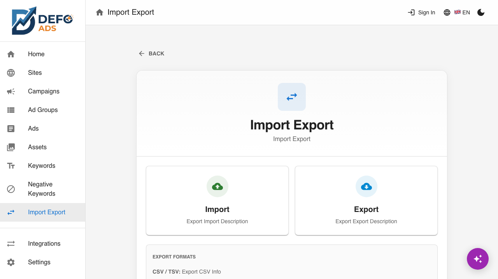
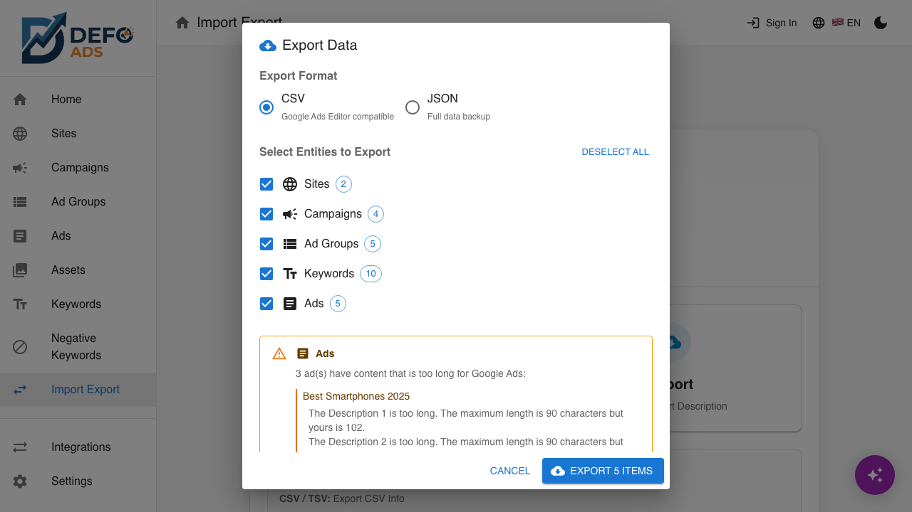

[Home](../README.md) > [Guides](../README.md#guides) > Import & Export

# Import & Export

Move data in and out of Defo Ads. Import campaigns from Google Ads Editor files, restore from backups, and export your campaigns for upload to Google Ads or safekeeping.

---

## Accessing Import & Export

Open the **Import / Export** page from the sidebar. The page has two main sections:

- **Import** — Upload files or paste data to bring campaigns into Defo Ads
- **Export** — Download your campaigns in CSV or JSON format

---

## Importing Data

Defo Ads supports two import formats: CSV/TSV (compatible with Google Ads Editor) and JSON (Defo Ads backup files).

### CSV / TSV Import

This format is designed to work with exports from **Google Ads Editor**, making it easy to bring existing campaigns into Defo Ads.

#### How to Import CSV/TSV

1. Navigate to the **Import / Export** page
2. Select the **Import** section
3. Choose **CSV/TSV** as the format
4. Either **upload a file** by clicking the upload area, or **paste CSV data** directly into the text field
5. Click **"Import"**

#### Supported Columns

Defo Ads recognizes the following columns from your CSV/TSV file:

| Column | Description | Required |
|--------|-------------|----------|
| **Campaign** | Campaign name | Yes |
| **Ad Group** | Ad group name | For ad group/keyword/ad rows |
| **Keyword** | Keyword text | For keyword rows |
| **Criterion Type** | Keyword match type (Broad, Phrase, Exact) | For keyword rows |
| **Status** | Entity status (Enabled, Paused, Removed) | No (defaults to Enabled) |
| **Headline 1** | First ad headline (max 30 chars) | For ad rows |
| **Headline 2** | Second ad headline (max 30 chars) | For ad rows |
| **Headline 3** | Third ad headline (max 30 chars) | For ad rows |
| **Description 1** | First ad description (max 90 chars) | For ad rows |
| **Description 2** | Second ad description (max 90 chars) | For ad rows |
| **Final URL** | Landing page URL | For ad rows |

> **Tip:** The easiest way to get a compatible CSV is to export from Google Ads Editor. The column names will match automatically.

#### Import Summary

After processing your file, Defo Ads shows an import summary with counts of what will be created:

| Entity | Count |
|--------|-------|
| Campaigns | Number of campaigns found |
| Ad Groups | Number of ad groups found |
| Keywords | Number of keywords found |
| Ads | Number of ads found |

Review the summary to make sure the numbers look correct, then confirm to complete the import.

### JSON Import

JSON import restores data from a previous Defo Ads backup. This is useful when:

- Moving to a new browser or computer
- Restoring after clearing browser data
- Transferring data between the free and premium versions

#### How to Import JSON

1. Navigate to the **Import / Export** page
2. Select the **Import** section
3. Choose **JSON** as the format
4. Upload your `.json` backup file
5. Review the summary and confirm

> **Important:** JSON import will **add** the imported data alongside your existing data. It does not overwrite or replace existing campaigns. If you want a clean restore, use **Settings > Clear All Data** first.

---

## Exporting Data

Export your campaigns for upload to Google Ads or as a backup.

### Selecting What to Export

1. Navigate to the **Import / Export** page
2. Select the **Export** section
3. Choose which campaigns to include:
   - **All campaigns** — Exports everything
   - **Selected campaigns** — Check the campaigns you want to export
4. Related entities are automatically included: ad groups, keywords, ads, and sites associated with the selected campaigns

### CSV Export

CSV export creates a file compatible with **Google Ads Editor**. Use this to upload your campaigns directly to Google Ads.

1. Select your campaigns
2. Choose **CSV** as the format
3. Click **"Export"**
4. Download the generated file

**What's included:**
- Campaigns with settings (name, budget, status, locations, networks)
- Ad groups with their keywords and ads
- All ad headlines, descriptions, and final URLs
- Keyword match types and statuses

**Note on sites:** Sites (website data) cannot be represented in Google Ads Editor format, so they are exported as a **separate CSV file** if you have sites associated with your campaigns.

### JSON Export

JSON export creates a complete backup of your Defo Ads data. This format preserves all data including internal IDs, sites, and settings that aren't part of the Google Ads format.

1. Select your campaigns (or choose all)
2. Choose **JSON** as the format
3. Click **"Export"**
4. Download the `.json` file

**What's included:**
- All campaign data (campaigns, ad groups, keywords, ads)
- Site data (URLs, descriptions, keywords, sitelinks)
- Internal metadata and relationships

> **Tip:** JSON export is the recommended format for **backups**. CSV is designed for Google Ads Editor compatibility.

### Export Validation

Before generating the export file, Defo Ads runs a validation check. If any issues are found, you'll see warnings:

- **Errors** (red) — Serious issues that may cause problems in Google Ads (e.g., missing required fields)
- **Warnings** (yellow) — Recommendations that won't prevent export but should be reviewed (e.g., ads exceeding character limits)

You can choose to **proceed anyway** or **go back and fix** the issues before exporting. Character limit warnings are especially important — Google Ads will reject ads that exceed the limits.

---

## Data Backup Best Practices

Regular backups protect your work, especially if you use the **free version** where all data is stored in your browser's local storage.

### Why Backups Matter (Free Version)

Your campaign data is stored in **localStorage**, which means it can be lost if you:

- Clear your browser data or cookies
- Uninstall or reinstall your browser
- Use a different browser or device
- Run a privacy/cleanup tool

### Recommended Backup Schedule

| Frequency | When |
|-----------|------|
| **After major changes** | Whenever you create or significantly edit campaigns |
| **Weekly** | If you actively work on campaigns |
| **Before browser maintenance** | Before clearing data, updating, or switching browsers |

### Backup Workflow

1. Go to **Import / Export** > **Export**
2. Select **All campaigns**
3. Choose **JSON** format
4. Download and save the file with a descriptive name (e.g., `defo-ads-backup-2026-02-09.json`)
5. Store the file in a safe location (cloud drive, external storage, etc.)

### Restoring from a Backup

1. Go to **Import / Export** > **Import**
2. Choose **JSON** format
3. Upload your backup file
4. Review the summary and confirm

> **Premium Feature** -- Premium users have their data stored securely in the cloud, so browser-based backups are less critical. Premium users can also sync directly with Google Ads. See [Sync](../premium/sync.md).

---

## Working with Google Ads Editor

Google Ads Editor is Google's free desktop application for managing Google Ads campaigns offline. Defo Ads is designed to work seamlessly with it.

### Defo Ads to Google Ads Editor

1. Export your campaigns as **CSV** from Defo Ads
2. Open Google Ads Editor
3. Go to **Account > Import > From file**
4. Select the CSV file from Defo Ads
5. Review the import and apply changes

### Google Ads Editor to Defo Ads

1. In Google Ads Editor, select the campaigns you want to export
2. Go to **Account > Export > Export selected campaigns**
3. Save as CSV
4. In Defo Ads, go to **Import / Export** > **Import**
5. Choose **CSV/TSV** and upload the file

---

## Common Questions

### Can I import from other ad platforms (Microsoft Ads, Facebook Ads)?

Currently, Defo Ads supports Google Ads Editor CSV format only. For other platforms, you would need to convert the data to match the supported column format.

### What happens if I import a campaign that already exists?

Imported campaigns are created as **new entries**. If you import a campaign with the same name as an existing one, both will exist side by side. You can then merge or delete duplicates manually.

### Is there a file size limit for imports?

There is no strict file size limit, but very large files (thousands of campaigns) may take longer to process. The import runs entirely in your browser, so performance depends on your device.

---

**Related:**
- [Campaigns](campaigns.md) — Create and manage advertising campaigns
- [Sync](../premium/sync.md) — Sync campaigns directly with Google Ads (Premium)
- [Settings](settings.md) — Configure data management options
