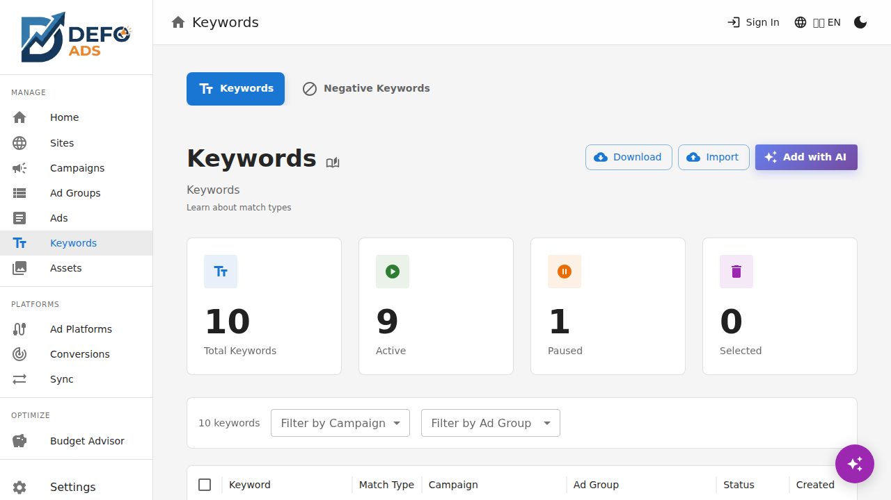

[Home](../README.md) > [Guides](../README.md#guides) > Keywords

# Keywords

Keywords are the search terms that trigger your ads. When someone searches on Google using words that match your keywords, your ad is eligible to appear. Choosing the right keywords — and the right match types — is one of the most important parts of a successful campaign.

---

## Why Keywords Matter

Keywords are the bridge between what people search for and the ads you show them. They determine:

- **When your ads appear** — Your ad only shows when someone's search matches your keywords
- **How relevant your ads are** — Better keyword-to-ad alignment means higher click-through rates
- **How much you spend** — More specific keywords typically cost less and convert better than broad ones
- **Your Quality Score** — Google rewards keyword relevance with lower costs and better ad positions

> **Tip:** Focus on keywords that describe what your customers are searching for, not just what you sell. "Best running shoes for flat feet" targets someone ready to buy; "shoes" is too broad to be useful.

---

## Keywords List View

Navigate to **Keywords** in the sidebar to open the Keywords page. This page has two tabs:

- **Keywords** — View and manage all positive keywords across all campaigns and ad groups
- **Negative Keywords** — Manage negative keyword lists and detect conflicts (see [Negative Keywords](negative-keywords.md))

The Keywords tab is selected by default.


### What You See

| Column | Description |
|--------|-------------|
| **Keyword** | The keyword text |
| **Match Type** | Broad, Phrase, or Exact |
| **Campaign** | The parent campaign |
| **Ad Group** | The parent ad group |
| **Status** | Enabled or Paused |

### Filtering

Use the filter controls to narrow down the list:

- **Search** — Filter keywords by text using the search bar
- **Filter by Campaign** — Show keywords from a specific campaign
- **Filter by Ad Group** — Further narrow to a specific ad group within the selected campaign



Filters stack: selecting a campaign shows only its ad groups in the ad group filter, making it easy to drill down to exactly the keywords you need.

### Bulk Actions

Select multiple keywords using the checkboxes to:

- **Delete** — Remove the selected keywords permanently

---

## Match Types

Match types control how closely a search query must match your keyword for your ad to appear. Defo Ads supports all three Google Ads match types.

| Match Type | Symbol | Example Keyword | Example Matching Searches |
|------------|--------|----------------|--------------------------|
| **Broad** | (none) | running shoes | running shoes, best shoes for jogging, buy sneakers for running |
| **Phrase** | "..." | "running shoes" | running shoes for men, buy running shoes online, red running shoes |
| **Exact** | [...] | [running shoes] | running shoes, running shoe |

### Quick Summary

- **Broad Match** — Widest reach. Your ad may show for searches related to your keyword, including synonyms and related topics. Good for discovery but can trigger irrelevant searches.
- **Phrase Match** — Moderate reach. Your ad shows for searches that include the meaning of your keyword. The search must include your keyword's concept in the right order.
- **Exact Match** — Narrowest reach. Your ad shows only for searches that have the same meaning as your keyword. Most precise, but limits volume.

For a detailed guide with more examples, strategies, and recommendations, see the [Keyword Match Types Reference](../reference/keyword-match-types.md).

> **Tip:** Start with Phrase Match for most keywords. It balances reach and relevance. Use Exact Match for your most important, high-intent keywords. Use Broad Match sparingly and pair it with [Negative Keywords](negative-keywords.md) to filter out irrelevant traffic.

---

## Adding Keywords

You can add keywords to an ad group in two ways.

### Manually

1. Navigate to an ad group detail view (from the ad groups list or from a campaign)
2. Go to the **Keywords** tab
3. Click **"Add Keyword"**
4. Enter the keyword text
5. Select the match type (Broad, Phrase, or Exact)
6. Click **"Save"**


You can add multiple keywords at once by entering one keyword per line in the text input.

### Generate with AI

1. From the ad group's Keywords tab, click **"Generate with AI"**
2. The AI generates relevant keywords based on:
   - The ad group's theme and existing keywords
   - The campaign's linked site (description, SEO keywords)
   - The campaign goals
3. Review the suggested keywords
4. Select the ones you want to keep and click **"Add Selected"**


> **Tip:** AI-generated keywords are a great starting point. Review them carefully and remove any that are not relevant to your specific offering. Quality is more important than quantity.

---

## Keyword Status

Each keyword has a status:

| Status | Meaning |
|--------|---------|
| **Enabled** | The keyword is active and will trigger ads when uploaded to Google Ads |
| **Paused** | The keyword is paused and will not trigger ads |

To change a keyword's status, click the status indicator in the keywords list or in the keyword detail view.

> **Note:** Like campaign status, keyword status in Defo Ads is a planning tool. Keywords are not live until you export and upload to Google Ads (free) or sync (Premium).

---

## Navigating from Keywords

The keywords list provides quick navigation to related items:

| Click On | Navigates To |
|----------|-------------|
| **Keyword text** | Keyword detail or edit view |
| **Campaign name** | Campaign detail view |
| **Ad Group name** | Ad group detail view |

This makes it easy to jump from a keyword to its parent ad group to review the ads that will show for that keyword.


---

## Keyword Organization

### How Many Keywords Per Ad Group?

Google recommends **5 to 20 keywords per ad group**. Here is why:

- **Fewer than 5** — Your ad group may not get enough search volume to be useful
- **5 to 20** — The sweet spot for relevance and reach
- **More than 20** — Keywords may be too loosely related, reducing ad relevance

### Grouping Strategy

Keywords within an ad group should all relate to the same theme. If you find keywords that do not fit, consider creating a new ad group for them.

**Good grouping:**
```
Ad Group: "Trail Running Shoes"
  - trail running shoes
  - off-road running shoes
  - trail shoes for men
  - best trail running shoes
```

**Poor grouping:**
```
Ad Group: "Shoes"
  - trail running shoes
  - office dress shoes
  - children's sandals
  - basketball sneakers
```

---

## Editing Keywords

To edit a keyword's text or match type:

1. Click the keyword in the list to open its detail view
2. Modify the keyword text or change the match type
3. Click **"Save"**

> **Note:** Changing a keyword's text effectively creates a new keyword from Google Ads' perspective. The original keyword's performance history will not carry over.

---

## Deleting Keywords

To delete keywords:

1. In the keywords list or ad group's Keywords tab, select the keywords to delete
2. Click **Delete**
3. Confirm the deletion

Deletion is permanent and cannot be undone.

> **Tip:** Instead of deleting keywords you are unsure about, consider pausing them. This keeps them in your account for future reference while preventing them from triggering ads.

---

## Keywords and Campaign Performance

While Defo Ads is primarily a planning and creation tool, understanding how keywords affect performance helps you make better choices:

- **High-intent keywords** (e.g., "buy running shoes online") tend to convert better but have higher competition
- **Informational keywords** (e.g., "best running shoes 2026") attract users earlier in their buying journey
- **Long-tail keywords** (e.g., "waterproof trail running shoes for women size 8") have lower volume but higher relevance
- **Negative keywords** prevent your ads from showing for irrelevant searches — see [Negative Keywords](negative-keywords.md)

---

## Validation

Keywords are checked during campaign validation. Common keyword-related issues:

| Issue | Type | Description |
|-------|------|-------------|
| **No keywords** | Error | An ad group has no keywords assigned |
| **Low keyword count** | Warning | An ad group has fewer than 5 keywords |
| **Duplicate keywords** | Warning | The same keyword appears in multiple ad groups within the same campaign |

See [Validation](validation.md) for more details on fixing campaign issues.

---

## Best Practices

- **Research before you write.** Think about what your customers actually search for, not just industry jargon.
- **Use a mix of match types.** Exact match for precision, phrase match for balance, broad match for discovery.
- **Include negative keywords.** Prevent your ads from showing for irrelevant searches. See [Negative Keywords](negative-keywords.md).
- **Review AI suggestions critically.** AI-generated keywords are good starting points, but always remove ones that do not fit your business.
- **Group tightly.** Keep each ad group focused on a single theme for better ad relevance.
- **Monitor and refine.** After uploading to Google Ads, use performance data to pause underperforming keywords and add new opportunities.

---

**Related:**
- [Ad Groups](ad-groups.md) — Manage the ad groups that contain your keywords
- [Negative Keywords](negative-keywords.md) — Block unwanted search terms
- [Keyword Match Types Reference](../reference/keyword-match-types.md) — Detailed match type guide with examples
- [AI Features](ai-features.md) — How AI generates keyword suggestions
