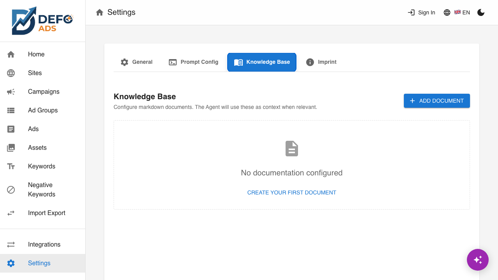

[Home](../README.md) > [Guides](../README.md#guides) > Knowledge Base

# Knowledge Base

The Knowledge Base lets you add custom documents that give AI additional context about your business. When AI generates ads, keywords, or other content, it references these documents to produce more relevant, on-brand results.

---

## Why Use the Knowledge Base

AI generates better content when it understands your business. Without extra context, AI relies only on your campaign goals and site data. The Knowledge Base fills in the gaps with information like:

- **Brand guidelines** — Tone of voice, approved terminology, words to avoid
- **Product details** — Features, pricing, unique selling points
- **Target audience** — Demographics, pain points, what motivates them
- **Company policies** — Shipping, returns, guarantees, support hours
- **Competitive positioning** — How you differentiate from competitors

The result is ad copy that sounds like it was written by someone who knows your business, not a generic AI.

---

## Accessing the Knowledge Base

1. Open **Settings** from the sidebar
2. Click the **Documentation** tab (or **Knowledge Base** tab, depending on your version)



You'll see a list of your documents (if any), with controls to add, enable/disable, edit, and delete.

---

## Adding a Document

1. Click **"Add Document"**
2. Enter a **name** for the document (e.g., "Brand Voice Guidelines")
3. Write or paste your content in the editor — **markdown formatting** is supported
4. Click **"Save"**


The document is immediately available for AI to use in all future generations.

### Writing Tips

- **Be specific** — Instead of "we sell good products," write "We sell premium organic coffee beans sourced from single-origin farms in Colombia and Ethiopia, roasted in small batches."
- **Use bullet points** — AI can extract key points more easily from structured content
- **Keep it focused** — Each document should cover one topic. Use multiple documents for different aspects of your business.
- **Use markdown** — Headers, lists, and bold text help organize information for both you and the AI

---

## Enabling and Disabling Documents

Each document has a **toggle switch** that controls whether AI uses it:

- **Enabled** (toggle on) — AI includes this document as context when generating content
- **Disabled** (toggle off) — AI ignores this document, but it's preserved for future use


This is useful when you want to:

- Temporarily exclude seasonal content (e.g., holiday promotions)
- Test how AI performs with and without specific context
- Keep draft documents that aren't ready to use yet

Only **enabled** documents are sent to the AI. Disabled documents have no effect on generated content.

---

## Editing Documents

1. Click on a document name in the list to open it
2. Modify the name or content as needed
3. Click **"Save"**

Changes take effect immediately. The next time AI generates content, it will use the updated version.


> **Tip:** Regularly review and update your Knowledge Base documents. If your business changes — new products, updated pricing, revised brand guidelines — update the documents so AI stays current.

---

## Deleting Documents

1. Click the **delete** icon next to the document
2. A **confirmation dialog** appears asking you to confirm the deletion
3. Click **"Delete"** to permanently remove the document

Deleted documents cannot be recovered. If you're unsure, consider **disabling** the document instead of deleting it.

---

## How AI Uses These Documents

When you trigger any AI generation (ads, keywords, campaign structures, etc.), Defo Ads:

1. Collects all **enabled** Knowledge Base documents
2. Includes them as context alongside your campaign goals, site data, and other relevant information
3. Sends everything to the AI model in a structured prompt
4. The AI uses all available context to generate relevant, on-brand content

This means the Knowledge Base affects **all AI features** in Defo Ads:

- Campaign structure generation
- Ad headline and description generation
- Keyword suggestions
- Ad review and improvement suggestions
- Site analysis interpretations

> **Premium Feature** -- When using the [AI Assistant](ai-assistant.md) chat interface, the assistant also has access to your Knowledge Base documents. You can ask it questions about your brand guidelines or instruct it to follow specific rules from your documents.

---

## Example Documents

Here are some examples of useful Knowledge Base documents to get you started:

### Brand Voice Guidelines

```markdown
# Brand Voice

## Tone
- Professional but approachable
- Confident, never aggressive
- Helpful and educational

## Words We Use
- "Crafted" instead of "made"
- "Investment" instead of "cost"
- "Community" instead of "customers"

## Words We Avoid
- "Cheap" — use "affordable" or "value"
- "Buy now" — use "Get started" or "Explore"
- Industry jargon without explanation
```

### Product Catalog

```markdown
# Product Lines

## Premium Coffee Beans
- Single-origin from Colombia and Ethiopia
- Small-batch roasted weekly
- Price: $18-24 per bag (250g)
- USP: Farm-to-cup traceability

## Subscription Plans
- Weekly delivery: $16/bag (save 15%)
- Bi-weekly delivery: $17/bag (save 10%)
- Free shipping on all subscriptions
```

### Target Audience

```markdown
# Target Audience

## Primary: Coffee Enthusiasts (25-45)
- Values quality over price
- Interested in origin and process
- Shops online, reads reviews
- Active on Instagram and YouTube

## Secondary: Gift Buyers
- Looking for premium gifts
- Seasonal spikes (holidays, birthdays)
- Values presentation and packaging
```

### Competitor Differentiation

```markdown
# How We're Different

## vs. Big Brands (Starbucks, Nespresso)
- We're small-batch, they're mass-produced
- We offer single-origin traceability
- We roast weekly, not months in advance

## vs. Other Specialty Roasters
- Our subscription is more flexible (pause, skip, cancel anytime)
- We include brewing guides with every order
- Free shipping on all orders over $30
```

---

## Best Practices

1. **Start with brand voice** — A brand voice document has the biggest impact on content quality across all AI features.
2. **Keep documents concise** — Aim for 100-500 words per document. Very long documents may dilute the most important information.
3. **One topic per document** — This makes it easy to enable/disable specific context and keeps things organized.
4. **Update regularly** — Outdated documents lead to outdated content. Review quarterly at minimum.
5. **Test the impact** — Generate content with and without specific documents enabled to see how they affect the output.

---

## Common Questions

### How many documents can I add?

There is no strict limit on the number of documents. However, adding too many large documents may slow down AI generation and dilute the most important context. Aim for 3-8 focused documents.

### Does the Knowledge Base affect all campaigns?

Yes. Enabled documents are used as context for AI generation across all campaigns. If you need different context for different campaigns, use **custom instructions** during generation to provide campaign-specific guidance.

### Can I use the Knowledge Base without AI?

The Knowledge Base is designed specifically for AI context. Without an AI key configured (free version) or an active subscription (premium version), the documents will be stored but not used.

---

**Related:**
- [AI Features](ai-features.md) — Overview of all AI-powered features
- [Settings](settings.md) — Access the Knowledge Base and other configuration
- [AI Assistant](ai-assistant.md) — Chat-based campaign management
