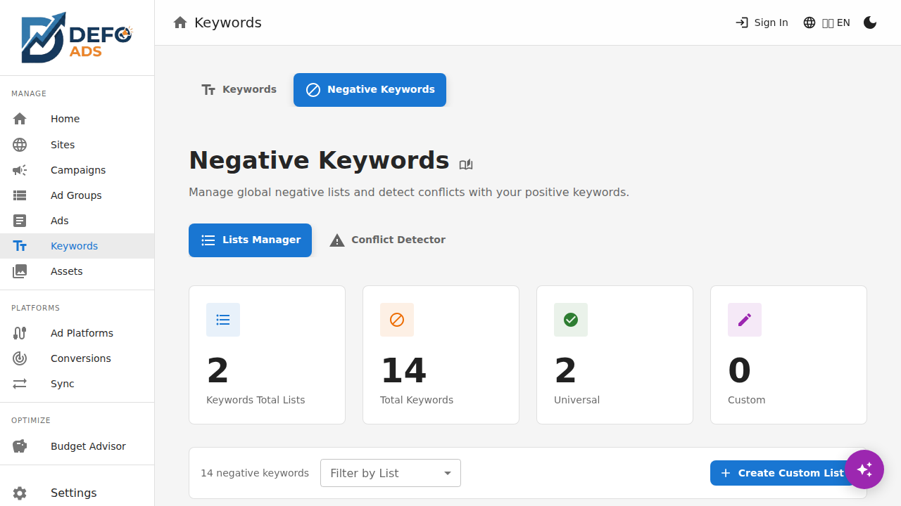

[Home](../README.md) > [Guides](../README.md#guides) > Negative Keywords

# Negative Keywords

Negative keywords prevent your ads from showing for irrelevant searches, saving your budget for the clicks that matter. Defo Ads provides tools to manage negative keyword lists and detect conflicts with your positive keywords.

---

## Why Negative Keywords Matter

When someone searches for a term that matches one of your keywords, Google may show your ad. But not every search is relevant. For example, if you sell premium leather shoes, you probably don't want your ads showing for "cheap shoes" or "free shoes."

Negative keywords let you exclude these irrelevant searches so you:

- **Save budget** by not paying for clicks that won't convert
- **Improve click-through rate (CTR)** by showing ads to a more relevant audience
- **Increase conversion rate** by attracting visitors who are actually interested in what you offer

---

## Accessing Negative Keywords

Navigate to **Keywords** in the sidebar, then click the **Negative Keywords** tab at the top of the page. You'll see three sub-tabs:

1. **Lists Manager** — Create and manage negative keyword lists
2. **Conflict Detector** — Check for conflicts between negative and positive keywords
3. **Entity List** — View all negative keywords in a flat list

---

## Lists Manager

The Lists Manager tab lets you organize negative keywords into reusable lists. There are two types of lists:

### Universal Lists

Universal lists are built-in lists that apply to **all campaigns** automatically. These contain commonly excluded terms that are rarely relevant for advertisers (e.g., "free," "torrent," "hack").

- Universal lists come pre-configured with Defo Ads
- You can enable or disable a universal list, but you cannot edit its contents
- When enabled, all keywords in the list are applied as negatives across every campaign

### Custom Lists

Custom lists are lists you create for your specific needs. You choose which campaigns each list applies to.

#### Creating a Custom List

1. Click the **"Add List"** button in the Lists Manager tab
2. Enter a **name** for the list (e.g., "Competitor Brand Names" or "Low-Intent Terms")
3. Add your negative keywords, **one per line**
4. Click **"Save"**

> **Tip:** Think about search terms that bring irrelevant traffic. Common categories include competitor names, free/cheap modifiers, job-related terms ("jobs," "salary," "hiring"), and DIY terms if you sell professional services.

#### Applying Lists to Campaigns

After creating a list, you need to assign it to one or more campaigns:

1. In the Lists Manager, find the list you want to apply
2. Click the **"Assign"** button (or the campaign icon)
3. A dialog appears showing all your campaigns with checkboxes
4. Select the campaigns where this list should apply
5. Click **"Save"**

A list that is not assigned to any campaign has no effect, so make sure to assign your lists after creating them.

#### Editing a List

1. Click on a list name or the **edit** icon
2. Modify the name or keywords as needed
3. Click **"Save"**

Changes take effect immediately for all campaigns the list is assigned to.

#### Deleting a List

1. Click the **delete** icon next to the list
2. Confirm the deletion in the dialog

Deleting a list removes all its negative keywords from every campaign it was assigned to.

---

## Conflict Detector

The Conflict Detector checks whether any of your negative keywords are accidentally blocking your positive keywords. This is a common problem — for example, if you have "running shoes" as a keyword and "running" as a negative, your ad will never show for "running shoes."

### Running a Conflict Check

1. Switch to the **Conflict Detector** tab
2. Click the **"Run Conflict Check"** button
3. Defo Ads analyzes all your campaigns, comparing every negative keyword against every positive keyword

### Understanding the Results

Each conflict shows:

| Column | Description |
|--------|-------------|
| **Negative Keyword** | The negative keyword causing the conflict |
| **Positive Keyword** | The positive keyword being blocked |
| **Campaign** | The campaign where the conflict occurs |
| **List** | The negative keyword list containing the conflicting term |

### Resolving Conflicts

For each conflict, you have two options:

- **Fix** — Removes the conflicting negative keyword from the list. This ensures your positive keyword is no longer blocked.
- **Ignore** — Dismisses the conflict if you intentionally want the negative to override the positive keyword.

> **Tip:** Run the Conflict Detector whenever you add new negative keyword lists or make significant keyword changes. It only takes a few seconds and can prevent wasted budget.

---

## Entity List

The Entity List tab provides a flat view of **all negative keywords** across all your lists. This is useful for:

- Quickly searching for a specific negative keyword
- Seeing which list and type (universal or custom) each keyword belongs to
- Getting an overview of your total negative keyword count

### Columns

| Column | Description |
|--------|-------------|
| **Keyword** | The negative keyword text |
| **List** | The name of the list this keyword belongs to |
| **Type** | Whether it's from a Universal or Custom list |

You can sort and filter the list using the column headers and the search bar.

---

## Best Practices

1. **Start with universal lists** — Enable the built-in lists to filter out the most common irrelevant terms.
2. **Review search terms regularly** — After your campaigns run on Google Ads, review actual search terms and add irrelevant ones as negatives.
3. **Use themed lists** — Group negatives by category (e.g., "Competitor Names," "Free/Cheap Terms," "Irrelevant Industries") for easier management.
4. **Run conflict checks after changes** — Whenever you add new negatives, run the Conflict Detector to catch accidental blocks.
5. **Don't over-exclude** — Adding too many negatives can reduce your reach. Only exclude terms that are clearly irrelevant.

---

## Common Questions

### Can I add negative keywords directly to a campaign without a list?

No. In Defo Ads, all negative keywords are managed through lists. This keeps your negatives organized and reusable across campaigns. Simply create a custom list with the keywords you need and assign it to the relevant campaign.

### Do negative keywords support match types?

Negative keywords in Defo Ads are added as-is. When synced to Google Ads, they follow Google's negative keyword matching behavior, which differs from positive keyword match types. A negative keyword blocks any search that contains all the words in the negative term.

### How many negative keywords can I add?

There is no hard limit in Defo Ads. However, Google Ads has its own limits per campaign and account. See [Limits & Quotas](../reference/limits-and-quotas.md) for details.

---

**Related:**
- [Keywords](keywords.md) — Manage positive keywords and match types
- [Campaigns](campaigns.md) — Create and manage advertising campaigns
