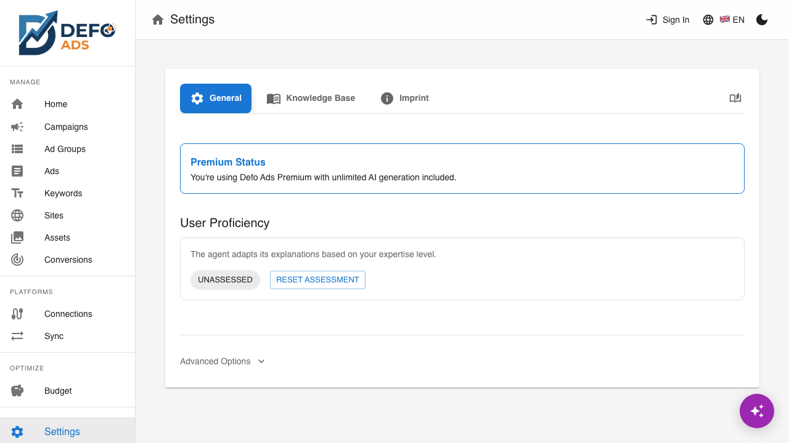
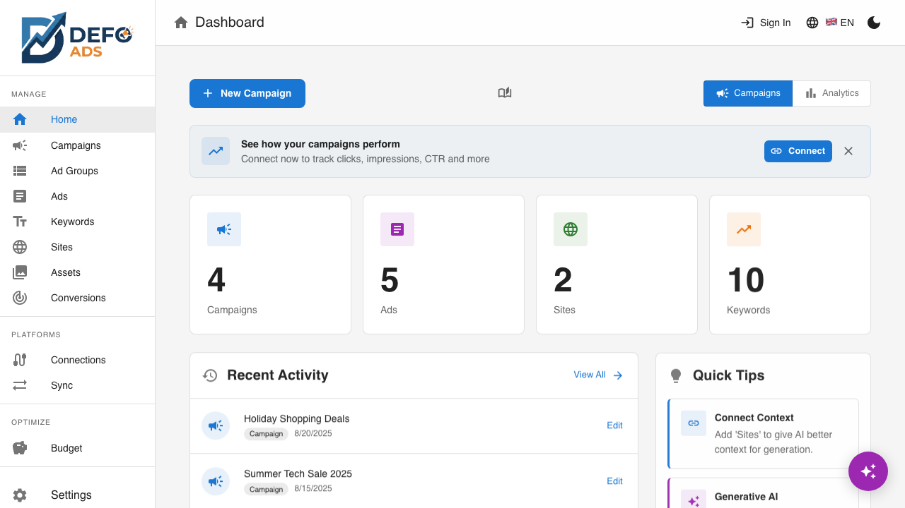
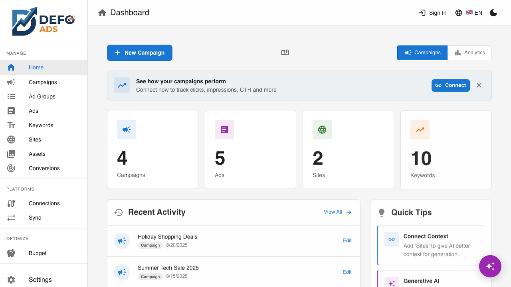

[Home](../README.md) > [Guides](../README.md#guides) > Settings

# Settings

Configure your AI setup, manage your Knowledge Base, and control your data. The Settings page also includes theme and language options accessible from the top navigation bar.

---

## Accessing Settings

Click **Settings** in the sidebar to open the Settings page. The page is organized into tabs:

- **General** — AI provider selection, API key management, and behavior preferences
- **Knowledge Base** — Knowledge Base documents
- **Team** — Team member management (Premium)
- **Account** — Subscription, notifications, and account management (Premium)
- **Imprint** — Legal and contact information

> **Note:** Platform connections and conversion tracking have their own dedicated pages accessible from the sidebar. See [Connections](../premium/integrations.md) and [Conversions](../premium/conversions.md).

---

## General Tab

The General tab contains your core AI and app preferences.

### AI Provider (Premium)

Premium users can choose between two AI providers:

- **Premium AI** (default for Pro users) — Uses your plan's AI allowance. No setup required. AI translations, generation, and image creation are handled automatically.
- **Your Own API Key** — Use your personal OpenAI key. You control costs directly.

Toggle between the two options using the provider cards in the General tab. When "Your Own API Key" is selected, the API Key input field becomes visible.

### OpenAI API Key

Your API key connects Defo Ads to OpenAI for AI-powered features. This field is only shown when using your own API key (always visible for free users, shown by toggling the provider for Premium users).

1. Get an API key from [platform.openai.com](https://platform.openai.com)
2. Paste it into the **OpenAI API Key** field
3. The key is saved automatically

**Important security details:**
- Your key is stored **locally in your browser only**
- It is **never sent to Defo Ads servers** — AI requests go directly from your browser to OpenAI
- If you clear your browser data, you'll need to re-enter the key
- You can remove the key at any time by clearing the field

> **Tip:** You can use Defo Ads without an API key. All features work except AI generation. You can always add a key later, or upgrade to Premium for managed AI.

### AI Behavior: Custom Instructions

Toggle: **"Ask for custom instructions before AI generation"**

- **On** (default) — Before each AI generation, a dialog appears where you can provide specific instructions (e.g., "Use formal tone" or "Focus on price savings")
- **Off** — AI generates content immediately without prompting for additional instructions

This is a convenience setting. When off, you can still influence AI output through your Knowledge Base documents.

### User Proficiency Level

Defo Ads adapts its AI explanations based on your experience level:

| Level | Description |
|-------|-------------|
| **Beginner** | AI provides detailed explanations and simpler suggestions |
| **Intermediate** | Balanced detail with some technical terminology |
| **Advanced** | Concise output, assumes knowledge of ads platform concepts |

Your proficiency level is initially determined through an assessment when you first use the app. You can:

- **View your current level** in the General tab
- **Reset assessment** — Click the reset button to retake the proficiency assessment

---

## Knowledge Base Tab

The Knowledge Base tab is where you manage your **Knowledge Base** — custom documents that provide AI with additional context about your business.

This is covered in detail in the [Knowledge Base](knowledge-base.md) guide. In summary:

- **Add documents** with markdown content
- **Enable/disable** documents without deleting them
- **Edit** existing documents
- **Delete** documents you no longer need

---

## Imprint Tab

The Imprint tab displays legal company information and contact details, including:

- Company name and address
- Contact email
- Legal disclaimers
- Links to privacy policy and terms of service

---

## Theme

Switch between **dark mode** and **light mode** using the theme toggle in the **top navigation bar** (not in Settings).

- Click the sun/moon icon to switch themes
- Your preference is saved and persists across sessions
- Dark mode reduces eye strain in low-light environments and can save battery on OLED screens

---

## Language

Switch the app language using the language selector in the **top navigation bar**.

Supported languages:

| Language | Code |
|----------|------|
| English | EN |
| German | DE |
| French | FR |

- Click the language code or flag icon in the top bar
- Select your preferred language from the dropdown
- The entire interface updates immediately
- Your preference is saved and persists across sessions

> **Note:** AI-generated content language is controlled separately. When generating ads, you can choose the target language regardless of your interface language.

---

## Data Management

### Clear All Data

If you need to start fresh or want to remove all your data:

1. Go to **Settings > General** (scroll to the bottom)
2. Click **"Clear All Data"**
3. A **confirmation dialog** appears listing exactly what will be deleted:
   - All campaigns
   - All ad groups
   - All ads
   - All keywords
   - All sites
   - All negative keyword lists
4. Click **"Confirm"** to permanently delete all data

**What is preserved:**
- Your OpenAI API key
- Your customized prompt templates
- Your Knowledge Base documents
- Your theme and language preferences

> **Warning:** This action cannot be undone. If you want to keep your data, **export a JSON backup** first. See [Import & Export](import-export.md).

---

## Premium Settings

> **Premium Feature** -- Premium subscribers have access to additional settings tabs.

Premium adds these tabs to the Settings page:

- **Team** — Manage team members, invite collaborators, set permissions. See [Team Collaboration](../premium/team-collaboration.md).
- **Account** — View subscription status, manage billing, configure notification preferences, and delete your account. See [User Profile](../premium/user-profile.md).

Premium users can choose to use the managed Premium AI provider (no API key needed) or their own OpenAI key. See the [AI Provider](#ai-provider-premium) section above.

> **Note:** Platform connections (Google Ads, Microsoft Advertising) are managed from the dedicated **Connections** page in the sidebar, not from Settings. See [Connections](../premium/integrations.md).

---

## Common Questions

### Where is my data stored?

In the **free version**, all data is stored in your browser's localStorage. Clearing browser data will delete your campaigns. Back up regularly using [Import & Export](import-export.md).

In the **premium version**, data is stored securely in the cloud and synced across devices.

### Can I use Defo Ads without an API key?

Yes. All campaign management features work without an API key. Only AI-powered features (generation, review, translation) require either an API key (free) or a Premium subscription.

### How do I transfer my data to a new browser?

1. In your current browser: go to the **Import / Export** page, select **Export > JSON** (all campaigns)
2. In your new browser: Open Defo Ads, complete the welcome wizard
3. Go to the **Import / Export** page, select **Import > JSON** and upload your backup file

> **Note:** In the free version, Import / Export is in the sidebar. In Premium, access it via **Sync > Open Import / Export** at the bottom of the Sync page.

---

**Related:**
- [AI Features](ai-features.md) — Overview of all AI-powered features
- [Knowledge Base](knowledge-base.md) — Custom documents for AI context
- [Connections](../premium/integrations.md) — Connect and manage ad platforms (Premium)
- [Team Collaboration](../premium/team-collaboration.md) — Manage team members (Premium)
- [User Profile](../premium/user-profile.md) — Account and subscription management (Premium)
