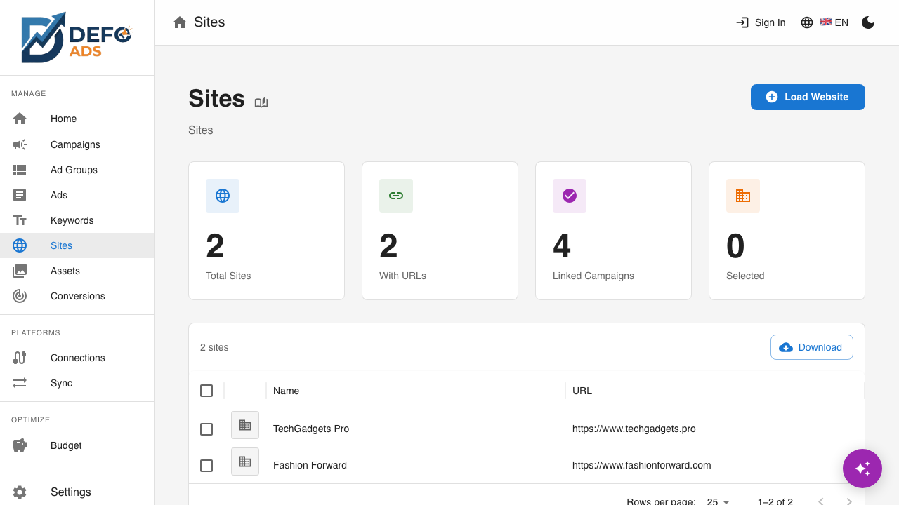
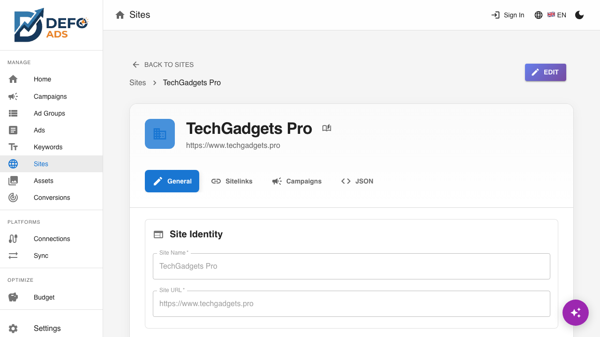
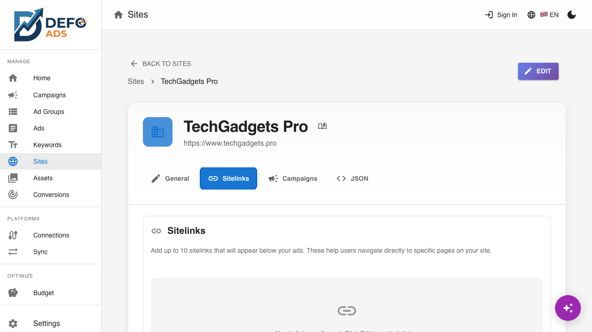
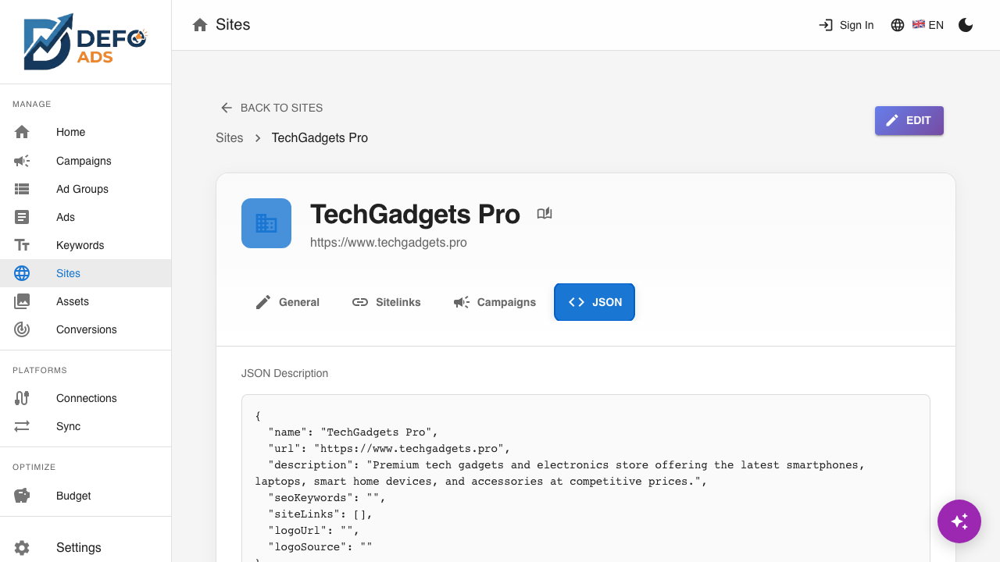
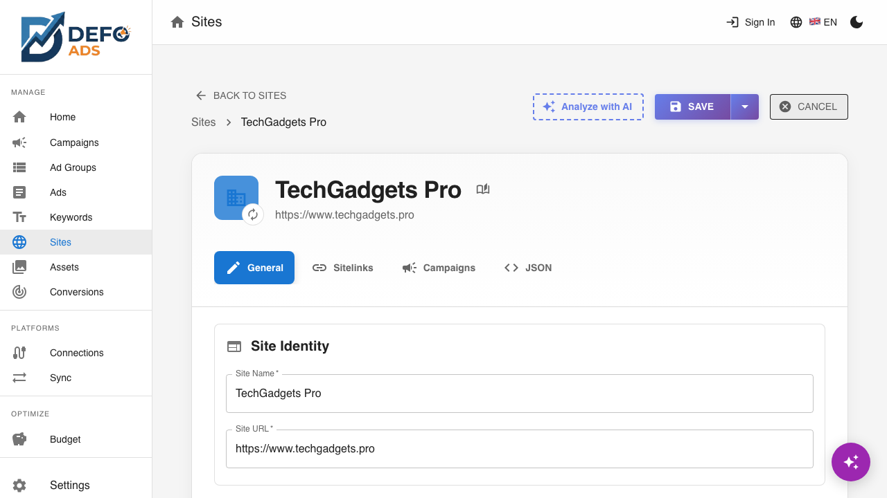

[Home](../README.md) > [Guides](../README.md#guides) > Sites

# Sites

Sites represent the websites you want to advertise. Adding a site gives AI the context it needs to generate more relevant and accurate ad content for your campaigns.

---

## Why Sites Matter

When you create a campaign, Defo Ads uses your site's information — its description, keywords, sitelinks, and more — to generate ad copy that actually reflects your business. Without a site, the AI has to work from your goals alone. With a site, it can:

- Write headlines and descriptions that match your brand voice
- Suggest keywords based on your actual content and SEO data
- Generate sitelinks that point to real pages on your website
- Use your logo for display and Performance Max campaigns

> **Tip:** Always create a site before creating your first campaign. The campaign wizard will ask you to select one, and the AI results are significantly better when it has site context to work with.

---

## Sites List View

Navigate to **Sites** in the sidebar to see all your websites.

Each site in the list shows:

| Column | Description |
|--------|-------------|
| **Favicon** | The site's icon, automatically detected from the URL |
| **Name** | The display name you gave the site |
| **URL** | The website address |
| **Campaigns** | Number of campaigns linked to this site |

### List Actions

- **Search** — Filter sites by name or URL using the search bar
- **Create New** — Click the **"Add Site"** button to create a new site
- **Delete** — Select one or more sites and click **Delete** (campaigns linked to deleted sites are not affected — they keep the site data they already have)

---

## Creating a Site

### Step 1: Enter Your URL

1. Click **"Add Site"** from the sites list or the dashboard
2. Enter your website URL (e.g., `https://www.example.com`)

### Step 2: Analyze with AI

Click the **"Analyze with AI"** button. Defo Ads will visit your website and use AI to extract:

- **Description** — A summary of what your website/business does
- **SEO Keywords** — Relevant keywords found on your site
- **Target Groups** — Audience segments your site serves (auto-generated from the description)
- **Sitelinks** — Internal pages that could be used as ad sitelinks (e.g., About, Pricing, Contact)
- **Logo** — Your site's logo, auto-detected from meta tags or favicon

A progress indicator shows the analysis status. This typically takes 10-30 seconds depending on your site.

### Step 3: Review and Edit

Once the analysis completes, review the extracted information:

- Edit the **name** (defaults to your site's title)
- Refine the **description** if the AI summary needs tweaking
- Add or remove **keywords**
- Review **target groups** — audience segments that help AI generate targeted content
- Review the **sitelinks** — remove any that are not relevant for advertising
- Confirm the **logo** — if auto-detection missed it, you can upload one manually

### Step 4: Create

Click **"Create"** to save the site. It will appear in your sites list and be available to select when creating campaigns.

> **Tip:** You do not need to get everything perfect at creation time. You can edit any site details later.

---

## Site Detail View

Click any site in the list to open its detail view. The detail page uses tabs to organize information.

### General Tab

The General tab shows the core information about your site:

| Field | Description |
|-------|-------------|
| **Name** | Display name for the site |
| **URL** | Website address (read-only after creation) |
| **Description** | AI-generated or manually written description of the site |
| **Keywords** | SEO keywords associated with the site |
| **Target Groups** | Audience segments your site targets (e.g., "Small business owners, E-commerce managers"). Used by AI when generating ads and keywords for campaigns linked to this site. Type a target group and press Enter to add it. |
| **Logo** | Site logo image |

### Sitelinks Tab

Sitelinks are links to specific pages on your website (e.g., "Pricing", "About Us", "Contact"). They appear below your ads in search results and give users more ways to reach your content.

Each sitelink has:

- **Link Text** — The clickable text (e.g., "View Pricing")
- **URL** — The page it links to
- **Description Line 1** — Optional short description
- **Description Line 2** — Optional second description line

You can have up to **10 sitelinks** per site.

#### Managing Sitelinks

- **Add manually** — Click **"Add Sitelink"** and fill in the fields
- **Generate with AI** — Click **"Generate with AI"** to have AI suggest sitelinks based on your site's content
- **Delete** — Click the delete icon on any sitelink row
- **Reorder** — Drag and drop to change the display order

### Campaigns Tab

Shows all campaigns that are linked to this site. Click any campaign to jump to its detail view.

| Column | Description |
|--------|-------------|
| **Campaign Name** | Name of the campaign |
| **Type** | Campaign type (Search, Display, etc.) |
| **Status** | Enabled or Paused |

This is a read-only view. To link or unlink a campaign from a site, edit the campaign itself.

### JSON Tab

Shows the raw JSON data for the site. This is useful for debugging or for advanced users who want to see exactly how the site data is structured.

---

## Editing a Site

To edit a site:

1. Open the site detail view
2. Click the **"Edit"** button in the top-right corner
3. Modify any fields on the General or Sitelinks tabs
4. Click **"Save"** to apply your changes

If you navigate away with unsaved changes, a warning dialog will ask you to discard or save your changes.

### Re-Analyzing a Site

If your website has changed significantly, you can re-run the AI analysis:

1. Open the site in edit mode
2. Click **"Re-Analyze with AI"**
3. The AI will scan your site again and update the description, keywords, and sitelinks
4. Review the new results and save

> **Note:** Re-analysis overwrites the current AI-generated fields. If you have made manual edits you want to keep, note them before re-analyzing.

---

## Logo Detection

Defo Ads automatically tries to detect your site's logo during the initial AI analysis. It checks:

1. Open Graph meta tags (`og:image`)
2. Favicon and Apple touch icon links
3. Common logo file paths (e.g., `/logo.png`, `/images/logo.svg`)

If auto-detection does not find the right image, you can upload a logo manually:

1. Open the site in edit mode
2. In the Logo section, click **"Upload"**
3. Select an image file from your computer
4. The logo will be saved with the site

Supported formats: PNG, JPG, SVG, and WebP.

---

## Best Practices

- **One site per website.** If you advertise multiple websites, create a separate site for each.
- **Keep descriptions accurate.** The AI uses the site description as primary context when generating ad copy. A clear, accurate description leads to better ads.
- **Review sitelinks regularly.** If you add or remove pages on your website, update the sitelinks to match.
- **Add keywords generously.** The more relevant keywords the AI has to work with, the better it can generate keyword lists for your campaigns.
- **Upload a high-quality logo.** This helps with Display and Performance Max campaigns that use image assets.

---

## Deleting a Site

To delete a site:

1. Go to the sites list
2. Select the site (or multiple sites) using the checkboxes
3. Click **Delete**
4. Confirm the deletion

> **Note:** Deleting a site does not delete campaigns linked to it. Those campaigns retain a copy of the site data they were created with. However, they will no longer receive updates if you re-analyze the site.

---

**Related:**
- [Campaigns](campaigns.md) — Create campaigns linked to your sites
- [AI Features](ai-features.md) — How AI uses site data for content generation
- [Campaign Details](campaign-details.md) — Edit campaign settings and linked sites
