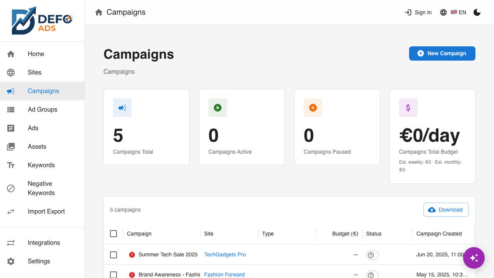

[Home](../README.md) > [Guides](../README.md#guides) > Validation

# Campaign Validation

Validation checks your campaigns for errors and warnings before you export or sync to Google Ads. It catches problems early so you don't waste time uploading campaigns that Google will reject.

---

## What Validation Does

Defo Ads examines every part of your campaign — settings, ad groups, ads, keywords, and sitelinks — and reports issues in two categories:

- **Errors** (must fix) — Problems that will prevent your campaign from working in Google Ads
- **Warnings** (should review) — Recommendations that won't block export but could reduce your campaign's performance

Validation runs automatically when you open a campaign's detail view and when you export. You can also trigger it manually at any time.

---

## Validation Status Icons

Validation status is shown on both the **campaign list** and **campaign detail** views using color-coded icons:

| Icon | Status | Meaning |
|------|--------|---------|
| Green checkmark | **Valid** | All checks passed. The campaign is ready for export. |
| Yellow warning | **Has warnings** | The campaign can be exported but has issues worth reviewing. |
| Red error | **Has errors** | The campaign has problems that must be fixed before it will work correctly in Google Ads. |

These icons give you a quick overview of your campaign health without opening each one.

---

## Validation Report

Click on a validation icon or the **"View Validation Report"** button to open the full validation report dialog.

### Report Structure

The report groups issues by section:

1. **Campaign Settings** — Campaign-level configuration issues
2. **Ad Groups** — Ad group structure and naming issues
3. **Ads** — Headline, description, and URL issues
4. **Keywords** — Keyword configuration issues
5. **Sitelinks** — Sitelink extension issues

Within each section, issues are separated into **Errors** (shown first) and **Warnings**.

### Understanding the Report

Each issue in the report includes:

| Field | Description |
|-------|-------------|
| **Icon** | Red (error) or yellow (warning) indicator |
| **Message** | Description of the issue (e.g., "Headline 1 is required") |
| **Location** | The specific entity and field where the issue exists |
| **Action** | Click to navigate directly to the field that needs fixing |

---

## Click-to-Fix Navigation

One of the most useful features of the validation report is **click-to-fix**. When you click on an issue:

1. The validation dialog stays accessible
2. The app navigates to the **exact entity and field** that needs fixing
3. You can make your changes right there
4. Click **"Re-validate"** to check if the issue is resolved

This saves you from manually hunting through campaigns to find the problem.

---

## Re-Validate

After making changes to fix reported issues:

1. Click the **"Re-validate"** button in the validation report (or on the campaign detail view)
2. Defo Ads runs all checks again
3. The report updates to show the current state
4. Fixed issues disappear from the list
5. The status icon updates accordingly

You can re-validate as many times as needed until all errors are resolved.

---

## Common Validation Errors

These are the most frequently encountered errors and how to fix them:

### Campaign Settings

| Error | How to Fix |
|-------|------------|
| **"Campaign name is required"** | Open campaign settings and enter a name |
| **"Budget must be greater than zero"** | Set a daily budget amount greater than 0 |
| **"At least one ad group is required"** | Add at least one ad group to the campaign |

### Ads

| Error | How to Fix |
|-------|------------|
| **"Headline 1 is required"** | Open the ad editor and add a first headline |
| **"Description 1 is required"** | Open the ad editor and add a first description |
| **"Headline exceeds 30 characters"** | Shorten the headline to 30 characters or fewer |
| **"Description 1 exceeds 90 characters"** | Shorten Description 1 to 90 characters or fewer |
| **"Description 2 exceeds 90 characters"** | Shorten Description 2 to 90 characters or fewer |
| **"Final URL is required"** | Add a landing page URL to the ad |
| **"Final URL is not a valid URL"** | Check the URL format (must include `https://`) |

### Keywords

| Error | How to Fix |
|-------|------------|
| **"At least one keyword is required"** | Add keywords to the ad group |
| **"Keyword text is empty"** | Remove the empty keyword entry or add text |

---

## Common Validation Warnings

Warnings don't prevent export but addressing them can improve your campaign's performance:

### Ads

| Warning | Recommendation |
|---------|---------------|
| **"Add Headline 3 for better ad performance"** | Google recommends at least 3 headlines for responsive search ads. Add a third headline. |
| **"Add Description 2 for better ad performance"** | A second description gives Google more options to show your ad. |
| **"Consider adding sitelinks for better CTR"** | Sitelinks increase ad visibility and click-through rate. |
| **"Ad has fewer than 3 headlines"** | Add more headline variations for Google to test. |

### Campaign Settings

| Warning | Recommendation |
|---------|---------------|
| **"No target locations set"** | Setting locations helps Google show your ads to the right audience. |
| **"Campaign is paused"** | The campaign won't run until you change its status to Enabled. |

### Keywords

| Warning | Recommendation |
|---------|---------------|
| **"Consider adding more keywords"** | More keywords give Google more opportunities to show your ads. |
| **"All keywords are broad match"** | Consider mixing in phrase and exact match keywords for better targeting. |

---

## Validation on Export

When you export campaigns from the **Import / Export** page, Defo Ads automatically runs validation before generating the export file.

### What Happens

1. You click **"Export"**
2. Validation runs on all selected campaigns
3. If issues are found, a **warning dialog** appears showing:
   - Total number of errors and warnings
   - Summary of the most important issues
4. You can choose to:
   - **"Fix Issues"** — Go back and resolve the problems
   - **"Export Anyway"** — Proceed with the export despite the issues

> **Tip:** Errors in your export may cause Google Ads Editor to reject the import or Google Ads to disapprove the campaign. It's always better to fix errors before exporting.

---

## Google Ads Requirements Reference

For detailed information on Google Ads field requirements and character limits, see:

- [Ad Specifications](../reference/ad-specifications.md) — Character limits for headlines, descriptions, and URLs
- [Campaign Types](../reference/campaign-types.md) — Requirements specific to each campaign type

### Quick Reference: Character Limits

| Field | Max Characters |
|-------|---------------|
| Headline | 30 |
| Description | 90 |
| Path 1 | 15 |
| Path 2 | 15 |
| Sitelink Title | 25 |
| Sitelink Description | 35 |

---

## Best Practices

1. **Validate early and often** — Don't wait until export. Check validation status as you build your campaigns.
2. **Fix all errors first** — Errors are mandatory fixes. Address them before worrying about warnings.
3. **Address warnings for better performance** — Warnings are optional but following them typically improves ad performance.
4. **Use click-to-fix** — Don't hunt for issues manually. Let the validation report navigate you to each problem.
5. **Re-validate after changes** — Always re-run validation after making fixes to confirm the issues are resolved.
6. **Check character counts while writing** — The ad editor shows character counts in real time. Stay within limits as you write to avoid validation errors later.

---

## Common Questions

### Does validation catch everything Google Ads will reject?

Validation covers the most common structural and content issues (missing fields, character limits, required entities). However, Google Ads has additional policies (e.g., trademark restrictions, prohibited content) that are outside the scope of Defo Ads validation.

### Can I export campaigns with errors?

Yes. The export warning dialog lets you proceed anyway. However, campaigns with errors may not import correctly into Google Ads Editor or may be disapproved by Google.

### Does validation run automatically?

Validation status is updated when you open a campaign's detail view and when you export. The campaign list shows the most recently computed validation status.

### Why did my validation status change after editing?

Validation status reflects the current state of your campaign. If you edit a field (e.g., remove a headline), the status updates accordingly the next time validation runs.

---

**Related:**
- [Campaign Details](campaign-details.md) — Edit campaign settings and ad groups
- [Campaigns](campaigns.md) — Create and manage advertising campaigns
- [Ads](ads.md) — Create and edit responsive search ads
- [Ad Specifications](../reference/ad-specifications.md) — Character limits and field requirements
