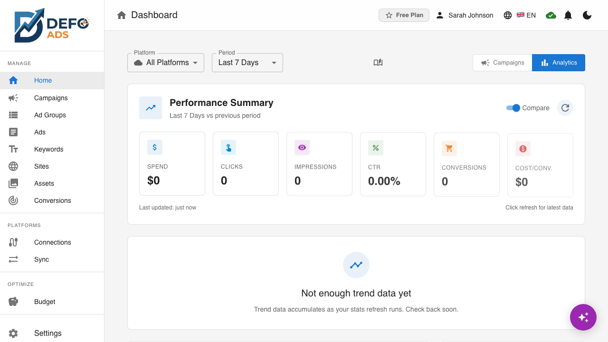
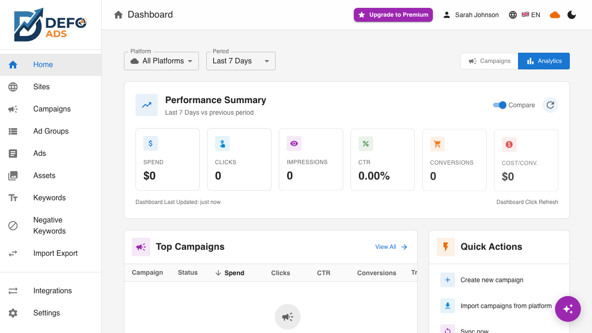

[Home](../README.md) > Premium Features

# Premium Features

Defo Ads includes cloud sync, managed AI, Google Ads integration, performance analytics, and team collaboration. This page provides an overview of every feature and how to get started.

---

## What You Get

Defo Ads is a connected, intelligent ads management platform. Here is what is included:

### Cloud Sync & Google Ads Integration

| Feature | Description | Learn More |
|---------|-------------|------------|
| **Google Ads Connection** | Connect your Google Ads accounts via OAuth for seamless integration | [Google Ads Connection](google-ads-connection.md) |
| **Microsoft Advertising** | Connect Microsoft Advertising for Bing, Yahoo, DuckDuckGo reach | [Connections](integrations.md) |
| **Bidirectional Sync** | Import campaigns from Google Ads and export your drafts back | [Sync](sync.md) |
| **Quick Sync** | One-click sync that remembers your last configuration | [Quick Sync](quick-sync.md) |
| **Scheduled Sync** | Automatic background syncs on a configurable schedule | [Scheduled Sync](scheduled-sync.md) |
| **Connections** | Manage all connected advertising platforms from one dedicated page | [Connections](integrations.md) |
| **Conversions** | Track and manage conversion actions across platforms | [Conversions](conversions.md) |

### Budget & Optimization

| Feature | Description | Learn More |
|---------|-------------|------------|
| **Global Budget** | Set a single daily or monthly budget for your entire account with automatic distribution across campaigns, real-time pacing, and spend tracking | [Budget Management](budget.md) |
| **AI Autopilot** | 24/7 autonomous campaign optimization across Google Ads and Microsoft Advertising — bid management, ad testing, budget allocation, and audience targeting on full autopilot | [AI Autopilot](autopilot.md) |

### AI & Creative

| Feature | Description | Learn More |
|---------|-------------|------------|
| **Managed AI** | Server-side AI generation with no API key needed | [AI Assistant](../guides/ai-assistant.md) |
| **AI Assistant** | Chat-based campaign management using natural language | [AI Assistant](../guides/ai-assistant.md) |
| **Asset Library** | Centralized image and logo management for campaigns | [Asset Library](asset-library.md) |

### Analytics & Insights

| Feature | Description | Learn More |
|---------|-------------|------------|
| **Performance Dashboard** | KPI cards, trend charts, and campaign rankings | [Performance Dashboard](performance-dashboard.md) |

### Collaboration & Account

| Feature | Description | Learn More |
|---------|-------------|------------|
| **Team Collaboration** | Invite members, assign roles, and share campaigns | [Team Collaboration](team-collaboration.md) |
| **User Profile** | Manage your account, view usage stats, and handle billing | [User Profile](user-profile.md) |
| **Subscription Management** | Choose plans, manage billing, and track quotas | [Subscription](subscription.md) |

---

## Feature Highlights

### Managed AI

You do not need to provide your own OpenAI API key. Defo Ads manages AI generation on the server side, giving you access to multiple AI models depending on your plan. Your daily token and image generation limits are included in your subscription.

### Bidirectional Google Ads Sync

Import your existing campaigns from Google Ads to manage them in Defo Ads, or export your locally crafted campaigns directly to Google Ads. Changes flow in both directions, keeping everything in sync.

### Performance Analytics

Track your campaign performance with interactive dashboards. See spend, clicks, impressions, CTR, and conversions at a glance with sparkline trends and period-over-period comparisons.

### AI Assistant

Use natural language to create, edit, and manage campaigns. The AI Assistant understands your context and proposes changes as drafts that you approve before they take effect.

---

## How to Get Premium

Getting started with Premium takes just a few steps:

1. **Sign up** for a Defo Ads account if you have not already
2. **Start your free trial** — a trial is automatically activated when you create your account
3. **Choose a plan** when you are ready — visit [Subscription](subscription.md) to see available plans
4. **Complete checkout** via Stripe for instant activation

For full details on plans, pricing, and billing, see the [Subscription & Billing](subscription.md) guide.

---

## Quick Start Checklist

New to Premium? Follow this path to get the most out of your subscription:

- [ ] Sign up and activate your free trial
- [ ] Connect your Google Ads account — [Google Ads Connection](google-ads-connection.md)
- [ ] Import your existing campaigns — [Sync](sync.md)
- [ ] Set your global budget — [Budget Management](budget.md)
- [ ] Explore the Performance Dashboard — [Performance Dashboard](performance-dashboard.md)
- [ ] Try the AI Assistant — [AI Assistant](../guides/ai-assistant.md)
- [ ] Upload campaign assets — [Asset Library](asset-library.md)
- [ ] Invite your team — [Team Collaboration](team-collaboration.md)

---

## Need Help?

- [Plans](../getting-started/plans.md) — Plan details and features
- [Troubleshooting](../troubleshooting/) — Solutions for common issues
- [Reference](../reference/) — Detailed technical reference

---

**Related:**
- [Plans](../getting-started/plans.md)
- [Subscription & Billing](subscription.md)
- [Getting Started Guide](../getting-started/)
