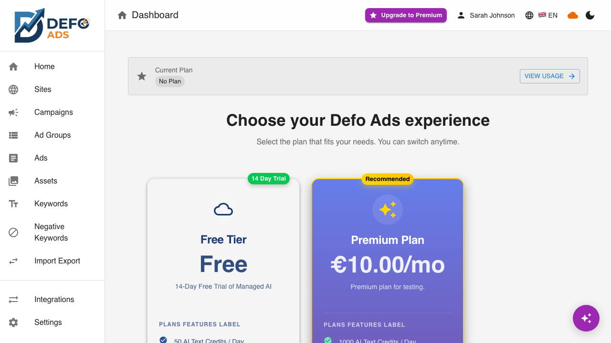

[Home](../README.md) > Premium Features

> **Premium Feature** — This feature requires a Defo Ads Premium subscription. [Compare plans](../getting-started/free-vs-premium.md)

# Premium Features

Defo Ads Premium unlocks the full power of campaign management with cloud sync, managed AI, Google Ads integration, performance analytics, and team collaboration. This page provides an overview of every premium feature and how to get started.

---

## What Premium Unlocks

Premium takes Defo Ads beyond local campaign drafting and gives you a connected, intelligent ads management platform. Here is what you get:

### Cloud Sync & Google Ads Integration

| Feature | Description | Learn More |
|---------|-------------|------------|
| **Google Ads Connection** | Connect your Google Ads accounts via OAuth for seamless integration | [Google Ads Connection](google-ads-connection.md) |
| **Bidirectional Sync** | Import campaigns from Google Ads and export your drafts back | [Sync](sync.md) |
| **Quick Sync** | One-click sync that remembers your last configuration | [Quick Sync](quick-sync.md) |
| **Scheduled Sync** | Automatic background syncs on a configurable schedule | [Scheduled Sync](scheduled-sync.md) |
| **Integrations Hub** | Manage all connected advertising platforms from one page | [Integrations](integrations.md) |

### AI & Content

| Feature | Description | Learn More |
|---------|-------------|------------|
| **Managed AI** | Server-side AI generation with no API key needed | [AI Assistant](../guides/ai-assistant.md) |
| **AI Assistant** | Chat-based campaign management using natural language | [AI Assistant](../guides/ai-assistant.md) |
| **Asset Library** | Centralized image and logo management for campaigns | [Asset Library](asset-library.md) |

### Analytics & Insights

| Feature | Description | Learn More |
|---------|-------------|------------|
| **Performance Dashboard** | KPI cards, trend charts, and campaign rankings | [Performance Dashboard](performance-dashboard.md) |

### Collaboration & Account

| Feature | Description | Learn More |
|---------|-------------|------------|
| **Team Collaboration** | Invite members, assign roles, and share campaigns | [Team Collaboration](team-collaboration.md) |
| **User Profile** | Manage your account, view usage stats, and handle billing | [User Profile](user-profile.md) |
| **Subscription Management** | Choose plans, manage billing, and track quotas | [Subscription](subscription.md) |

---

## Feature Highlights

### Managed AI

With Premium, you do not need to provide your own OpenAI API key. Defo Ads manages AI generation on the server side, giving you access to multiple AI models depending on your plan. Your daily token and image generation limits are included in your subscription.

### Bidirectional Google Ads Sync

Import your existing campaigns from Google Ads to manage them in Defo Ads, or export your locally crafted campaigns directly to Google Ads. Changes flow in both directions, keeping everything in sync.

### Performance Analytics

Track your campaign performance with interactive dashboards. See spend, clicks, impressions, CTR, and conversions at a glance with sparkline trends and period-over-period comparisons.

### AI Assistant

Use natural language to create, edit, and manage campaigns. The AI Assistant understands your context and proposes changes as drafts that you approve before they take effect.

---

## How to Get Premium

Getting started with Premium takes just a few steps:

1. **Sign up** for a Defo Ads account if you have not already
2. **Start your free trial** — a trial is automatically activated when you create your account
3. **Choose a plan** when you are ready — visit [Subscription](subscription.md) to see available plans
4. **Complete checkout** via Stripe for instant activation

For full details on plans, pricing, and billing, see the [Subscription & Billing](subscription.md) guide.

---

## Already Using the Free Version?

If you have been using the free (open-source) version of Defo Ads, upgrading to Premium is straightforward:

### What Happens When You Upgrade

1. **Create an account** — Sign up with your email or Google account
2. **Your local campaigns are preserved** — Campaigns stored in your browser remain accessible
3. **Cloud sync activates** — Your campaigns can now be synced to the cloud for access on any device
4. **AI switches to managed** — No more need for your own OpenAI API key (though you can still use one if you prefer)

### What You Keep

- All campaigns you created in the free version stay in your browser's local storage
- You can import them into your cloud account via the sync features
- Your workflow and interface remain familiar — Premium adds features on top of the same experience

### Free Version Still Works

Even after upgrading, the free open-source version continues to function independently. Premium is an extension, not a replacement. You can use both if you wish.

---

## Quick Start Checklist

New to Premium? Follow this path to get the most out of your subscription:

- [ ] Sign up and activate your free trial
- [ ] Connect your Google Ads account — [Google Ads Connection](google-ads-connection.md)
- [ ] Import your existing campaigns — [Sync](sync.md)
- [ ] Explore the Performance Dashboard — [Performance Dashboard](performance-dashboard.md)
- [ ] Try the AI Assistant — [AI Assistant](../guides/ai-assistant.md)
- [ ] Upload campaign assets — [Asset Library](asset-library.md)
- [ ] Invite your team — [Team Collaboration](team-collaboration.md)

---

## Need Help?

- [Getting Started Guide](../getting-started/free-vs-premium.md) — Compare free and premium features side by side
- [Troubleshooting](../troubleshooting/) — Solutions for common issues
- [Reference](../reference/) — Detailed technical reference

---

**Related:**
- [Free vs Premium Comparison](../getting-started/free-vs-premium.md)
- [Subscription & Billing](subscription.md)
- [Getting Started Guide](../getting-started/)
