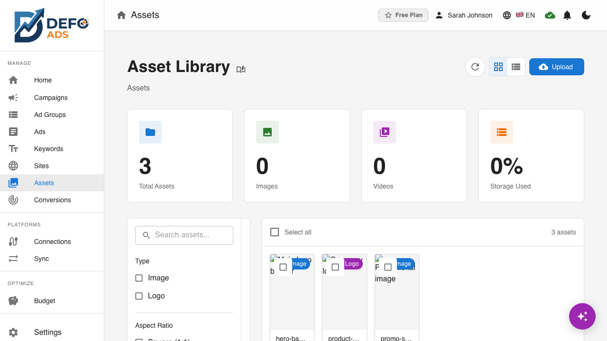
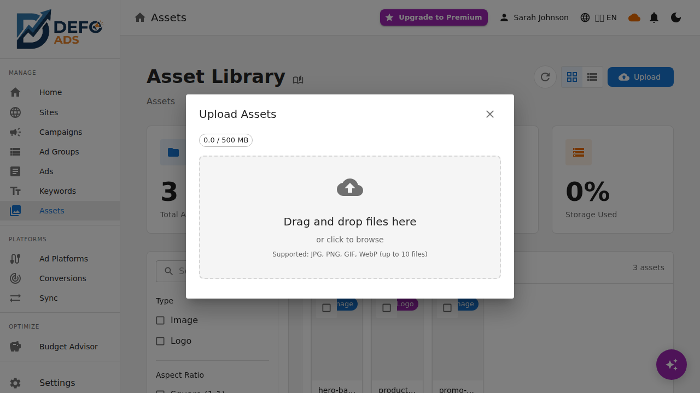
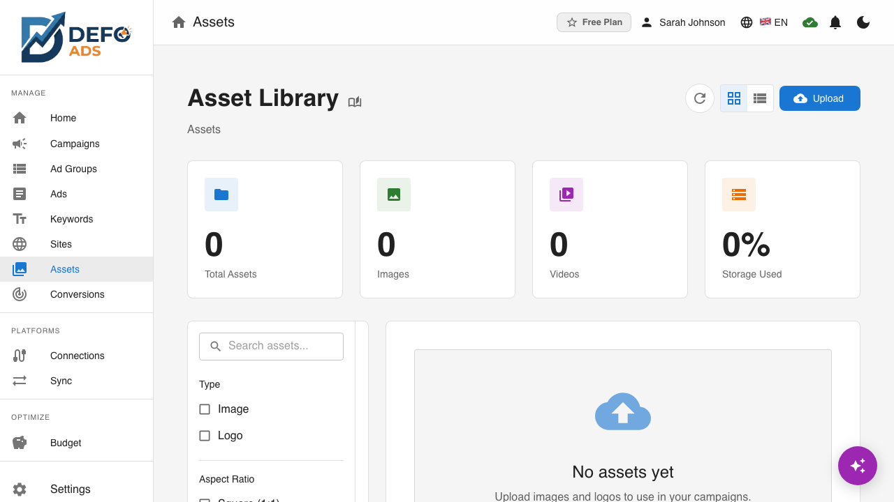
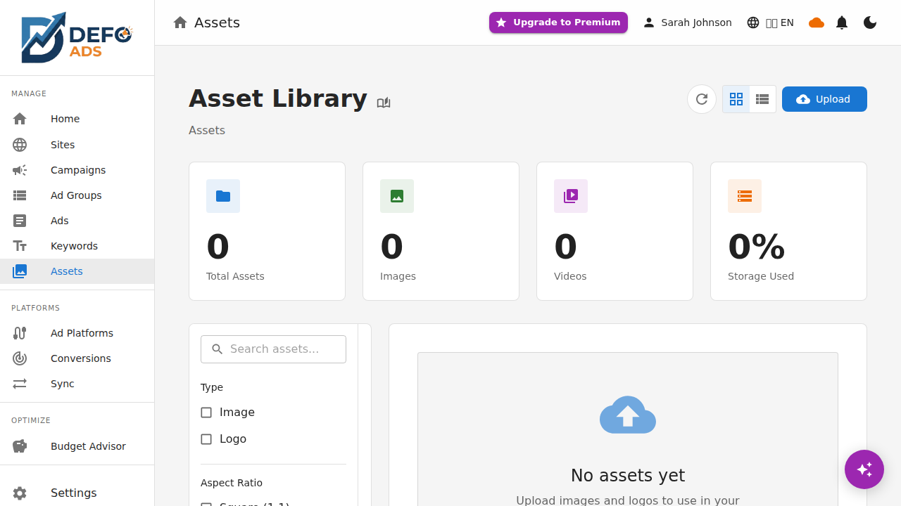

[Home](../README.md) > [Premium](README.md) > Asset Library

> See [Plans](../getting-started/plans.md) for feature details.

# Asset Library

The Asset Library is your centralized hub for managing campaign images and logos. Upload, organize, and attach visual assets to your campaigns — all from one place. Display and Performance Max campaign types require images, and the Asset Library makes managing them straightforward.

---

## What Is the Asset Library?

The Asset Library stores all your campaign images in the cloud. Instead of uploading images individually for each campaign, you upload them once to the library and then select them when creating or editing campaigns.

This approach gives you:

- **Reusability** — Use the same image across multiple campaigns
- **Organization** — All your assets in one searchable location
- **Quota visibility** — See how much storage you have used and how much remains

---

## Accessing the Asset Library

Navigate to the **Assets** page from the sidebar menu. The Asset Library is available to all Premium users.

---

## Uploading Assets

### How to Upload

1. Click the **Upload** button at the top of the Asset Library page
2. A file picker dialog opens
3. Select one or more image files from your device
4. The images upload and appear in the library

You can also drag and drop files directly onto the Asset Library page.

### Supported File Formats

| Format | Extension | Notes |
|--------|-----------|-------|
| **JPEG** | .jpg, .jpeg | Best for photographs and complex images |
| **PNG** | .png | Best for graphics with transparency |
| **WebP** | .webp | Modern format with good compression |
| **GIF** | .gif | Supported for static images (animations not used in ads) |

### File Size Limit

Each image file can be up to **5 MB** in size. Files exceeding this limit are rejected with an error message. To reduce file size:

- Use image compression tools before uploading
- Convert to WebP format for better compression
- Resize images to the recommended dimensions

### Upload Progress

When uploading, a progress indicator shows:

- Upload percentage for each file
- Success confirmation when complete
- Error message if a file fails validation

---

## Asset Types

Google Ads campaigns use two primary image types, and the Asset Library supports both:

### Marketing Images

- **Aspect ratio:** Landscape (1.91:1)
- **Recommended resolution:** 1200 x 628 pixels
- **Used in:** Display campaigns, Performance Max campaigns
- **Purpose:** Primary ad visuals that appear alongside your ad copy

Marketing images are the main visual component of image-based ad formats. They should be eye-catching, relevant to your product or service, and comply with Google Ads image policies.

### Logos

- **Aspect ratio:** Square (1:1)
- **Recommended resolution:** 1200 x 1200 pixels
- **Used in:** Display campaigns, Performance Max campaigns
- **Purpose:** Brand identification in ad units

Logos appear in smaller sizes within ad units and should be recognizable even at reduced dimensions. Use clean, simple designs with good contrast.

---

## Organizing Your Assets

### View Modes

The Asset Library supports two view modes:

| Mode | Description |
|------|-------------|
| **Grid view** | Thumbnail grid showing image previews — best for visual browsing |
| **List view** | Table format with file name, type, size, and upload date — best for detailed information |

Toggle between views using the view mode buttons at the top of the library.

### Filtering

Use the filter bar to narrow down assets:

- **By type** — Show only Marketing Images or only Logos
- **By upload date** — Sort by newest or oldest
- **By name** — Search for assets by file name

Filtering is especially useful as your library grows and you need to find specific assets quickly.

### Asset Details

Click any asset to view its details:

| Field | Description |
|-------|-------------|
| **File name** | Original file name |
| **Type** | Marketing Image or Logo |
| **Dimensions** | Width x height in pixels |
| **File size** | Size in KB or MB |
| **Upload date** | When the asset was added |
| **Used in** | List of campaigns using this asset |

---

## Using Assets in Campaigns

### During Campaign Creation

When creating a Display or Performance Max campaign, you reach a step where images are required:

1. The campaign editor shows an **Add Images** section
2. Click **Select from Library** to open the Asset Library picker
3. Browse or search for the images you want
4. Select one or more images and click **Add**
5. The selected images are attached to the campaign

### Asset Requirements by Campaign Type

| Campaign Type | Marketing Images | Logos | Required? |
|--------------|-----------------|-------|-----------|
| **Search** | Not used | Not used | No |
| **Display** | Yes | Yes | Yes |
| **Performance Max** | Yes | Yes | Yes |
| **Shopping** | Not used | Not used | No |

### Removing Assets from Campaigns

To remove an image from a campaign:

1. Open the campaign editor
2. Navigate to the images section
3. Click the remove button on the image you want to detach
4. The image is removed from the campaign but remains in your Asset Library

---

## Storage Quota

Your Asset Library storage is determined by your subscription plan.

### Viewing Your Quota

The storage quota is displayed at the top of the Asset Library page:

- **Used storage** — How much space your current assets occupy
- **Total quota** — Your plan's storage limit
- **Visual progress bar** — Shows usage as a percentage

The quota is also visible on the [User Profile](user-profile.md) page under usage statistics.

### When You Reach Your Limit

If you reach your storage quota:

- New uploads are blocked with a "Storage limit reached" message
- Existing assets remain accessible and usable
- You can free up space by deleting unused assets
- Upgrading your plan increases your storage quota

---

## Batch Actions

### Selecting Multiple Assets

To perform actions on multiple assets at once:

1. Switch to the selection mode (checkbox appears on each asset)
2. Click the checkbox on each asset you want to select
3. Use the **Select All** option to select all visible assets
4. The batch action bar appears at the top or bottom of the page

### Available Batch Actions

| Action | Description |
|--------|-------------|
| **Delete** | Remove all selected assets permanently |

### Batch Deletion

1. Select the assets you want to delete
2. Click the **Delete** button in the batch action bar
3. A confirmation dialog shows the number of assets to be deleted
4. If any selected assets are currently used in campaigns, a warning is shown
5. Confirm to proceed with deletion

Deleted assets cannot be recovered. Assets that are in use by campaigns will be detached from those campaigns when deleted.

---

## Tips and Best Practices

### Image Quality

- Upload the highest resolution images you have (within the 5 MB limit)
- Google Ads may display images at various sizes, so higher resolution ensures sharpness
- Avoid images with excessive text — Google Ads may reject them

### Organization

- Use descriptive file names before uploading (e.g., "summer-sale-banner-2026.jpg" instead of "IMG_4521.jpg")
- Regularly review and delete assets you no longer need to manage storage
- Check the "Used in" field before deleting to avoid breaking campaign references

### Performance

- WebP format offers the best file size to quality ratio
- Keep logos simple and high-contrast for readability at small sizes
- Test how your images look at different sizes by previewing them in campaign creation

---

**Related:**
- [Premium Features Overview](README.md) — All premium features
- [Subscription & Billing](subscription.md) — Storage quotas by plan
- [User Profile](user-profile.md) — View storage usage
- [Bidirectional Sync](sync.md) — Assets and sync behavior
