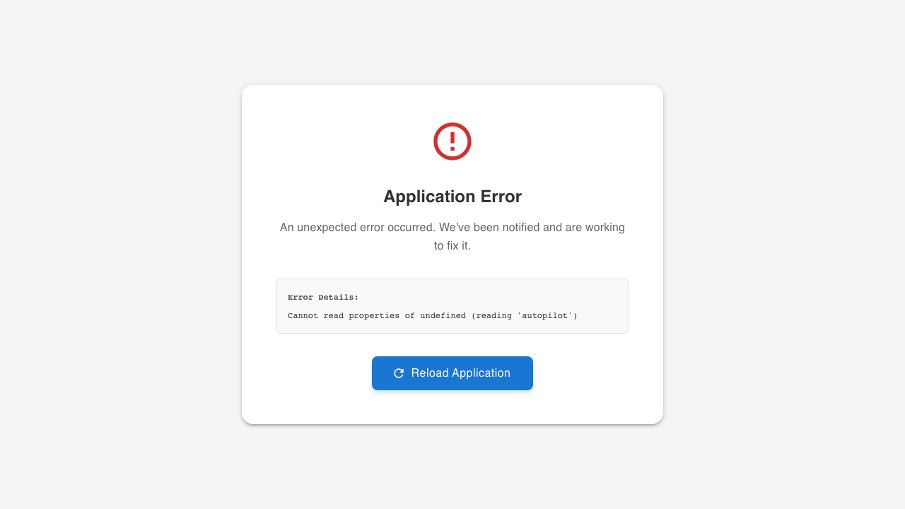

[Home](../README.md) > [Premium Features](README.md) > AI Autopilot

# AI Autopilot — Your 24/7 Campaign Optimizer

AI Autopilot is your personal, always-on campaign manager. It monitors your Google Ads and Microsoft Advertising campaigns around the clock, makes data-driven optimizations, and keeps you informed of every decision — so you get expert-level results without the expert-level time investment.

---

## How It Works

Autopilot operates in a continuous optimization loop across three stages:

### 1. Learning (Days 1–14)

When you activate Autopilot, it enters a learning phase to understand your campaigns:

- Collects daily performance baselines across all your campaigns
- Maps which ads, keywords, and audiences perform above or below average
- Establishes your CTR, CPC, and spend benchmarks
- Generates early recommendations even before optimizations begin

You'll see progress on your dashboard: "Autopilot is learning your campaigns — Day 5 of 14."

### 2. Optimize

Once Autopilot has enough data, it begins active optimization cycles:

| What It Optimizes | How Often | What It Does |
|-------------------|-----------|--------------|
| **Ad Performance** | Every 24h | Compares ads within each ad group. Pauses underperformers, keeps winners running. Uses statistical significance — no guesswork. |
| **Keyword Bids** | Every 24h | Increases bids on high-CTR keywords to capture more clicks. Decreases bids on low performers. Adds negative keywords to eliminate wasted spend. |
| **Budget Allocation** | Every 48h | Shifts budget from underperforming campaigns to overperformers. Ensures your money goes where the clicks are. |
| **Audience Targeting** | Weekly | Analyzes device, location, and time-of-day performance. Adjusts bid modifiers to concentrate budget on your best-performing segments. |

### 3. Report & Learn

Every week, Autopilot generates a performance report comparing this week to last week and to your pre-Autopilot baseline:

- **What changed** — clicks, CTR, CPC, spend with trend indicators
- **What Autopilot did** — summary of all optimizations with reasoning
- **What's next** — the AI's planned focus for the coming week

---

## Two Modes — You Choose the Level of Control

### Recommend Mode

Autopilot analyzes your campaigns and presents recommendations as actionable cards. You review each suggestion, see the reasoning and expected impact, then apply or dismiss with one click.

Best for: Users who want AI insights but prefer to approve every change.

### Auto-Optimize Mode

Autopilot makes changes and syncs them to Google Ads and Microsoft Advertising automatically. You stay informed via the real-time activity feed and weekly reports, but the AI handles the execution.

Best for: Users who want hands-off optimization and trust the AI's judgment.

> You can switch between modes at any time. Start with Recommend to build confidence, then graduate to Auto-Optimize when you're ready.

---

## Cross-Platform: Google Ads + Microsoft Advertising

Autopilot optimizes campaigns across both platforms from a single dashboard:

- **Unified budget tracking** — your monthly cap applies across both platforms combined
- **Per-platform reporting** — see how each platform performs side by side
- **Cross-platform learning** — patterns discovered on Google Ads inform Microsoft Ads optimization, and vice versa
- **Platform-aware** — handles each platform's unique constraints (e.g., Microsoft Ads' negative keyword match type restrictions)

---

## Budget Safety — You Stay in Control

Autopilot has hard guardrails that it can never override:

| Guardrail | What It Does |
|-----------|-------------|
| **Monthly Budget Cap** | Your absolute maximum. Autopilot pauses campaigns if projected spend reaches the cap. |
| **Maximum CPC** | No keyword bid can exceed your ceiling, regardless of AI recommendation. |
| **Bid Change Limits** | Bids change by max 15% per cycle — small, safe increments. |
| **Budget Shift Limits** | Max 25% of any campaign's budget can be moved per cycle. |
| **Pause Protection** | Autopilot never pauses the last active ad in an ad group. |
| **Minimum Data** | No action on entities with fewer than 100 impressions. |
| **Auto-Revert** | If a change causes CTR to drop more than 20% within 48 hours, it's automatically rolled back. |

---

## Activity Feed — Full Transparency

Every action Autopilot takes is logged with a timestamp, the entity affected, the reasoning, and the expected impact. Nothing happens in a black box.

- Bid adjustments, ad pauses, budget shifts, negative keywords — all visible
- Color-coded by type for quick scanning
- Filterable by campaign, action type, and date range
- Expandable detail showing before/after values

---

## Real-Time Alerts

Autopilot notifies you immediately when something important happens:

- **Budget pacing** — projected to exceed your monthly cap
- **Performance drop** — CTR declined more than 30% day-over-day
- **Auto-revert** — a change was rolled back due to underperformance
- **Sync failure** — changes couldn't be pushed to the ad platform
- **Escalation** — the AI needs your input after repeated unsuccessful optimizations

---

## Getting Started

1. **Activate Autopilot** from the main navigation (when enabled on your account)
2. **Choose your mode** — Recommend Only or Auto-Optimize
3. **Set your budget** — monthly cap, max CPC, and daily flexibility
4. **Select campaigns** — choose specific campaigns or "All campaigns"
5. **Activate** — Autopilot begins learning immediately

The learning phase takes 7–14 days depending on your campaign volume. During this time, you'll already receive insights and recommendations.

---

## FAQ

**Does Autopilot work with both Google Ads and Microsoft Advertising?**
Yes. Autopilot optimizes campaigns across both platforms and tracks your budget across all platforms combined. It handles platform-specific differences automatically.

**Can Autopilot exceed my budget?**
No. Your monthly budget cap is a hard limit that Autopilot can never override. It checks spend pacing every 6 hours and reduces daily budgets if it projects an overspend.

**What happens if Autopilot makes a bad change?**
If a change causes CTR to drop more than 20% within 48 hours, Autopilot automatically reverts it and logs the reason. After 3 unsuccessful attempts on the same entity, it escalates to you for review.

**Can I switch between Recommend and Auto-Optimize?**
Yes, at any time. Switching to Recommend pauses any pending auto-changes. Switching to Auto-Optimize shows a confirmation dialog.

**How is this different from Google's Smart Bidding?**
Smart Bidding handles auction-level bid optimization (about 20% of campaign management). Autopilot handles the other 80%: cross-campaign budget allocation, ad creative evaluation, keyword discovery, negative keyword management, audience targeting, and cross-platform coordination. They work together.

**What if I'm not ready for full automation?**
Start with Recommend mode. Review suggestions, apply the ones you agree with. Once you see consistent value, switch to Auto-Optimize. You're always in control.

---

*Autopilot is available on eligible premium plans. Contact your account administrator or upgrade your plan to get started.*
