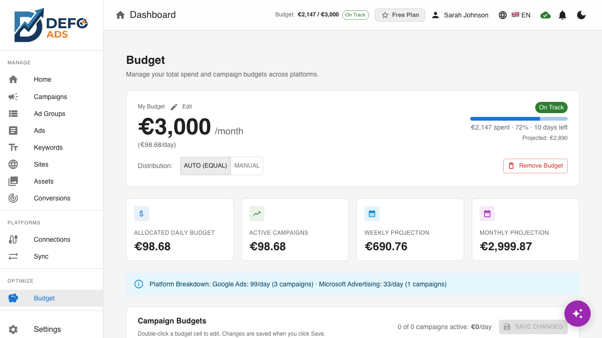
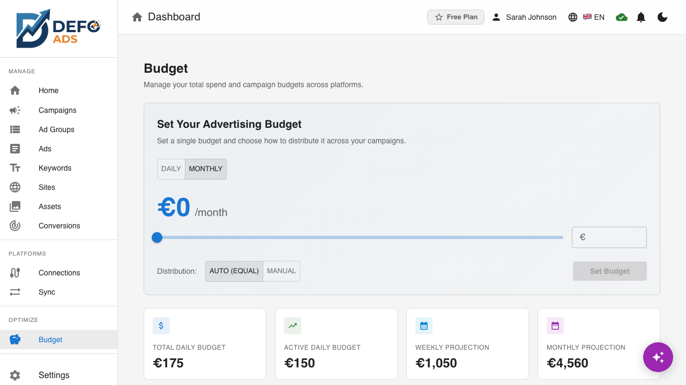
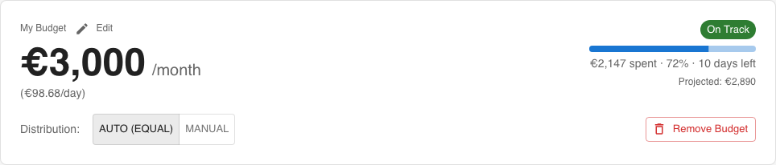
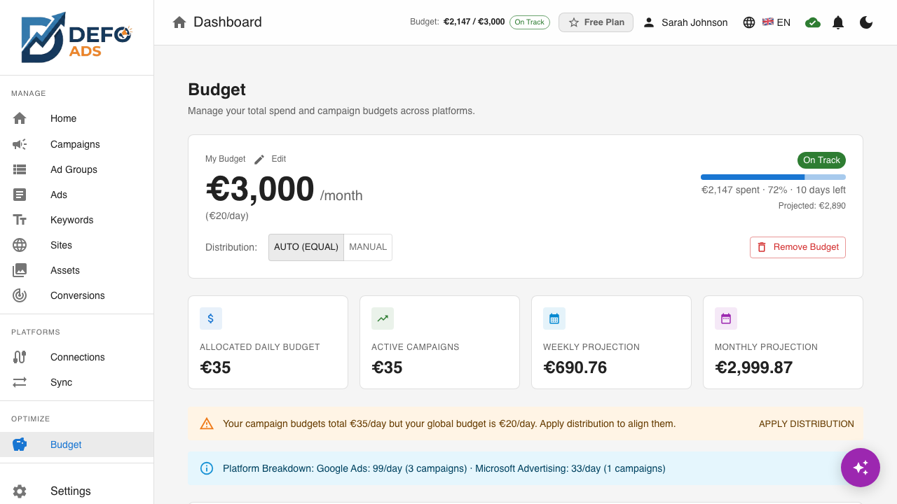
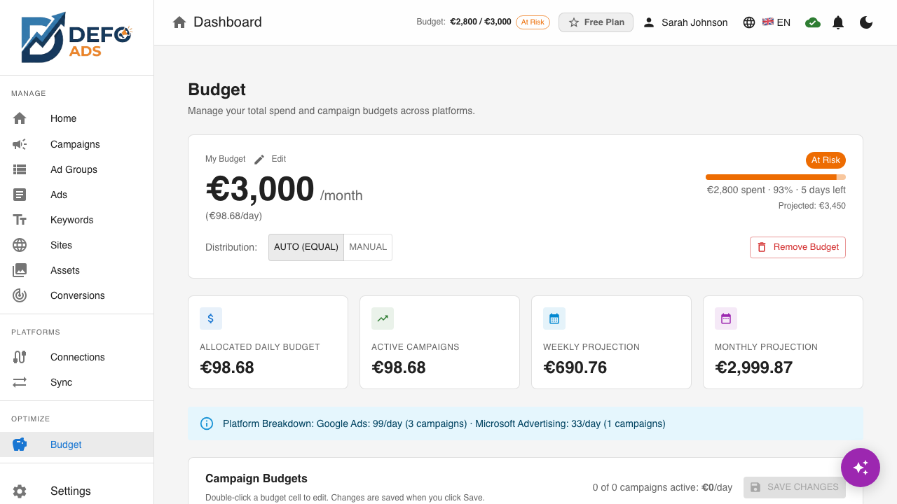

[Home](../README.md) > [Premium Features](README.md) > Budget Management

# Budget Management — One Budget, Total Control

Set a single global budget for your entire account and let Defo Ads distribute it across your campaigns. No more juggling individual campaign budgets — set your monthly or daily limit once and stay in control.



---

## How It Works

Budget management follows a simple hierarchy:

```
Your Global Budget          (e.g., "I want to spend 3,000/month")
  Campaign Budgets          (auto-distributed or manually set)
    Platform Split          (auto or manual per-campaign)
```

You set one number. The system handles the rest.

---

## Setting Your Budget

Navigate to **Budget** in the sidebar. If no budget is configured, you'll see a setup card:



1. **Enter your budget** using the slider or type a precise amount
2. **Choose a period** — Daily or Monthly (auto-converts using the 30.4 factor)
3. **Click Set Budget** — your budget is live immediately

The slider shows a live preview of the monthly/daily equivalent and per-campaign allocation.

---

## The Budget Dashboard

Once configured, the Budget page shows everything at a glance:

### Budget Header

The top card shows your global budget with real-time spend tracking:



| Element | What It Shows |
|---------|--------------|
| **Amount** | Your total budget (e.g., 3,000/month) with daily equivalent |
| **Progress bar** | How much you've spent vs your total budget |
| **Pacing status** | On Track (green), At Risk (amber), or Over Budget (red) |
| **Projection** | Estimated month-end spend based on current burn rate |
| **Days remaining** | Days left in the current billing period |

Click **Edit** to adjust your budget inline — a slider and text field appear within the card. Save applies the new budget and redistributes across campaigns automatically.

### Distribution Modes

Choose how your budget is split across campaigns:

| Mode | Behavior |
|------|----------|
| **Auto (Equal)** | Budget is split equally across all active campaigns. Adding or pausing a campaign triggers automatic redistribution. |
| **Manual** | You set each campaign's budget individually. Total cannot exceed the global cap. |
| **Performance** | Available when Autopilot is active. AI shifts budget toward your best-performing campaigns. |

### Metric Cards

Below the header, four cards show actual campaign budget totals:

- **Allocated Daily Budget** — sum of all campaign daily budgets
- **Active Campaigns** — budget allocated to enabled campaigns only
- **Weekly Projection** — daily total multiplied by 7
- **Monthly Projection** — daily total multiplied by 30.4

### Campaign Budget Grid

The grid shows every campaign with its daily budget, status, platform links, and sync state. Double-click a budget cell to edit inline. Changes are saved when you click **Save Changes**.

---

## Budget Warnings & Safety

### Mismatch Warning

If your campaign budgets don't match your global cap (e.g., you set a 20/day cap but a campaign has 35/day), a warning appears with an **Apply Distribution** button to realign them.



### At-Risk Pacing

When projected month-end spend exceeds your budget, the pacing chip turns amber:



### Hard Cap (Optional)

Enable "Pause all campaigns when budget is reached" to prevent any overspend. This is off by default — enable it from the Budget page if you need a strict ceiling.

---

## Budget in Campaign Creation

When you create a new campaign with a global budget active:

- **Auto mode**: The wizard defaults to auto-allocation — no budget input needed. Your budget is redistributed equally after creation.
- **Manual mode**: A budget field appears capped at your remaining daily capacity.
- **No global budget**: The standard slider (5-500/day) appears as before.

The wizard shows your global budget context: total budget, allocated amount, and remaining capacity.

---

## Budget in Campaign Editing

When editing a campaign's budget with a global budget active, you'll see:

- A context banner showing what percentage of your global budget this campaign uses
- Remaining capacity for other campaigns
- Validation that prevents exceeding your global cap


In Auto mode, changing a campaign's budget shows a lock warning — the campaign will be excluded from future auto-redistribution.

---

## Budget and Autopilot

When [AI Autopilot](autopilot.md) is active, it reads your global budget directly — no separate configuration needed. Autopilot's "Performance" distribution mode shifts budget toward your best-performing campaigns while respecting your global cap.

Budget guardrails (monthly cap, max CPC, shift limits) are enforced on every Autopilot optimization cycle.

---

## Budget and Sync

After budget changes are applied, campaigns show as **pending sync** in the sync badge. Budget changes are exported to Google Ads and Microsoft Advertising on your next sync — either manually or via scheduled sync.

> **Note:** Google Ads may spend up to 2x your daily budget on high-traffic days, but will not exceed your monthly limit (daily budget x 30.4). This is a platform behavior, not a Defo Ads setting.

---

## Removing Your Budget

Click **Remove Budget** on the Budget page to delete the global budget. Campaign budgets remain at their current values but are no longer governed by a global cap.

---

## FAQ

**What happens when I add a new campaign?**
In Auto mode, the budget is redistributed equally across all campaigns (including the new one). In Manual mode, you set the new campaign's budget yourself.

**Can I lock a campaign's budget?**
Yes. In Auto mode, manually editing a campaign's budget locks it at that amount. Other campaigns redistribute the remaining budget. Locked campaigns show a lock icon in the grid.

**What currency does the global budget use?**
The global budget uses your primary currency. Campaigns in other currencies show converted amounts.

**Does the global budget work with both Google Ads and Microsoft Advertising?**
Yes. Platform-level budget splits (if configured per-campaign) operate within the global cap.

---

*Budget Management is available on all premium plans.*
