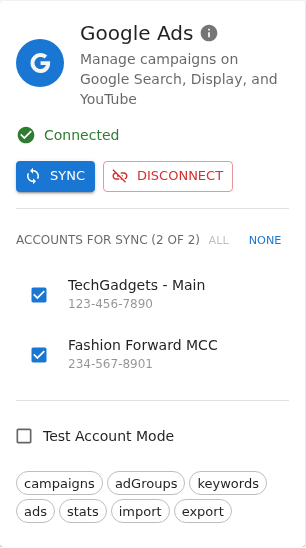
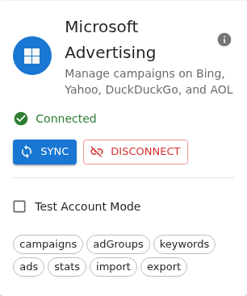

# Connections

Defo Ads connects to major advertising platforms so you can manage all your campaigns from a single interface. The **Connections** page provides a central hub for managing your platform connections, with an overview of all platforms and dedicated tabs for each.

<!-- TODO: Replace with updated screenshot showing new Connections view -->

## Supported Platforms

| Platform | Authentication | Networks |
|----------|---------------|----------|
| **Google Ads** | Google OAuth | Google Search, YouTube, Display Network, Shopping, Maps |
| **Microsoft Advertising** | Azure Entra ID (OAuth) | Bing, Yahoo, DuckDuckGo, AOL |

> **Note:** Microsoft Advertising integration is available on Premium plans.

---

## Page Layout

The Connections page uses a tabbed layout:

- **Overview** — A dashboard showing all platforms at a glance with status summaries
- **Google Ads** — Detailed management for your Google Ads connection
- **Microsoft Ads** — Detailed management for your Microsoft Advertising connection

You can navigate directly to a specific platform tab using deep links (e.g., `/connections/google` or `/connections/msads`). These deep links are used throughout the app — in sync error messages, notifications, and AI assistant responses.

### Overview Tab

The Overview tab displays:

- **Summary statistics** — Supported platforms, connected count, and platforms needing attention
- **Platform cards** — One card per platform showing:
  - Platform icon and name
  - Connection status badge (Connected, Expired, or Not Connected)
  - Selected account name (if connected)
  - Action button: **Manage** (connected), **Reconnect** (expired), or **Connect** (disconnected)

---

## Connecting Google Ads

1. Go to **Connections** and click the **Google Ads** tab (or click **Connect** on the Overview card).
2. Click the **Connect** button.
3. A Google OAuth popup window opens — sign in with the Google account associated with your Google Ads account.
4. Review the requested permissions and click **Allow**.
5. After authorization, Defo Ads retrieves your available Google Ads accounts.
6. Select the account you want to connect.
7. If you manage multiple accounts through a Manager (MCC) account, choose the specific sub-account.

<!-- TODO: Replace screenshot -->

### Google Ads Configuration

Once connected, you can configure:

- **Test Mode** — Enable to use a test/sandbox account for development
- **MCC ID** — Specify a Manager Account ID when using MCC accounts

---

## Connecting Microsoft Advertising

1. Go to **Connections** and click the **Microsoft Ads** tab (or click **Connect** on the Overview card).
2. Click the **Connect** button.
3. A Microsoft OAuth popup opens, powered by Azure Entra ID.
4. Sign in with the Microsoft account linked to your Microsoft Advertising account.
5. Review the requested permissions and click **Accept**.
6. Select the account you want to connect.

### Microsoft Advertising Networks

When you connect Microsoft Advertising, your campaigns can reach users across multiple search networks:

- **Bing** — Microsoft's primary search engine
- **Yahoo** — Syndicated search results
- **DuckDuckGo** — Privacy-focused search engine
- **AOL** — Syndicated search results

<!-- TODO: Replace screenshot -->

---

## Platform Detail Tabs

Each platform's dedicated tab provides several sections:

### Connection Status Banner

A color-coded banner at the top showing the current connection state:

- **Connected (green)** — Shows account name, ID, and last sync timestamp
- **Expired (orange)** — Auth has expired, with a reconnect prompt
- **Disconnected (gray)** — Not connected, with a connect button

### Account Selection

If you have access to multiple accounts on a platform:

- A list of available accounts with checkboxes
- Accounts with linked campaigns are **locked** (cannot be deselected) — a lock icon explains why
- **Select All** / **Deselect All** buttons for convenience
- Account selection is saved automatically

### Usage & Statistics

When connected, you can see:

- **API Quota** — A usage bar showing API calls consumed vs. limit, color-coded (green, yellow, red), with time until reset
- **Performance Overview** — Summary metrics (Impressions, Clicks, Cost, CTR) with trend indicators and a daily performance chart for the last 30 days

### Troubleshooting Section

An expandable accordion with platform-specific guidance and a **Copy Connection Link** button for support troubleshooting.

---

## Managing Connections

### Connection Status

| Status | Indicator | Meaning |
|--------|-----------|---------|
| **Connected** | Green checkmark | Platform is connected and functioning normally |
| **Expired** | Orange warning | Authorization needs renewal — click **Reconnect** |
| **Not Connected** | Gray | Platform is not connected |

### Disconnecting a Platform

1. Go to **Connections** and open the platform's tab.
2. Click the **Disconnect** button.
3. Confirm the disconnection in the dialog.

> **Important:** Disconnecting a platform does not delete any campaigns you have already synced. It only stops synchronization with that platform. Your OAuth tokens are revoked on disconnect.

### Reconnecting a Platform

If your connection expires or encounters an error:

1. Go to **Connections** — the affected platform shows an **Expired** status.
2. Click **Reconnect**.
3. Complete the authorization flow again.
4. Your previous account selection will be restored if available.

### Copy Auth Link

If you need to complete the OAuth flow in a different browser, click the **Copy Auth Link** icon button to get the authorization URL.

<!-- TODO: Replace screenshot -->

---

## Troubleshooting

### "Authorization Failed" Error

- Verify you are signing in with the correct account.
- Check that your ad platform account is active and in good standing.
- Clear your browser cookies and try again.
- For Google Ads, ensure third-party access is not blocked in your Google Account security settings.

### "Account Not Found" Error

- Confirm that the account you are trying to connect has active campaigns or is otherwise in good standing.
- For Google Ads Manager (MCC) accounts, make sure the sub-account you want to connect is not suspended.
- For Microsoft Advertising, verify your account has been fully set up in the Microsoft Advertising portal.

### Connection Drops Frequently

- OAuth tokens expire periodically. If your connection drops regularly, reconnect and ensure you grant all requested permissions.
- Check that your ad platform account has not been suspended or placed under review.
- Verify that no other third-party application has revoked Defo Ads' access.

### Platform-Specific Limitations

- **Google Ads:** Some account types (e.g., accounts under certain compliance reviews) may have restricted API access.
- **Microsoft Advertising:** Accounts must be fully verified with Microsoft before they can be connected.

---

**Related:**
- [Sync](sync.md) — Synchronize campaigns with connected platforms
- [Conversions](conversions.md) — Track and manage conversion actions
- [Performance Dashboard](performance-dashboard.md) — Cross-platform performance analytics
