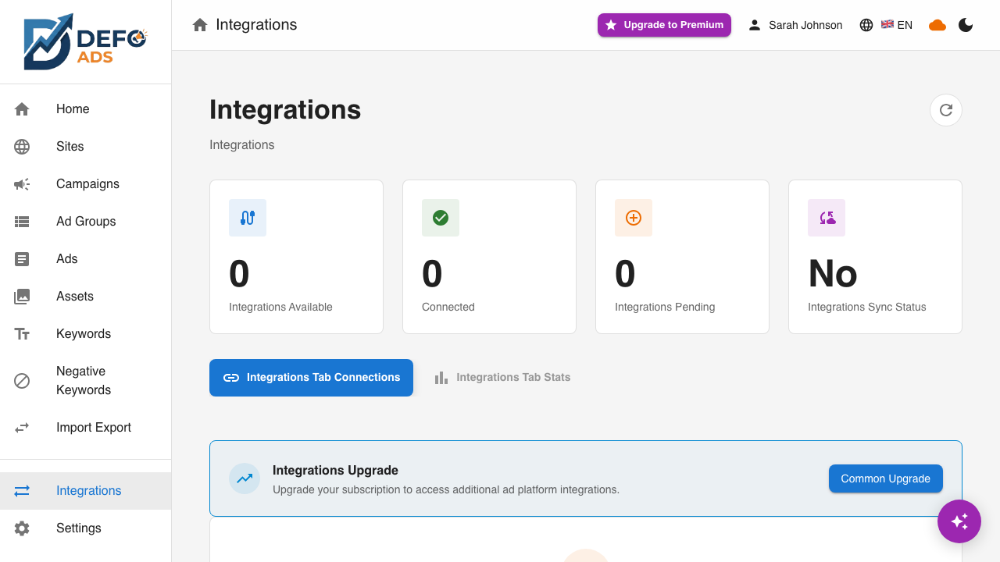

[Home](../README.md) > [Premium](README.md) > Integrations

> **Premium Feature** — This feature requires a Defo Ads Premium subscription. [Compare plans](../getting-started/free-vs-premium.md)

# Integrations

The Integrations page is your central hub for managing connections to advertising platforms. Connect your ad accounts, monitor connection health, and view sync statistics — all from one place. Defo Ads is designed to work with multiple platforms through a unified interface.

---

## Overview

The Integrations page provides a card-based view of all available and connected advertising platforms. Each platform card shows its connection status, account details, and key statistics.

Navigate to **Integrations** from the sidebar to access this page.


---

## Currently Supported Platforms

### Google Ads

Google Ads is the first and fully supported advertising platform in Defo Ads. The integration provides:

- **OAuth-based connection** — Secure authorization via Google sign-in
- **Bidirectional sync** — Import and export campaigns, ad groups, keywords, ads, location targets, and sitelinks
- **Performance data** — Pull click, impression, spend, and conversion metrics
- **Multi-account support** — Connect standard accounts and Manager (MCC) accounts
- **Real-time status** — See connection health at a glance

For detailed setup instructions, see [Google Ads Connection](google-ads-connection.md).



---

## Future Platforms

Defo Ads is built on a platform-agnostic architecture. The following platforms are planned for future integration:

### Meta Ads (Coming Soon)

Manage Facebook and Instagram advertising campaigns. Connect your Meta Business account to import and export campaigns across the Meta Ads ecosystem.

### Microsoft Ads (Coming Soon)

Integrate with Microsoft Advertising (formerly Bing Ads) for search and display campaigns on the Microsoft Search Network.

### TikTok Ads (Coming Soon)

Connect your TikTok For Business account to manage video and performance campaigns on TikTok.

### LinkedIn Ads (Coming Soon)

Manage B2B advertising campaigns on LinkedIn, including sponsored content, message ads, and dynamic ads.


Future platform cards appear on the Integrations page with a "Coming Soon" badge. You cannot connect to these platforms yet, but their presence shows the planned roadmap.

---

## Platform Card Details

Each connected platform card displays the following information:

### Connection Status

| Status | Indicator | Meaning |
|--------|-----------|---------|
| **Connected** | Green dot | Active and working connection |
| **Expired** | Yellow dot | OAuth token needs refreshing |
| **Disconnected** | Gray dot | No active connection |
| **Error** | Red dot | Connection issue requiring attention |

### Account Information

For each connected account within a platform:

- **Account name** — The name set in the advertising platform
- **Account ID** — Unique identifier
- **Account type** — Standard, Manager, etc.
- **Campaign count** — Number of campaigns in the account

### Quota Indicators

Some metrics related to the platform connection:

- **API usage** — Calls made against the platform API
- **Sync status** — Last sync timestamp and result
- **Data freshness** — How recent the performance data is

### Sync Statistics

A summary of sync activity for each connected platform:

| Statistic | Description |
|-----------|-------------|
| **Total syncs** | Number of sync operations performed |
| **Last sync** | Timestamp and result of the most recent sync |
| **Entities synced** | Total campaigns, ad groups, keywords, and ads processed |
| **Success rate** | Percentage of sync operations that completed without errors |


---

## Connecting a Platform

### General Flow

The connection process follows the same pattern for all platforms:

1. **Click Connect** on the platform card
2. **OAuth redirect** — You are taken to the platform's sign-in page
3. **Authorize** — Grant Defo Ads the necessary permissions
4. **Select accounts** — Choose which advertising accounts to connect
5. **Confirmation** — The platform card updates to show the connected status


<!-- TODO: Add screenshot of the OAuth authorization step -->

### Permissions Requested

Each platform requires different permissions. Generally, Defo Ads requests:

- **Read access** — To import campaigns and performance data
- **Write access** — To export and update campaigns
- **Account management** — To list and select accounts

The exact permissions are displayed during the OAuth authorization step for full transparency.

---

## Managing Connections

### Viewing Connection Details

Click on a connected platform card to expand its details or navigate to a detail view showing:

- All connected accounts with their information
- Recent sync activity
- Connection health and token status
- Quick actions (reconnect, disconnect, sync now)

### Reconnecting an Expired Connection

When an OAuth token expires:

1. The platform card shows a "Requires Reconnection" warning
2. Click **Reconnect**
3. Complete the sign-in flow to refresh the token
4. All settings and history are preserved

### Disconnecting a Platform

To remove a platform connection:

1. Click the **Disconnect** button (or find it in the card's menu)
2. A confirmation dialog explains what will happen
3. Confirm the disconnection

After disconnecting:

- OAuth tokens are removed
- Sync operations stop for that platform
- Previously imported data remains in Defo Ads
- Performance data already fetched is preserved
- You can reconnect at any time


---

## Platform-Agnostic Design

Defo Ads is designed so that your workflow remains consistent regardless of which advertising platforms you connect. This means:

### Unified Campaign Management

- Campaigns from all connected platforms appear in the same campaign list
- The campaign editor uses the same interface regardless of the destination platform
- Platform-specific fields are handled transparently

### Consistent Sync Experience

- The [Sync](sync.md) page works the same way for all platforms
- [Quick Sync](quick-sync.md) remembers configurations per platform
- [Scheduled Sync](scheduled-sync.md) can be configured independently per platform

### Cross-Platform Analytics

- The [Performance Dashboard](performance-dashboard.md) can display data from all connected platforms
- KPI cards aggregate or filter by platform
- You can compare performance across platforms

### What This Means for You

- Learning one platform's workflow teaches you all of them
- Switching between platforms does not require learning new interfaces
- Adding a new platform connection extends your existing workflow naturally

---

## Integrations Page Layout

The Integrations page is organized as follows:

```
+---------------------------------------------------+
|  Integrations                        [+ Connect]  |
+---------------------------------------------------+
|                                                    |
|  [Google Ads]        [Meta Ads]                   |
|   Connected           Coming Soon                  |
|   2 accounts                                       |
|   Last sync: 2h ago                                |
|                                                    |
|  [Microsoft Ads]     [TikTok Ads]                 |
|   Coming Soon         Coming Soon                  |
|                                                    |
|  [LinkedIn Ads]                                    |
|   Coming Soon                                      |
|                                                    |
+---------------------------------------------------+
```

Connected platforms appear first, followed by coming-soon platforms. This prioritizes active connections while showing the growing ecosystem.

---

## Tips

- **Check connection health regularly** — An expired token prevents syncs from running, including scheduled syncs
- **Use multi-account support** — If you manage multiple businesses or brands, connect all accounts and switch between them as needed
- **Review sync statistics** — High failure rates may indicate account issues or API changes that need attention
- **Stay informed about new platforms** — Watch for coming-soon badges to change to "Available" as new integrations launch

---

**Related:**
- [Google Ads Connection](google-ads-connection.md) — Detailed Google Ads setup guide
- [Bidirectional Sync](sync.md) — Import and export campaigns
- [Performance Dashboard](performance-dashboard.md) — Cross-platform analytics
- [Premium Features Overview](README.md) — All premium features
