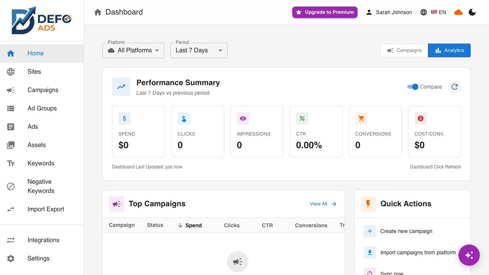
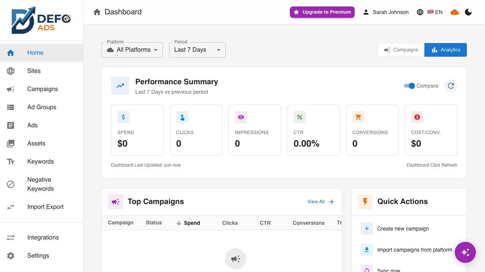
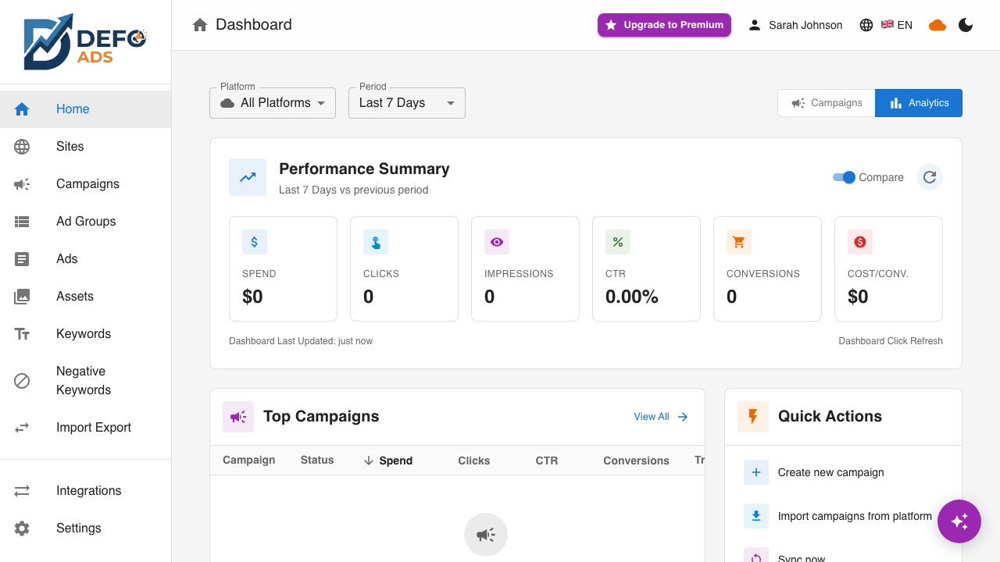

[Home](../README.md) > [Premium](README.md) > Performance Dashboard

> **Premium Feature** — This feature requires a Defo Ads Premium subscription. [Compare plans](../getting-started/free-vs-premium.md)

# Performance Dashboard

The Performance Dashboard gives you a comprehensive view of your Google Ads campaign performance with interactive charts, KPI cards, campaign rankings, and an activity feed. Monitor spend, clicks, conversions, and more — all within Defo Ads.

---

## Accessing the Dashboard

The Performance Dashboard is available from the sidebar under **Dashboard** or **Analytics**. If you have a connected Google Ads account with active campaigns, the dashboard loads automatically with your latest performance data.

**Requirement:** You must have at least one Google Ads account connected to see performance data. See [Google Ads Connection](google-ads-connection.md) to set up your connection.


---

## KPI Cards

At the top of the dashboard, a row of KPI cards shows your most important metrics at a glance.

### Available Metrics

| Metric | Description |
|--------|-------------|
| **Spend** | Total advertising spend for the selected period |
| **Clicks** | Total number of clicks on your ads |
| **Impressions** | Total number of times your ads were shown |
| **CTR** | Click-through rate (clicks / impressions) |
| **Conversions** | Total conversion actions tracked |

### Card Details

Each KPI card includes:

- **Current value** — The metric total for the selected time period
- **Sparkline trend** — A small inline chart showing the metric's trajectory over the period
- **Period-over-period comparison** — Percentage change compared to the previous equivalent period

### Period-Over-Period Comparison

The comparison shows how the current period performs against the previous one:

| Color | Meaning |
|-------|---------|
| **Green** | Improvement (for metrics where higher is better, like clicks and conversions) |
| **Red** | Decline (for metrics where higher is better) or increase (for cost metrics) |
| **Gray** | No significant change or insufficient data |

For example, if your CTR is 3.2% this week compared to 2.8% last week, the card shows **+14.3%** in green.


---

## Period Selector

Control the time range for all dashboard data using the period selector at the top of the page.

### Preset Periods

| Period | Description |
|--------|-------------|
| **Last 7 days** | The most recent week of data |
| **Last 30 days** | The most recent month of data |
| **Last 90 days** | The most recent quarter of data |

### Custom Range

Click **Custom** to select a specific start and end date using the date picker. This is useful for analyzing specific campaigns, promotions, or seasonal periods.

When you change the period:

- All KPI cards update to reflect the new range
- Trend charts redraw with the new data
- The top campaigns table recalculates rankings
- Period-over-period comparisons adjust to the corresponding previous period



---

## Trend Charts

Below the KPI cards, interactive charts visualize your performance data over time.

### Chart Types

The dashboard supports line and area charts for visualizing trends. You can toggle between them in the chart settings.

### Multi-Metric Overlay

You can display up to 3 metrics simultaneously on a single chart:

- **Primary metric** — Displayed on the left Y-axis
- **Secondary metric** — Displayed on the right Y-axis (dual Y-axis)
- **Third metric** — Overlaid with a distinct color and style

This allows you to see correlations — for example, how spend relates to clicks and conversions over time.


### Hover Tooltips

Hover over any point on the chart to see a tooltip with:

- The exact date
- The precise value for each displayed metric
- Comparison to the previous day or period point

### Interacting with Charts

| Action | Result |
|--------|--------|
| **Hover** | Shows tooltip with exact values |
| **Click a metric legend** | Toggles that metric on/off in the chart |
| **Drag to zoom** | Zooms into a specific date range within the chart |
| **Reset zoom** | Returns to the full period view |

### Exporting Charts

You can export any chart for use in reports and presentations:

- **PNG** — High-resolution image file
- **PDF** — Document-ready format

Click the export icon in the top-right corner of the chart and select your preferred format.



---

## Top Campaigns Table

Below the trend charts, a ranked table shows your top-performing campaigns.

### Table Columns

| Column | Description |
|--------|-------------|
| **Rank** | Position based on the selected performance metric |
| **Campaign Name** | Name of the campaign |
| **Status** | Current status (Active, Paused, etc.) |
| **Spend** | Total spend for the period |
| **Clicks** | Total clicks |
| **Impressions** | Total impressions |
| **CTR** | Click-through rate |
| **Conversions** | Total conversions |
| **Sparkline** | Inline mini-chart showing the trend for the primary metric |

### Performance Badges

Each campaign receives a performance badge based on its metrics relative to your account average:

| Badge | Color | Criteria |
|-------|-------|----------|
| **High Performer** | Green | Metrics significantly above account average |
| **Needs Attention** | Yellow/Amber | Metrics declining or below average |
| **Underperforming** | Red | Metrics significantly below account average |

These badges provide a quick visual indicator so you can focus your attention where it matters most.



### Sorting and Filtering

- Click any column header to sort by that metric
- Use the search bar above the table to filter by campaign name
- Click a campaign row to navigate to that campaign's detail page

---

## Activity Feed

The right side of the dashboard (or below the main content on smaller screens) shows the Activity Feed — a chronological list of recent events.

### Event Types

| Event | Icon | Description |
|-------|------|-------------|
| **Import** | Download arrow | Campaigns imported from Google Ads |
| **Export** | Upload arrow | Campaigns exported to Google Ads |
| **Sync** | Refresh arrows | Scheduled or quick sync completed |
| **Error** | Warning triangle | Sync or connection error occurred |
| **Connection** | Link icon | Google Ads account connected or reconnected |

### Event Details

Each activity entry shows:

- **Event type** icon and label
- **Description** — What happened (e.g., "Imported 5 campaigns from My Business Account")
- **Timestamp** — When it occurred (relative time like "2 hours ago" or absolute date)
- **Status** — Success or failure


### Scrolling and History

The Activity Feed shows the most recent events first. Scroll down to see older events. The feed retains events for a configurable retention period.

---

## Dashboard Layout

The dashboard is organized into sections for efficient scanning:

```
+---------------------------------------------------+
|  Period Selector: [7 days] [30 days] [90 days]    |
+---------------------------------------------------+
|  [Spend] [Clicks] [Impressions] [CTR] [Conv]     |  <- KPI Cards
+---------------------------------------------------+
|                                    |               |
|  Trend Charts                      | Activity Feed |
|  (multi-metric, interactive)       | (recent       |
|                                    |  events)      |
|                                    |               |
+------------------------------------+               |
|  Top Campaigns Table               |               |
|  (ranked, with badges)             |               |
+------------------------------------+---------------+
```

On mobile devices, the layout stacks vertically with the Activity Feed appearing below the main content.

---

## Requirements and Limitations

### Requirements

- At least one Google Ads account must be connected
- Campaigns must have been synced (imported) to appear in analytics
- Performance data comes from Google Ads reporting API

### Data Freshness

- Performance data is fetched during sync operations
- More frequent syncs (see [Scheduled Sync](scheduled-sync.md)) result in more up-to-date data
- There may be a slight delay (up to a few hours) between Google Ads reporting and data availability in Defo Ads

### What the Dashboard Does Not Show

- Real-time bidding data (Google Ads processes this internally)
- Conversion attribution details (available in Google Ads directly)
- Search term reports (planned for future updates)

---

**Related:**
- [Google Ads Connection](google-ads-connection.md) — Connect to see performance data
- [Bidirectional Sync](sync.md) — Import campaigns and performance data
- [Scheduled Sync](scheduled-sync.md) — Keep data fresh with automatic syncs
- [User Profile](user-profile.md) — View account usage statistics
