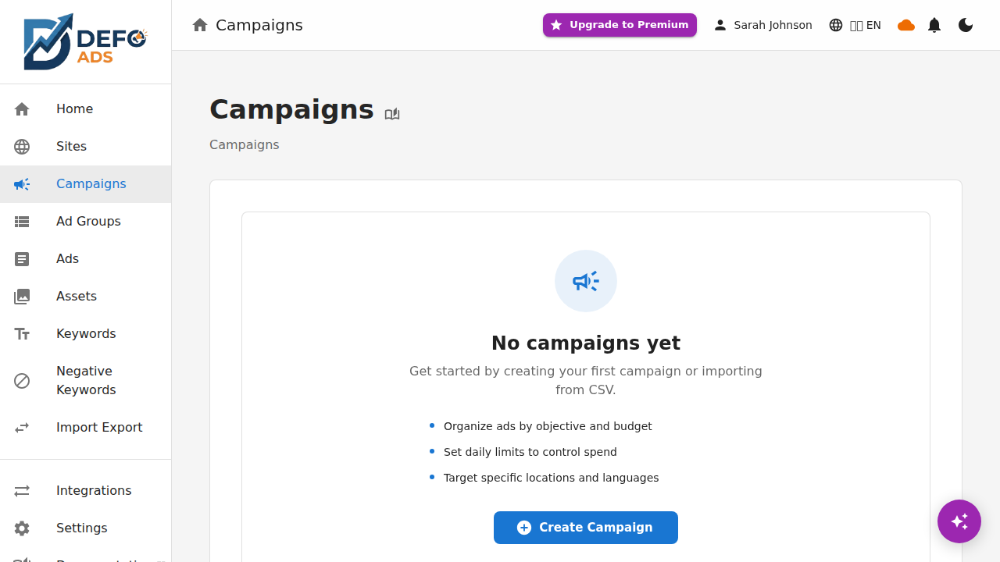
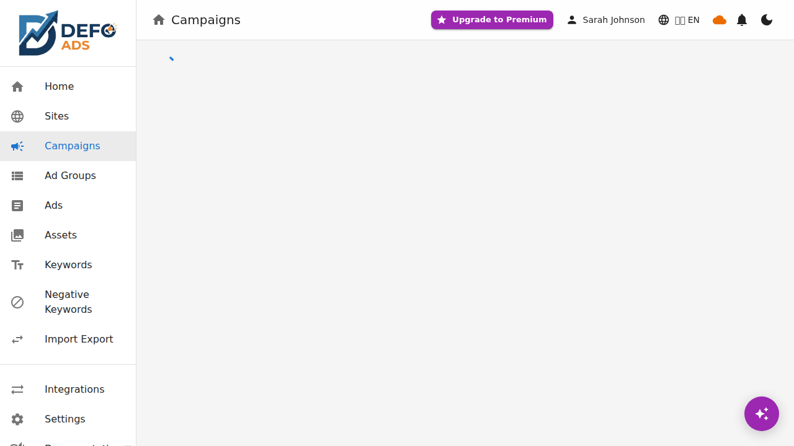

# Performance Dashboard

The Performance Dashboard provides a unified view of your advertising performance across all connected platforms. Compare metrics side by side, filter by platform, and get AI-generated insights to optimize your campaigns.

## Cross-Platform Performance Overview

The dashboard aggregates data from all connected platforms into a single view. At the top of the dashboard, summary cards show your total performance across all platforms:

- **Total Impressions** — How many times your ads were shown across all platforms.
- **Total Clicks** — How many clicks your ads received across all platforms.
- **Overall CTR** — Your combined click-through rate.
- **Total Spend** — Your total advertising spend across all platforms.
- **Total Conversions** — Combined conversions from all platforms.
- **Overall CPA** — Your average cost per acquisition across all platforms.

These summary metrics give you a quick snapshot of your overall advertising performance without needing to check each platform individually.

---

## Key Metrics

The dashboard tracks the following metrics for each campaign:

| Metric | Description |
|--------|-------------|
| **Impressions** | Number of times your ads were displayed |
| **Clicks** | Number of times users clicked on your ads |
| **CTR (Click-Through Rate)** | Percentage of impressions that resulted in a click |
| **Spend** | Total amount spent on the campaign |
| **Conversions** | Number of completed conversion actions (purchases, sign-ups, etc.) |
| **CPA (Cost Per Acquisition)** | Average cost for each conversion |

---

## Platform Badges

Campaigns in the dashboard display platform badges to indicate which platforms they are active on:

- **[G]** — The campaign is running on **Google Ads**.
- **[M]** — The campaign is running on **Microsoft Advertising**.

A campaign can display multiple badges if it has been exported to more than one platform. Campaigns without any badge are local-only and have not been synced to any platform.

---

## Platform Comparison View

When a campaign is linked to two or more platforms, the dashboard offers a **side-by-side comparison view**:

1. Click on a multi-platform campaign (one with both [G] and [M] badges).
2. The detail view shows metrics for each platform in parallel columns.
3. Compare impressions, clicks, CTR, spend, conversions, and CPA between Google Ads and Microsoft Advertising for the same campaign.

This comparison helps you understand which platform is delivering better results for each campaign, so you can allocate budget accordingly.

---

## Filtering Campaigns by Platform

You can filter the campaign list to show only campaigns from a specific platform:

1. Use the **platform selector** at the top of the dashboard.
2. Choose **All Platforms**, **Google Ads**, or **Microsoft Advertising**.
3. The campaign list and summary metrics will update to reflect only the selected platform.

This is useful when you want to focus on the performance of a single platform without the distraction of cross-platform data.

---

## Dashboard Platform Selector

The platform selector at the top of the dashboard controls the scope of all displayed data:

- **All Platforms** — Shows aggregated data across all connected platforms. Summary cards combine metrics from every platform.
- **Google Ads** — Shows only Google Ads campaigns and metrics.
- **Microsoft Advertising** — Shows only Microsoft Advertising campaigns and metrics.

Switching the platform selector updates all dashboard components, including summary cards, the campaign list, charts, and AI insights.

---

## AI-Generated Insights

The Performance Dashboard includes AI-generated insights that analyze your campaign data and provide actionable recommendations. These insights take platform context into account:

- **Cross-platform comparison** — The AI identifies campaigns that perform significantly better on one platform compared to another and suggests budget reallocation.
- **Underperforming campaigns** — Flags campaigns with declining metrics and suggests potential causes and fixes.
- **Budget optimization** — Recommends budget adjustments based on CPA and conversion trends across platforms.
- **Keyword opportunities** — Identifies high-performing keywords on one platform that could be added to campaigns on another platform.

Insights are refreshed each time you load the dashboard and are based on the most recently synced data.

---

## Related

- [Sync](sync.md) — Keep your performance data up to date with regular syncs
- [Platform Integrations](integrations.md) — Connect platforms to see their data in the dashboard
