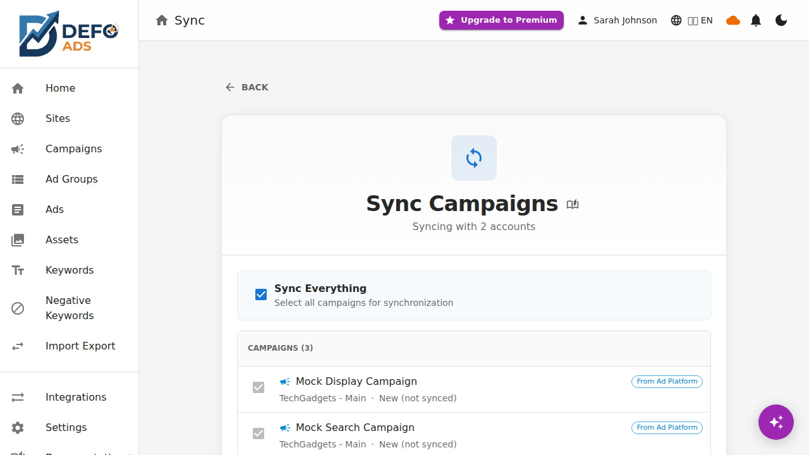

# Sync

Sync keeps your campaigns in Defo Ads aligned with your connected advertising platforms. You can sync with a single platform or all connected platforms at once, and track progress in real time.

## Overview

Sync operations move campaign data between Defo Ads and your connected platforms. There are two directions:

- **Import** — Pull campaigns, ad groups, keywords, and ads from a connected platform into Defo Ads.
- **Export** — Push campaigns, ad groups, keywords, and ads from Defo Ads to a connected platform.

Sync ensures that changes made in Defo Ads are reflected on your advertising platforms, and vice versa.

---

## What Gets Synced

Sync operations cover the full campaign hierarchy:

| Entity | Description |
|--------|-------------|
| **Campaigns** | Campaign settings, budgets, bidding strategies, targeting, status |
| **Ad Groups** | Ad group names, bids, status |
| **Keywords** | Keyword text, match types, bids, status, negative keywords |
| **Ads** | Ad copy (headlines, descriptions), URLs, status |

---

## Per-Platform Sync

You can sync with a specific connected platform individually:

1. Navigate to the **Sync** page.
2. Select the platform you want to sync with (e.g., Google Ads or Microsoft Advertising).
3. Choose the sync direction (import or export).
4. Click **Sync** to begin.

Per-platform sync is useful when you have made changes that only affect one platform, or when you want to import from a specific source.

---

## Sync All (Multi-Platform Sync)

If you have multiple platforms connected, you can sync with all of them simultaneously:

1. Navigate to the **Sync** page.
2. Click **Sync All**.
3. Defo Ads will initiate sync operations with every connected platform in parallel.

This is the fastest way to ensure all your platforms are up to date.

---

## Sync Progress Tracking

During a sync operation, Defo Ads displays real-time progress for each platform:

- **Per-platform progress bars** show the percentage of entities processed for each connected platform.
- **Cross-platform status tracking** gives you an overview of which platforms have completed syncing and which are still in progress.

Progress indicators update in real time so you can monitor the operation without refreshing.

---

## Platform-Specific Considerations

### Microsoft Advertising

When syncing campaigns to Microsoft Advertising, be aware of the following automatic adjustments:

- **DISPLAY campaigns become Audience campaigns.** Microsoft Advertising does not have a direct equivalent of Google's Display campaigns. Defo Ads automatically maps DISPLAY campaign types to Microsoft's Audience campaign type during export.
- **Broad match negative keywords are converted to phrase match.** Microsoft Advertising does not support broad match for negative keywords. During export, any broad match negative keywords are automatically converted to phrase match to maintain compatibility.

### Google Ads

Google Ads supports all campaign types and keyword match types used in Defo Ads without conversion.

---

## Conflict Resolution

When the same entity has been modified both in Defo Ads and on the platform since the last sync, a conflict occurs. Defo Ads handles conflicts as follows:

- **Last write wins** — By default, the most recent change takes precedence. If you edited a campaign in Defo Ads after it was last synced, your local changes will overwrite the platform version during export.
- **Import overwrites local** — When importing, platform data replaces local data for the imported entities.
- **Review before sync** — Before exporting, Defo Ads shows a summary of changes that will be pushed. Review this summary to catch any unintended overwrites.

> **Tip:** If you are unsure about conflicts, import first to get the latest platform data, then make your changes in Defo Ads, and export afterward.

---

## Related

- [Quick Sync](quick-sync.md) — One-click sync for immediate updates
- [Scheduled Sync](scheduled-sync.md) — Automatic background synchronization
- [Import & Export Guide](../guides/import-export.md) — Detailed import and export workflows

