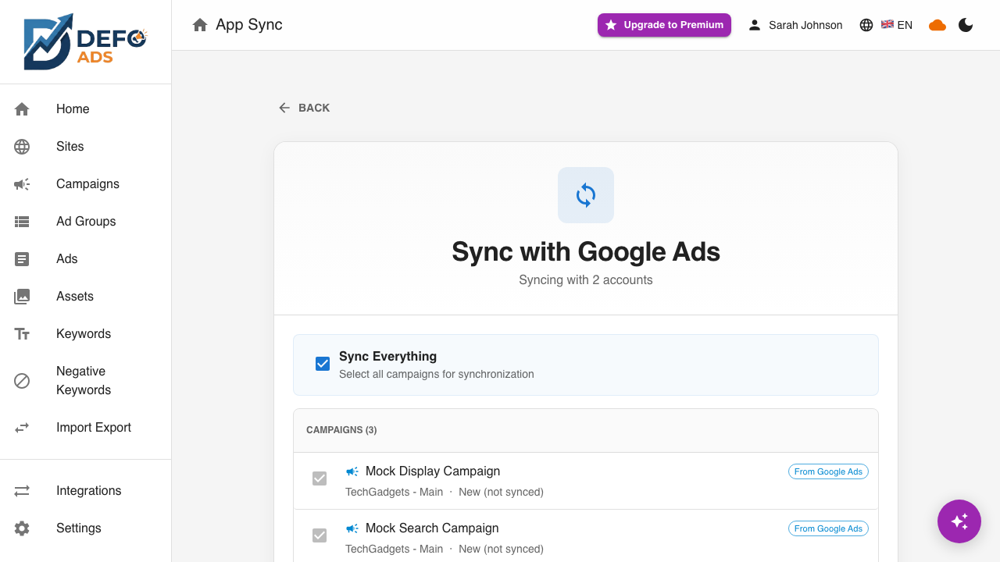

[Home](../README.md) > [Premium](README.md) > Bidirectional Sync

> **Premium Feature** — This feature requires a Defo Ads Premium subscription. [Compare plans](../getting-started/free-vs-premium.md)

# Bidirectional Sync with Google Ads

Defo Ads Premium provides full bidirectional synchronization with Google Ads. Import your existing campaigns into Defo Ads for editing and analysis, or export campaigns you have created in Defo Ads directly to Google Ads. This guide covers both directions in detail.

---

## Overview

Sync works in two directions:

- **Import** — Pull campaigns from Google Ads into Defo Ads
- **Export** — Push campaigns from Defo Ads to Google Ads

Each sync operation processes campaigns along with their full hierarchy: ad groups, keywords, ads, location targets, and sitelinks. You can sync selectively (choosing specific campaigns) or sync everything at once.


---

## Importing from Google Ads

Import brings your existing Google Ads campaigns into Defo Ads so you can view, edit, and manage them alongside campaigns you create locally.

### Step 1: Go to the Sync Page

Navigate to the **Sync** page from the sidebar. Select the **Import** tab.

### Step 2: Choose the Source Account

If you have multiple Google Ads accounts connected, select the account you want to import from using the account dropdown.


### Step 3: Select Campaigns to Import

You see a list of campaigns available in the selected Google Ads account. For each campaign, the list shows:

- Campaign name
- Campaign type (Search, Display, Performance Max, etc.)
- Status (Active, Paused, etc.)
- Number of ad groups

You can either:

- **Select individual campaigns** by checking the boxes next to them
- **Click "Sync Everything"** to import all campaigns from the account


### Step 4: Start the Import

Click **Start Import** to begin. The sync processes the selected campaigns and all their child entities.

### What Gets Imported

The import includes the complete campaign hierarchy:

| Entity | Details |
|--------|---------|
| **Campaigns** | Name, type, status, budget, bidding strategy, dates |
| **Ad Groups** | Name, status, bid amounts |
| **Keywords** | Keyword text, match type, status, bids |
| **Ads** | Headlines, descriptions, URLs, paths |
| **Location Targets** | Targeted and excluded geographic locations |
| **Sitelinks** | Sitelink extensions with URLs and descriptions |

### Deduplication

Defo Ads tracks which campaigns have been previously imported using their Google Ads resource IDs. If you run an import again:

- **Previously imported campaigns** are updated with any changes from Google Ads
- **New campaigns** (not previously imported) are added
- **No duplicates** are created

---

## Exporting to Google Ads

Export pushes campaigns you have created or modified in Defo Ads to your Google Ads account, making them live on the Google Ads platform.

### Step 1: Select Campaigns to Export

On the Sync page, switch to the **Export** tab. You see a list of campaigns in Defo Ads that are eligible for export. Select the campaigns you want to push to Google Ads.


### Step 2: Assign Google Ads Accounts

Each campaign must be assigned to a destination Google Ads account. If a campaign was previously imported from a specific account, it is automatically assigned back to that account.

For campaigns that have never been linked to a Google Ads account (locally created campaigns), you need to assign one:

- **Per-campaign assignment:** Click the account selector on each campaign row
- **Batch assignment:** Select multiple campaigns, then use the batch action to assign them all to the same account



### Step 3: Validation Check

Before the export starts, Defo Ads runs a validation check on each campaign to ensure it meets Google Ads requirements. Common validation checks include:

- Campaign has at least one ad group
- Ad groups have at least one keyword and one ad
- Required fields are filled (headlines, descriptions, URLs)
- Budget is set and valid

If validation fails, the affected campaigns are flagged with error details. You can fix the issues and retry.

### Step 4: Start the Export

Click **Start Export**. Campaigns are processed in batches of 5 at a time to stay within API rate limits and provide smoother progress tracking.

### Batch Processing

Large exports are handled in batches:

- **Batch size:** 5 campaigns per batch
- **Sequential processing:** Each batch completes before the next starts
- **Progress updates:** The progress bar and status updates reflect batch completion
- **Error isolation:** A failure in one batch does not stop subsequent batches

---

## Progress Tracking

Both import and export operations provide detailed real-time progress tracking.

### Progress Bar

A progress bar at the top of the sync view shows:

- **Overall percentage** of completion
- **Entity counts** — for example, "3 of 8 campaigns processed"
- **Elapsed time** since the sync started


### Per-Entity Status

Each entity in the sync is tracked individually with one of these statuses:

| Status | Icon | Meaning |
|--------|------|---------|
| **Pending** | Gray clock | Queued but not yet started |
| **In Progress** | Blue spinner | Currently being processed |
| **Success** | Green check | Completed without errors |
| **Failed** | Red X | An error occurred during processing |
| **Skipped** | Gray dash | Intentionally skipped (e.g., already up to date) |

### Hierarchical View

The progress view shows entities in their natural hierarchy:

```
Campaign: "Summer Sale 2026"        [Success]
  Ad Group: "Running Shoes"         [Success]
    Keyword: "running shoes"        [Success]
    Keyword: "best running shoes"   [Success]
    Ad: "Shop Running Shoes"        [Success]
  Ad Group: "Hiking Boots"          [Failed]
    Keyword: "hiking boots"         [Pending]
    Ad: "Explore Hiking Boots"      [Pending]
```

You can expand and collapse campaign nodes to focus on specific areas.


### Error Details

When an entity fails, the error message is displayed inline next to the entity. You can:

- **View the error** — Click the failed entity to see the full error message
- **Retry** — Click the retry button to attempt syncing that specific entity again
- **Copy Error Report** — Use the "Copy Error Report" button to copy all errors to your clipboard for debugging or sharing with support


### Canceling a Sync

You can cancel an in-progress sync at any time:

1. Click the **Cancel** button on the progress view
2. A confirmation dialog appears asking you to confirm
3. If confirmed, the sync stops after the current entity finishes processing
4. Entities already synced are not rolled back
5. Remaining entities stay in their current state in Defo Ads

---

## After Sync

### Platform Links

Once a campaign has been synced (imported or exported), it gains a **platform link** that shows:

- **Source/destination platform** — Google Ads icon and account name
- **Last import timestamp** — When the campaign was last pulled from Google Ads
- **Last export timestamp** — When the campaign was last pushed to Google Ads
- **Google Ads campaign ID** — Direct reference to the campaign in Google Ads

These links appear on the campaign detail page and in the campaign list.


### Viewing Sync History

The Activity Feed on the Performance Dashboard shows recent sync events, including:

- Sync direction (import or export)
- Number of entities processed
- Success and failure counts
- Timestamp

---

## Best Practices

### Before Your First Import

- Review your Google Ads campaigns to know what to expect
- Start with a small batch to verify the import works correctly
- Check imported campaigns for completeness before relying on them

### Before Exporting

- Run the built-in validation to catch issues early
- Double-check budgets and bid amounts
- Ensure all required fields are populated
- Remember that exported campaigns become live on Google Ads (subject to Google's own review)

### Regular Syncing

- Use [Quick Sync](quick-sync.md) for routine sync operations
- Set up [Scheduled Sync](scheduled-sync.md) for hands-free automation
- Review the Activity Feed after each sync to catch any errors

---

**Related:**
- [Quick Sync](quick-sync.md) — One-click sync for returning users
- [Scheduled Sync](scheduled-sync.md) — Automated background syncs
- [Google Ads Connection](google-ads-connection.md) — Setting up your connection
- [Troubleshooting](../troubleshooting/) — Sync error troubleshooting
