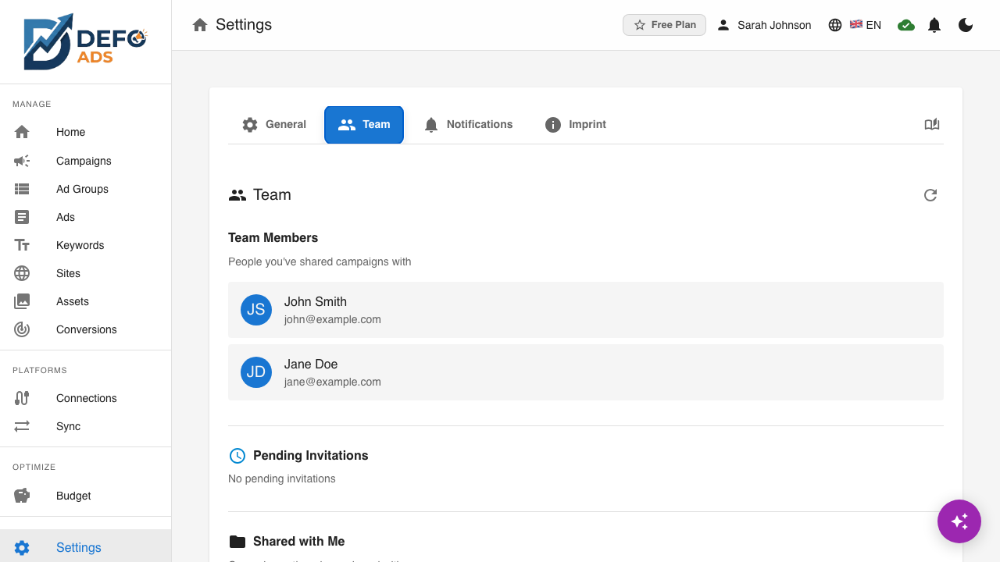
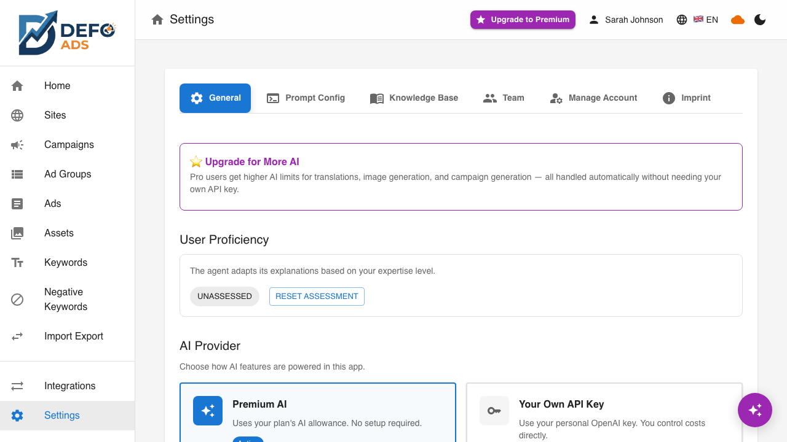

[Home](../README.md) > [Premium](README.md) > Team Collaboration

> See [Plans](../getting-started/plans.md) for feature details.

# Team Collaboration

Team Collaboration lets you invite team members to work together on campaigns. Share access, assign roles, and coordinate advertising efforts across your organization — all within Defo Ads.

---

## What Is Team Collaboration?

Team Collaboration enables multiple users to work on the same campaigns and share resources within Defo Ads. Instead of one person managing everything, you can distribute responsibilities across your team.

Key capabilities include:

- **Invite team members** via email with a specific role
- **Share campaigns** with selected team members
- **Manage roles and permissions** to control who can do what
- **View team activity** to stay informed about changes

---

## Accessing Team Settings

Navigate to **Settings** from the sidebar, then select the **Team** tab. This is where all team management actions are performed.

---

## Inviting Team Members

### How to Send an Invitation

1. Go to **Settings** > **Team**
2. Click the **Invite Member** button
3. Enter the email address of the person you want to invite
4. Select a **role** for the new member (see [Roles and Permissions](#roles-and-permissions) below)
5. Click **Send Invitation**

An invitation email is sent to the recipient with a link to join your team.

### What the Recipient Sees

The invited person receives an email containing:

- Your name (the inviter)
- The team or organization name
- Their assigned role
- A link to accept or decline the invitation

### Accepting an Invitation

When the recipient clicks the invitation link:

1. If they already have a Defo Ads account, they are prompted to accept and join
2. If they do not have an account, they are guided through signup first, then can accept
3. Once accepted, they appear in your team member list

### Declining an Invitation

The recipient can also decline the invitation. If declined, the invitation is removed from your pending list and the recipient is not added to your team.

---

## Invitation Link

Each invitation generates a unique link that can be shared directly if email delivery is unreliable:

1. After sending an invitation, the invitation link is shown in the pending invitations list
2. You can copy the link and share it through another channel (chat, messaging, etc.)
3. The link is unique to the invitation and is tied to the specified email address
4. The link expires after a configurable period

---

## Team Member List

The Team settings page shows all current team members with their details:

| Column | Description |
|--------|-------------|
| **Name** | Team member's display name |
| **Email** | Their email address |
| **Role** | Assigned role (Member, Admin, etc.) |
| **Joined** | Date they joined the team |
| **Status** | Active or Inactive |

### Member Actions

For each team member, you can:

- **Change role** — Update their permissions (admin only)
- **Remove from team** — Revoke their access (admin only)
- **View activity** — See their recent actions

---

## Pending Invitations

Below the active member list, a separate section shows invitations that have been sent but not yet accepted or declined.

### Pending Invitation Details

| Column | Description |
|--------|-------------|
| **Email** | The email address the invitation was sent to |
| **Role** | The role assigned in the invitation |
| **Sent** | When the invitation was sent |
| **Expires** | When the invitation link expires |

### Managing Pending Invitations

- **Resend** — Send the invitation email again if the recipient did not receive it
- **Copy Link** — Copy the invitation URL to share through another channel
- **Cancel** — Revoke the invitation before it is accepted

---

## Campaign Sharing

Team members can share specific campaigns with each other, allowing targeted collaboration without giving blanket access to everything.

### How to Share a Campaign

1. Open the campaign you want to share
2. Go to the campaign's **Settings** or **Sharing** section
3. Select team members to share with
4. Choose the access level (view, edit)
5. Click **Share**

### Shared Campaign Indicators

Shared campaigns show visual indicators:

- A **shared badge** or icon on the campaign card
- The list of people the campaign is shared with
- The access level for each person

### Collaboration on Shared Campaigns

When multiple team members have access to a campaign:

- Each person can view or edit according to their access level
- Changes are synced via the cloud so everyone sees the latest version
- The activity feed shows who made which changes

---

## Leaving a Team

If you are a member of a team and want to leave:

1. Go to **Settings** > **Team**
2. Click **Leave Team** at the bottom of the page
3. Confirm your decision in the dialog

### What Happens When You Leave

- You lose access to shared campaigns and team resources
- Your individual campaigns and data remain in your own account
- Any campaigns you created that were shared with the team stay shared (but you can no longer access them)
- The team admin is notified of your departure

---

## Roles and Permissions

Roles determine what each team member can do within the team. The available roles and their permissions are outlined below.

### Available Roles

| Role | Description |
|------|-------------|
| **Admin** | Full access to all team features, can manage members and settings |
| **Member** | Standard access to shared campaigns and team features |

### Permission Matrix

| Permission | Admin | Member |
|------------|-------|--------|
| View shared campaigns | Yes | Yes |
| Edit shared campaigns | Yes | Yes |
| Create campaigns | Yes | Yes |
| Share campaigns | Yes | Yes |
| Invite new members | Yes | No |
| Remove members | Yes | No |
| Change member roles | Yes | No |
| Manage team settings | Yes | No |
| Delete the team | Yes | No |
| Connect integrations | Yes | Varies |

### Changing a Member's Role

Admins can change a team member's role:

1. Go to **Settings** > **Team**
2. Find the team member in the list
3. Click the role dropdown or edit button
4. Select the new role
5. Confirm the change

Role changes take effect immediately. The affected member's permissions update without requiring them to log out or refresh.

---

## Team Workflow Best Practices

### Getting Started

1. Have the team admin set up the Defo Ads account with a premium subscription
2. Connect Google Ads accounts from the [Connections](integrations.md) page
3. Import existing campaigns via [Sync](sync.md)
4. Invite team members with appropriate roles
5. Share relevant campaigns with each member

### Day-to-Day Collaboration

- **Assign campaign ownership** — Each campaign should have a clear owner responsible for its performance
- **Use sharing selectively** — Share only the campaigns each member needs access to
- **Review the activity feed** — Keep an eye on changes made by team members
- **Communicate through the AI Assistant** — Team members can use the [AI Assistant](../guides/ai-assistant.md) to quickly make changes or get information

### Security Considerations

- **Use the principle of least privilege** — Assign the minimum role needed for each member
- **Review team membership regularly** — Remove members who no longer need access
- **Monitor invitation links** — Cancel pending invitations that are no longer needed
- **Admin accounts** — Keep the number of admins small to reduce risk

---

## Frequently Asked Questions

**How many team members can I add?**
The number of team members depends on your subscription plan. Check your [Subscription](subscription.md) details for the current limit.

**Can a person be on multiple teams?**
This depends on the current platform configuration. Check the Team settings for details on multi-team support.

**What happens to shared campaigns if a member is removed?**
The campaigns remain accessible to other team members who have access. The removed member loses their access.

**Can I transfer admin rights to another member?**
Yes. Change the other member's role to Admin, and they gain full team management capabilities.

**Do team members need their own premium subscription?**
Team members access premium features through the team's subscription. They do not need separate individual subscriptions.

---

**Related:**
- [User Profile](user-profile.md) — Manage your individual account
- [Subscription & Billing](subscription.md) — Team plan details
- [Premium Features Overview](README.md) — All premium features
- [Connections](integrations.md) — Connect advertising platforms for the team
