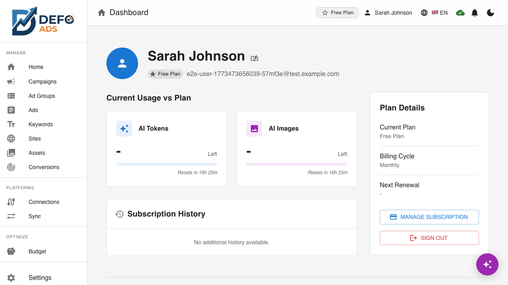

[Home](../README.md) > [Premium](README.md) > User Profile

> **Premium Feature** — This feature requires a Defo Ads Premium subscription. [Compare plans](../getting-started/free-vs-premium.md)

# User Profile

The User Profile page is your personal command center in Defo Ads. View your account details, monitor subscription status, track usage statistics, manage billing, and sign out — all in one place.

---

## Accessing Your Profile

There are two ways to open the User Profile page:

1. **Sidebar navigation** — Click **Profile** in the sidebar menu
2. **Avatar** — Click your avatar or profile icon in the top navigation bar


---

## Account Details

The top section of the User Profile page shows your personal account information.

### Displayed Information

| Field | Description |
|-------|-------------|
| **Name** | Your display name as set during signup or in account settings |
| **Email** | The email address associated with your account |
| **Avatar** | Your profile picture (from Google account or uploaded) |


### Editing Account Details

Depending on your authentication method:

- **Google sign-in users:** Your name and avatar come from your Google account. Changes in Google are reflected in Defo Ads.
- **Email/password users:** You can update your name directly from the profile page.

---

## Subscription Status

Below your account details, the subscription section shows the current state of your Defo Ads plan.

### Information Displayed

| Field | Description |
|-------|-------------|
| **Plan name** | The name of your current subscription (e.g., Pro, Business, Free Trial) |
| **Tier** | The subscription tier level |
| **Status** | Active, Trialing, Canceled, or Expired |
| **Current period** | Start and end dates of the current billing period |
| **Trial end date** | If on a free trial, shows when the trial expires |

### Status Indicators

| Status | Meaning |
|--------|---------|
| **Active** | Your subscription is current and all premium features are available |
| **Trialing** | You are on a free trial — features are available with trial-level quotas |
| **Canceled** | You canceled but access continues until the period end date |
| **Expired** | Your trial or subscription has ended — premium features are paused |


### Upgrade Prompt

If you are on a free trial or a lower-tier plan, an upgrade prompt is shown with a link to view available plans. See [Subscription & Billing](subscription.md) for details on upgrading.

---

## Usage Statistics

The usage section provides real-time visibility into how much of your plan's resources you have consumed today.

### AI Token Usage

| Field | Description |
|-------|-------------|
| **Used** | Number of AI tokens consumed today |
| **Limit** | Your daily token allowance based on your plan |
| **Progress bar** | Visual indicator of usage percentage |
| **Reset countdown** | Time remaining until the daily counter resets |

AI tokens are consumed when you:

- Generate ad copy (headlines, descriptions)
- Use the AI Assistant for chat interactions
- Generate campaign suggestions
- Any AI-powered text generation

The daily limit resets every 24 hours. The countdown timer shows exactly when the reset occurs.


### Image Storage

| Field | Description |
|-------|-------------|
| **Used** | Amount of storage consumed by uploaded assets |
| **Quota** | Your plan's storage limit |
| **Progress bar** | Visual indicator of storage percentage |

Image storage is consumed by assets uploaded to the [Asset Library](asset-library.md). Unlike AI tokens, storage does not reset daily — it reflects the total size of all your stored assets.

To free up storage, delete unused assets from the Asset Library.


### Campaign Count

| Field | Description |
|-------|-------------|
| **Active** | Number of campaigns currently active in your account |
| **Limit** | Maximum number of campaigns allowed by your plan |
| **Progress bar** | Visual indicator of campaign usage |

The campaign count tracks how many campaigns you have relative to your plan's limit. If you reach the limit, you need to remove or archive campaigns before creating new ones, or upgrade to a higher plan.


### Usage Summary View

All three usage metrics are displayed together for a quick overview:

```
+---------------------------------------------------+
|  Usage                                             |
+---------------------------------------------------+
|                                                    |
|  AI Tokens         12,450 / 50,000                |
|  [=========>.........................]  24.9%      |
|  Resets in 6h 23m                                  |
|                                                    |
|  Image Storage     18.3 MB / 100 MB               |
|  [===>................................]  18.3%     |
|                                                    |
|  Campaigns         7 / 25                          |
|  [====>...............................]  28.0%     |
|                                                    |
+---------------------------------------------------+
```

---

## Billing

The billing section provides quick access to subscription management via Stripe.

### Manage Subscription

Click the **Manage Subscription** button to open the Stripe Customer Portal. From there you can:

- **View billing history** — See all past invoices and payments
- **Download receipts** — Get PDF receipts for accounting
- **Update payment method** — Change your credit card or add a new one
- **Change plan** — Upgrade or downgrade your subscription
- **Cancel subscription** — End your subscription (access continues until period end)


### Billing Information Shown

On the profile page itself, you see:

| Field | Description |
|-------|-------------|
| **Next billing date** | When your next payment is due |
| **Amount** | The expected charge |
| **Payment method** | Last 4 digits of the card on file |

For detailed billing management, the Stripe Customer Portal provides full control.

---

## Delete Account

> **Warning:** This action is permanent and cannot be undone.

The **Danger Zone** section at the bottom of the User Profile page allows you to permanently delete your account and all associated data.



### How to Delete Your Account

1. Scroll to the **Danger Zone** section at the bottom of the User Profile page
2. Click **Delete Account**
3. A confirmation dialog appears
4. Type `DELETE` in the confirmation field
5. Complete the security verification (CAPTCHA)
6. Click **Delete Account** to confirm

### What Gets Deleted

- Your user account and authentication credentials
- All campaign data stored in the cloud
- All subscription records

### What Happens After Deletion

- You are signed out immediately
- You are redirected to the home page
- Your data cannot be recovered

> **Tip:** If you simply want to cancel your subscription while keeping your data, use the **Manage Subscription** button instead to cancel through the billing portal.

---

## Logout

The **Logout** button is located at the bottom of the User Profile page.

### What Happens When You Log Out

- Your session is ended
- You are redirected to the login page
- Locally cached data remains in the browser (but is not accessible without signing back in)
- Any unsaved changes are lost

### Logging Back In

After logging out, sign in again with the same credentials to access your account. All your data, campaigns, and settings are preserved in the cloud.


---

## Profile Page Layout

The User Profile page is organized into clear sections from top to bottom:

```
+---------------------------------------------------+
|  [Avatar]  John Doe                               |
|            john.doe@example.com                    |
+---------------------------------------------------+
|  Subscription                                      |
|  Pro Plan  |  Active  |  Renews Mar 15, 2026      |
|  [Upgrade]                                         |
+---------------------------------------------------+
|  Usage                                             |
|  AI Tokens:    12,450 / 50,000    Resets in 6h    |
|  Storage:      18.3 MB / 100 MB                   |
|  Campaigns:    7 / 25                              |
+---------------------------------------------------+
|  Billing                                           |
|  Next payment: $29.00 on Mar 15, 2026             |
|  Card: **** 4242                                   |
|  [Manage Subscription]                             |
+---------------------------------------------------+
|                                                    |
|  [Logout]                                          |
|                                                    |
+---------------------------------------------------+
|  ⚠ Danger Zone                                    |
|  Permanently delete your account and all data.    |
|  [Delete Account]                                  |
+---------------------------------------------------+
```

---

## Frequently Asked Questions

**How do I change my email address?**
Email changes depend on your authentication provider. For Google sign-in, update your email through Google. For email/password accounts, contact support.

**Why does my AI token count reset?**
AI tokens operate on a daily budget. This ensures fair usage across all subscribers and prevents any single user from exhausting shared AI resources.

**What happens if I exceed my campaign limit?**
You will not be able to create new campaigns until you delete or archive existing ones, or upgrade to a plan with a higher limit. Existing campaigns are not affected.

**Can I see historical usage data?**
The profile page shows current-day usage. Historical usage tracking may be available in the Performance Dashboard or through your billing history.

**Is my data deleted if my subscription expires?**
No. Your data is preserved even after subscription expiration. If you resubscribe, everything is still there.

---

**Related:**
- [Subscription & Billing](subscription.md) — Plans, pricing, and billing details
- [Asset Library](asset-library.md) — Manage image storage
- [AI Assistant](../guides/ai-assistant.md) — Uses your AI token quota
- [Premium Features Overview](README.md) — All premium features
