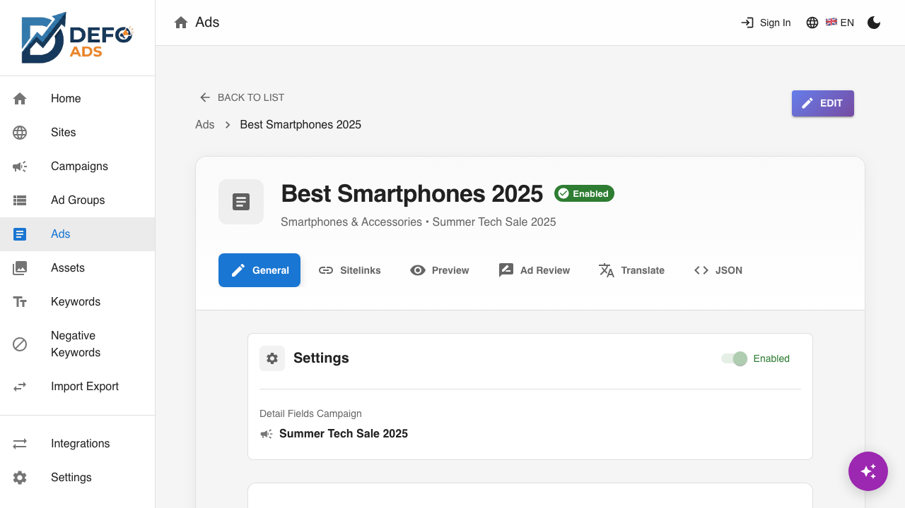

[Home](../README.md) > [Reference](../README.md#reference) > Ad Specifications

# Ad Specifications

This page lists the character limits, field requirements, and asset specifications for ads in Defo Ads. Use this as a quick reference when creating or editing your ads.

---

## Responsive Search Ads (RSA)

Responsive search ads are the standard text ad format for Search campaigns. You provide multiple headlines and descriptions, and Google automatically tests combinations to find the best performers.

### Required Fields

| Field | Required | Max Characters | Notes |
|-------|----------|---------------|-------|
| **Headline 1** | Yes | 30 | Always shown. Make it attention-grabbing. |
| **Headline 2** | Yes | 30 | Always shown alongside Headline 1. |
| **Headline 3** | Recommended | 30 | Shown when Google determines it will improve performance. |
| **Description 1** | Yes | 90 | Main description text. |
| **Description 2** | Recommended | 90 | Additional description for more detail. |
| **Final URL** | Yes | -- | Must be a valid URL (your landing page). |
| **Path 1** | Optional | 15 | Display URL path segment (cosmetic only). |
| **Path 2** | Optional | 15 | Second display URL path segment. Requires Path 1. |

### Headline Details

- You can provide **up to 15 headlines** per responsive search ad
- Google requires a **minimum of 3 headlines** for RSAs uploaded to Google Ads
- Each headline has a maximum of **30 characters**
- Headlines are separated by a vertical bar ( | ) when displayed
- Avoid repeating the same message across headlines -- variety helps Google test

**Character counting:** Spaces, punctuation, and special characters all count toward the limit. For example, "Free Shipping Today!" is 21 characters.

### Description Details

- You can provide **up to 4 descriptions** per responsive search ad
- Google requires a **minimum of 2 descriptions** for RSAs uploaded to Google Ads
- Each description has a maximum of **90 characters**
- Use descriptions to expand on your headline with details, benefits, or calls to action

### Final URL

- Must be a complete, valid URL starting with `http://` or `https://`
- This is the page users land on when they click your ad
- The URL must be a working page -- Google will reject ads with broken landing pages

### Display Path

The display path appears in the ad's URL line but does not affect where users land. It is cosmetic and helps users understand what to expect.

**Example:**
- Final URL: `https://www.example.com/products/summer-collection`
- Path 1: `summer`
- Path 2: `hats`
- Displayed URL: `www.example.com/summer/hats`

---

## Sitelink Extensions

Sitelinks add additional links below your main ad, directing users to specific pages on your website.

### Fields

| Field | Required | Max Characters | Notes |
|-------|----------|---------------|-------|
| **Link Text** | Yes | 25 | The clickable text shown to users. |
| **Description Line 1** | Optional | 35 | Additional context below the link text. |
| **Description Line 2** | Optional | 35 | Second line of context. |
| **Final URL** | Yes | -- | Must be a valid URL. Should be different from the main ad URL. |

### Limits

- Maximum **4 sitelinks** displayed per ad (Google may show fewer based on device and placement)
- You can create more than 4 sitelinks -- Google will rotate and test them
- Each sitelink should point to a **different page** on your website

### Best Practices

- Use sitelinks to highlight specific products, categories, or pages
- Keep link text short and action-oriented ("View Pricing", "Contact Us", "Free Trial")
- Fill in both description lines for maximum ad real estate
- Ensure each sitelink URL leads to a relevant, working page

---

## Image and Asset Requirements (Premium)

Premium users can upload images for Display and Performance Max campaigns. These assets are stored in the [Asset Library](../premium/asset-library.md).

### Marketing Images

| Specification | Requirement |
|---------------|-------------|
| **Aspect ratio** | Landscape (1.91:1) recommended |
| **Minimum size** | 600 x 314 pixels (landscape) |
| **Recommended size** | 1200 x 628 pixels (landscape) |
| **Formats** | JPEG, PNG, WebP, GIF |
| **Max file size** | 5 MB per image |
| **Text on image** | Keep text to less than 20% of the image area |

### Square Images

| Specification | Requirement |
|---------------|-------------|
| **Aspect ratio** | Square (1:1) |
| **Minimum size** | 300 x 300 pixels |
| **Recommended size** | 1200 x 1200 pixels |
| **Formats** | JPEG, PNG, WebP, GIF |
| **Max file size** | 5 MB per image |

### Logos

| Specification | Requirement |
|---------------|-------------|
| **Aspect ratio** | Square (1:1) |
| **Minimum size** | 128 x 128 pixels |
| **Recommended size** | 1200 x 1200 pixels |
| **Formats** | JPEG, PNG, WebP, GIF (transparent background recommended) |
| **Max file size** | 5 MB |

### Performance Max Asset Recommendations

For best results with Performance Max campaigns, Google recommends providing:

| Asset Type | Minimum | Recommended |
|------------|---------|-------------|
| **Landscape images** | 1 | 5+ |
| **Square images** | 1 | 5+ |
| **Logos** | 1 | 2+ |
| **Headlines** (30 chars) | 3 | 10-15 |
| **Long headlines** (90 chars) | 1 | 3-5 |
| **Descriptions** (90 chars) | 2 | 4-5 |
| **Total images** | 3 | 15+ |

> **Tip:** More assets give Google's AI more combinations to test, which generally leads to better performance. Aim for 15 or more total images across landscape and square formats.

---

## Character Limit Tips

Writing effective ad copy within tight character limits takes practice. Here are strategies that help:

### Headlines (30 characters)

- **Lead with the benefit:** "Save 50% on Hosting" (20 chars)
- **Use numbers:** "3-Day Free Trial" (16 chars) is more compelling than "Try It Free"
- **Include a keyword:** Match your headline to what people are searching for
- **Use abbreviations carefully:** "24/7 Support" works; "Gr8 Deals" does not
- **Skip unnecessary words:** "Buy Shoes Online" instead of "You Can Buy Shoes Online"

### Descriptions (90 characters)

- **Expand on the headline:** Add details the headline could not fit
- **Include a call to action:** "Sign up today and get your first month free."
- **Add trust signals:** "Trusted by 10,000+ businesses. 30-day money-back guarantee."
- **Mention unique selling points:** What makes you different from competitors?

### Checking Character Counts

Defo Ads shows a **live character counter** as you type in headline and description fields. The counter changes color as you approach the limit:

- **Green:** Within safe limits
- **Yellow:** Approaching the maximum
- **Red:** Over the limit (the ad will not pass validation)

### Using AI for Character-Optimized Copy

The AI in Defo Ads is trained to generate headlines and descriptions within character limits. If you find the AI output is too long:

1. Reduce the complexity of your goals description
2. Use the **custom instructions** field to ask for shorter, punchier copy
3. Edit the generated text manually -- the AI output is always a starting point

---

## Validation

Defo Ads validates your ads against these specifications before you export or sync. The [Validation](../guides/validation.md) page explains each error and warning:

| Validation Check | Level | Message |
|-----------------|-------|---------|
| Missing Headline 1 or 2 | Error | "Headline is required" |
| Headline over 30 characters | Error | "Headline exceeds 30 characters" |
| Description over 90 characters | Error | "Description exceeds 90 characters" |
| Missing Final URL | Error | "Final URL is required" |
| Invalid URL format | Error | "Final URL must be a valid URL" |
| Missing Headline 3 | Warning | "Adding a third headline is recommended" |
| Missing Description 2 | Warning | "Adding a second description is recommended" |
| Path without Final URL | Error | "Path requires a Final URL" |

---

**Related:**
- [Ads](../guides/ads.md) -- Create and edit responsive search ads
- [Campaign Types](campaign-types.md) -- Requirements vary by campaign type
- [Validation](../guides/validation.md) -- Check your campaigns for errors before going live
- [Asset Library](../premium/asset-library.md) -- Upload and manage campaign images (Premium)
