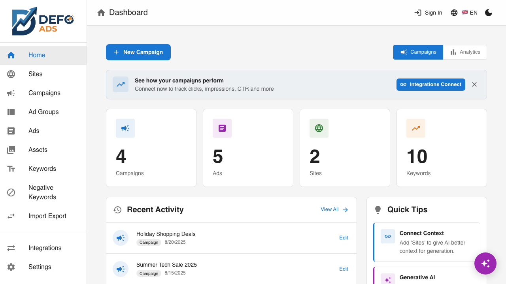

[Home](../README.md) > [Reference](../README.md#reference) > Supported Languages

# Supported Languages

Defo Ads supports multiple languages for the app interface, campaign targeting, and AI content generation. This page covers what is available and how to switch between languages.

---

## App Interface Languages

The Defo Ads user interface is available in the following languages:

| Language | Code | Status |
|----------|------|--------|
| **English** | EN | Full support |
| **German** (Deutsch) | DE | Full support |
| **French** (Francais) | FR | Full support |

### How to Switch the Interface Language

1. Look for the **language selector** in the top navigation bar
2. Click it to open the language dropdown
3. Select your preferred language
4. The interface updates immediately

The selected language is saved in your browser and persists across sessions. If you clear your browser data, it will reset to the default (English).

> **Note:** Additional interface languages may be added in future updates.

---

## Campaign Target Languages

When creating a campaign, you can set the **target language** to specify which language your audience speaks. This tells Google Ads which users to show your ads to, based on their language settings.

The following target languages are available:

| Language | Description |
|----------|-------------|
| **English** | Target English-speaking users |
| **German** | Target German-speaking users |
| **French** | Target French-speaking users |
| **Spanish** | Target Spanish-speaking users |
| **Italian** | Target Italian-speaking users |
| **Dutch** | Target Dutch-speaking users |
| **Polish** | Target Polish-speaking users |
| **Portuguese** | Target Portuguese-speaking users |
| **Japanese** | Target Japanese-speaking users |
| **Korean** | Target Korean-speaking users |
| **Chinese** | Target Chinese-speaking users |
| **All Languages** | Target users regardless of language setting |

### Setting the Target Language

1. Open your campaign's settings (in the campaign detail view)
2. Find the **Language** field
3. Select one or more target languages from the dropdown
4. Save your changes

### Tips for Language Targeting

- **Match your ad language to your target language.** If you target German-speaking users, write your ads in German.
- **"All Languages"** is useful when your landing page auto-detects user language or when you want to reach multilingual markets.
- You can create **separate campaigns for each language** to tailor your ads and keywords more precisely.

---

## AI Content Generation Languages

The AI in Defo Ads can generate ad content (headlines, descriptions, keywords) in **any of the supported target languages** listed above.

### How AI Language Works

The AI determines the output language based on:

1. **Campaign target language** -- If your campaign targets German users, the AI generates German content
2. **Site language** -- If your linked site is in a specific language, the AI follows that language
3. **Custom instructions** -- You can explicitly request a language in the custom instructions field

### Generating Content in a Specific Language

To ensure AI output is in your desired language:

1. Set the **campaign target language** to your desired language
2. Optionally, add a note in the **campaign goals** or **custom instructions**: "Generate all content in French"
3. Run the AI generation

The AI will produce headlines, descriptions, and keywords in the specified language while respecting character limits.

---

## Translation Between Languages

The AI can translate existing ad content from one language to another. This is useful when you want to expand a successful campaign into a new market.

### How to Translate Ads

1. Open the ad you want to translate
2. Use the AI generation feature
3. In the **custom instructions**, specify: "Translate this ad from English to Spanish"
4. The AI generates translated versions while respecting character limits

### Tips for Translation

- **AI translation is not a direct word-for-word translation.** The AI adapts the message to sound natural in the target language while staying within character limits.
- **Review translated content carefully.** Automated translation may miss cultural nuances or local terminology.
- **Create separate campaigns per language.** Rather than mixing languages within a campaign, create dedicated campaigns for each language market.
- **Update keywords too.** Translating ads is not enough -- you also need keywords in the target language.

For more details on AI content generation, see [AI Features](../guides/ai-features.md).

---

## Language and Locale Considerations

### Character Limits Across Languages

Character limits (e.g., 30 characters for headlines) apply regardless of language. This can be challenging for some languages:

| Language | Character Challenge |
|----------|-------------------|
| **German** | Words tend to be longer (compound nouns). May need creative abbreviation. |
| **French** | Accented characters count as single characters. Slightly longer than English. |
| **Japanese/Korean/Chinese** | Each character carries more meaning, so limits are generally easier to meet. |
| **English** | Baseline -- most ad copy examples are written for English limits. |

### Right-to-Left Languages

Currently, all supported languages use left-to-right (LTR) text direction. Right-to-left (RTL) language support (such as Arabic or Hebrew) is not yet available.

---

## Summary

| Feature | Languages Available |
|---------|-------------------|
| **App interface** | English, German, French |
| **Campaign targeting** | English, German, French, Spanish, Italian, Dutch, Polish, Portuguese, Japanese, Korean, Chinese, All Languages |
| **AI generation** | All supported target languages |
| **AI translation** | Between any supported target languages |

---

**Related:**
- [Settings](../guides/settings.md) -- Configure app preferences including language
- [AI Features](../guides/ai-features.md) -- AI-powered content generation and translation
- [Campaigns](../guides/campaigns.md) -- Set campaign target language during creation
- [Ad Specifications](ad-specifications.md) -- Character limits that apply across all languages
