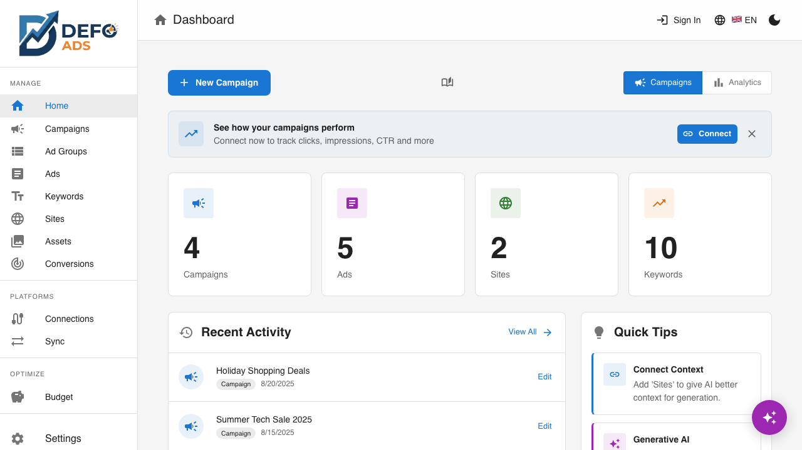

[Home](../README.md) > [Troubleshooting](../README.md#troubleshooting) > Common Issues

# Common Issues

Solutions to the most frequently encountered problems in Defo Ads. If your issue is not listed here, check the more specific troubleshooting pages for [Sync Errors](sync-errors.md) and [AI Issues](ai-issues.md).

---

## My Data Is Not Showing

**Symptom:** You open Defo Ads and your campaigns, sites, or settings are gone.

**Cause:** You may be signed in to a different account, or there may be a temporary sync issue.

**Solution:**

1. **Check your account.** Make sure you are signed in with the correct Google account.
2. **Refresh the page.** Press `Ctrl+R` (Windows/Linux) or `Cmd+R` (Mac) to reload data from the cloud.
3. **Check your internet connection.** Defo Ads requires an active connection to load your data from the cloud.
4. **Contact support** if your data is still missing after these steps — your campaigns are stored securely in the cloud and should be recoverable.

---

## I Cannot Log In

**Symptom:** You cannot sign in to your Premium account.

**Possible causes and solutions:**

### Wrong Email or Password

- Double-check the email address for typos
- Use the **"Forgot Password"** link to reset your password
- Check if Caps Lock is on

### Try Google Sign-In

If you originally signed up with Google, you cannot log in with email/password. Click **"Sign in with Google"** instead.

### Browser Cache Issues

1. Clear your browser cache and cookies for the Defo Ads domain
2. Try logging in again
3. If that does not work, try an incognito/private window

### Account Does Not Exist

If you see "User not found":
- You may not have created an account yet -- click **Sign Up** instead
- You may have used a different email address

### Still Cannot Log In

- Check if the service is experiencing downtime
- Try again in a few minutes
- If the problem persists, contact support

---

## The Page Is Loading Forever

**Symptom:** The app shows a loading spinner that never goes away, or the page appears blank.

**Solutions (try in order):**

1. **Refresh the page.** Press `Ctrl+R` (Windows/Linux) or `Cmd+R` (Mac).

2. **Clear browser cache.** Go to your browser settings and clear cached files for the Defo Ads domain.

3. **Try incognito mode.** Open the app in a private browsing window. If it works there, a browser extension may be causing the issue.

4. **Check your internet connection.** Defo Ads requires an active internet connection.

5. **Disable browser extensions.** Ad blockers and privacy extensions can sometimes interfere with the app. Try disabling them temporarily.

6. **Try a different browser.** If the issue only happens in one browser, it may be a browser-specific problem.

---

## I Cannot Create More Campaigns

**Symptom:** The "New Campaign" button is disabled or you see an error when trying to create a campaign.

Your plan may have a campaign limit:

1. Go to your **User Profile** to check your plan's campaign limit
2. If you have reached the limit, you have two options:
   - Delete existing campaigns to make room
   - Upgrade to a plan with a higher or unlimited campaign limit

See [Limits & Quotas](../reference/limits-and-quotas.md) for details on plan limits.

---

## Dark Mode Is Not Working

**Symptom:** The app does not switch to dark mode, or it reverts to light mode.

**Solution:**

1. Click the **theme toggle** icon in the top navigation bar (sun/moon icon)
2. The app should switch immediately between light and dark mode

**If it does not persist:**

- The theme preference is stored in your browser's localStorage
- If you are in incognito mode, the preference will not be saved
- Clearing browser data will reset the theme to the default

---

## My Language Did Not Change

**Symptom:** You selected a different language but the interface is still in the original language.

**Solution:**

1. Click the **language selector** in the top navigation bar
2. Select your preferred language from the dropdown
3. The interface should update immediately
4. If it does not, **refresh the page** (`Ctrl+R` or `Cmd+R`)

**If the language resets on reload:**

- The language preference is stored in localStorage
- Clearing browser data or using incognito mode will reset it to the default (English)

See [Supported Languages](../reference/supported-languages.md) for the full list of available languages.

---

## Export File Is Empty

**Symptom:** You downloaded an export file but it contains no data or is an empty file.

**Possible causes:**

### No Entities Selected

- Before exporting, make sure you have **selected the campaigns** (or other entities) you want to include
- If no campaigns are selected, the export will be empty

### No Data to Export

- Check that the campaigns you selected actually contain ad groups, ads, and keywords
- Empty campaigns (no ad groups) will produce a minimal export

### Browser Download Issue

1. Check your browser's download folder -- the file may have downloaded to an unexpected location
2. Try the export again
3. If using a download manager extension, try disabling it temporarily

**Solution:** Select the campaigns you want to export, then click **Download**. See [Import & Export](../guides/import-export.md) for step-by-step instructions.

---

## Import Did Not Work

**Symptom:** You tried to import a CSV file but nothing happened, or you received an error.

### Check File Format

Defo Ads imports CSV files in **Google Ads Editor format**. The file must:

- Be a valid CSV file (comma-separated values)
- Use the correct column headers that match Google Ads Editor format
- Be encoded in UTF-8 (especially important for non-English characters)

### Common Format Issues

| Problem | Solution |
|---------|----------|
| Wrong delimiter | Ensure the file uses commas, not semicolons or tabs |
| Missing columns | Check that required columns (Campaign, Ad Group, etc.) are present |
| Extra header rows | The first row must be the column headers |
| Encoding issues | Save the file as UTF-8 to preserve special characters |

### JSON Import (Backup Restore)

If you are restoring a Defo Ads JSON backup (not a Google Ads CSV), use the import function in **Settings > Data Management**, not the regular Import page.

See [Import & Export](../guides/import-export.md) for details on supported formats and column requirements.

---

## Cookie Consent Keeps Appearing

**Symptom:** The cookie consent dialog appears every time you visit the app.

**Cause:** Your cookie preference is not being saved. This can happen when:

- You are using incognito/private browsing mode
- Your browser blocks third-party cookies
- A privacy extension is blocking cookie storage
- You have configured your browser to clear cookies on exit

**Solution:**

1. Click **Accept** or **Decline** on the cookie consent dialog
2. If it reappears, check your browser's cookie settings:
   - Make sure cookies are not blocked for the Defo Ads domain
   - Disable any "clear cookies on exit" setting
   - Check privacy extensions (uBlock Origin, Privacy Badger, etc.)

---

## Still Need Help?

If your issue is not covered here:

1. Check the other troubleshooting pages:
   - [Sync Errors](sync-errors.md) -- Google Ads sync problems
   - [AI Issues](ai-issues.md) -- AI generation and API key problems
2. Look for error messages in the app and search for them in this documentation
3. Contact support with a description of the issue, your browser and OS, and any error messages you see

---

**Related:**
- [Sync Errors](sync-errors.md) -- Google Ads sync troubleshooting
- [AI Issues](ai-issues.md) -- AI and API key troubleshooting
- [Settings](../guides/settings.md) -- App configuration and data management
- [Import & Export](../guides/import-export.md) -- Data backup and restoration
- [Limits & Quotas](../reference/limits-and-quotas.md) -- Usage limits by plan
