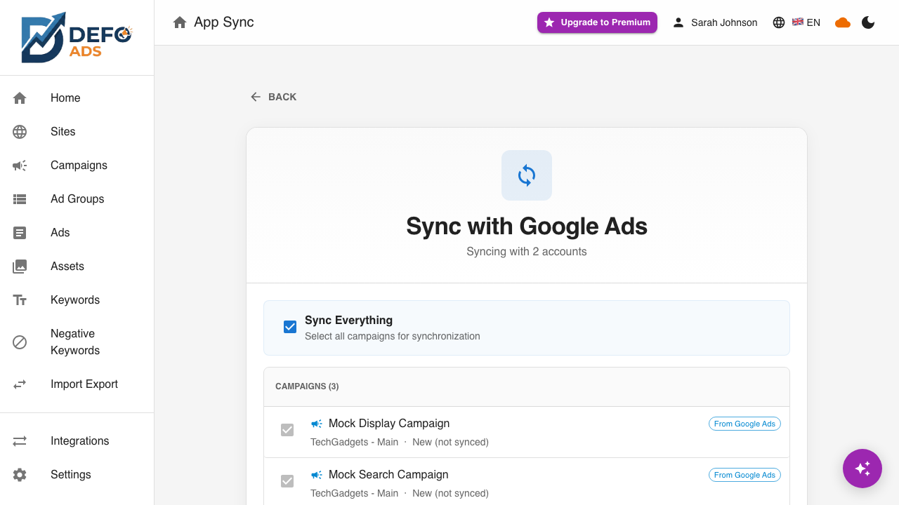

[Home](../README.md) > [Troubleshooting](../README.md#troubleshooting) > Sync Errors

# Sync Errors

When syncing campaigns between Defo Ads and Google Ads (Premium feature), errors can occur during the import or export process. This page explains common sync errors and how to resolve them.

---

## Overview

Sync errors appear in the **progress dialog** during a sync operation. The dialog shows:

- Overall progress (campaigns processed / total)
- Status of each campaign (success, failed, or in progress)
- Error messages for any failures
- Action buttons: **Retry Failed**, **Copy Error Report**, **Cancel**

When a sync completes with errors, the dialog remains open so you can review what happened and take action.

---

## Common Sync Errors

### Authentication Expired

**Error message:** "Authentication expired" or "Invalid credentials"

**Cause:** Your Google Ads connection token has expired. Google OAuth tokens expire periodically and need to be refreshed.

**Solution:**

1. Go to **Integrations** in the sidebar
2. Find the Google Ads connection
3. Click **Reconnect** to re-authenticate with your Google account
4. Grant the requested permissions
5. Return to your sync and retry

> **Tip:** If this happens frequently, make sure you are not revoking Defo Ads access in your Google Account security settings.

---

### Account Not Accessible

**Error message:** "Account not accessible" or "Permission denied for account"

**Cause:** You do not have access to the Google Ads account you are trying to sync with, or the account has been removed from your Google Ads manager.

**Solution:**

1. Verify that you have access to the Google Ads account:
   - Log in to [ads.google.com](https://ads.google.com) directly
   - Check that the account ID matches what is configured in Defo Ads
2. If the account belongs to a manager (MCC) account, ensure your user has the appropriate permissions
3. Go to **Integrations** in Defo Ads and check that the correct account is selected
4. Reconnect if needed

---

### Campaign Validation Failed

**Error message:** "Campaign validation failed" or specific validation errors

**Cause:** The campaign data does not meet Google Ads requirements. Google Ads enforces strict rules on campaign structure, ad content, and keyword formatting.

**Common validation issues:**

| Issue | Solution |
|-------|----------|
| Missing required fields (headlines, descriptions, URL) | Fill in all required ad fields |
| Headlines or descriptions exceed character limits | Shorten text to within limits |
| Invalid URL format | Ensure URLs start with `http://` or `https://` |
| No keywords in ad group | Add at least one keyword to each ad group |
| No ads in ad group | Add at least one ad to each ad group |
| Invalid budget value | Set a positive daily budget |

**Solution:**

1. Run **Validation** on your campaign before syncing (see [Validation](../guides/validation.md))
2. Fix all errors (red items) -- warnings (yellow) are optional but recommended
3. Retry the sync

---

### Rate Limit Exceeded

**Error message:** "Rate limit exceeded" or "Too many requests"

**Cause:** The Google Ads API has rate limits on how many requests can be made in a given time period. This can happen when syncing many campaigns at once.

**Solution:**

1. **Wait a few minutes** and retry. Rate limits typically reset within 1-5 minutes.
2. If syncing many campaigns, try syncing them in **smaller batches** (5-10 campaigns at a time).
3. Avoid running multiple syncs simultaneously.

> **Note:** This is a Google-imposed limit, not a Defo Ads limit. The sync process automatically attempts to stay within rate limits, but very large syncs may still trigger them.

---

### Partial Sync Failure

**Error message:** "Partial sync completed" or individual campaign errors

**Cause:** Some campaigns synced successfully while others failed. This is common when syncing multiple campaigns, as each campaign is processed independently.

**What you see:**

- The progress dialog shows a checkmark for succeeded campaigns and an error icon for failed ones
- Each failed campaign has its own error message

**Solution:**

1. Review the error messages for each failed campaign
2. Fix the underlying issues (validation errors, permission problems, etc.)
3. Click **"Retry Failed"** to retry only the campaigns that failed
4. Successfully synced campaigns are not affected -- they will not be re-uploaded

---

### Connection Timeout

**Error message:** "Connection timeout" or "Request timed out"

**Cause:** The sync took too long to complete. This can happen with:

- Slow or unstable internet connections
- Very large campaigns with many ad groups, ads, and keywords
- Google Ads API slowdowns

**What happens:**

- After **60 seconds** without progress, the sync dialog shows a "slow progress" indicator
- The sync continues to attempt completion in the background

**Solution:**

1. **Check your internet connection.** Try loading another website to confirm connectivity.
2. **Wait and retry.** Temporary network issues often resolve themselves.
3. If the timeout persists:
   - Try syncing fewer campaigns at once
   - Try syncing during off-peak hours
   - Check if Google Ads is experiencing service issues at [Google Ads Status](https://ads.google.com/status)

---

### Duplicate Entity

**Error message:** "Duplicate entity" or "Campaign already exists"

**Cause:** A campaign (or ad group, ad, keyword) with the same name or ID already exists in your Google Ads account.

**This happens when:**

- You previously synced the same campaign and are trying to sync it again
- You created a campaign manually in Google Ads with the same name
- You duplicated a campaign in Defo Ads and both copies are being synced

**Solution:**

1. **Skip the duplicate.** If the campaign already exists in Google Ads, you may not need to re-upload it.
2. **Update the existing campaign.** Sync will attempt to update rather than create if it detects a matching campaign.
3. **Rename the campaign.** If you want both versions, rename one to avoid the conflict.

---

### Invalid Campaign Structure

**Error message:** "Invalid campaign structure" or "Unsupported configuration"

**Cause:** The campaign contains settings or combinations that are not supported by the Google Ads API. Examples:

- A Search campaign with image assets but no text ads
- Incompatible network settings for the campaign type
- Location targeting that conflicts with language targeting

**Solution:**

1. Review the specific error message for details on what is invalid
2. Check the [Campaign Types](../reference/campaign-types.md) reference for requirements specific to your campaign type
3. Adjust the campaign settings and retry

---

## Using the Error Report

When sync errors occur, you can copy a detailed error report for debugging or support:

1. In the sync progress dialog, click **"Copy Error Report"**
2. A detailed report is copied to your clipboard
3. The report includes:
   - Timestamp of the sync attempt
   - List of campaigns attempted
   - Success/failure status for each campaign
   - Detailed error messages and error codes
   - Your account and plan information (no sensitive data)

Use the error report to share with support, compare across sync attempts, or document issues for your team.

---

## Retrying and Canceling

**Retry Failed:** Click **"Retry Failed"** in the sync dialog to retry only the campaigns that failed. Successfully synced campaigns are skipped. You can retry multiple times -- each attempt only processes remaining failures.

**Cancel:** Click **"Cancel"** to stop an in-progress sync. A confirmation dialog will appear. Campaigns that already completed remain synced in Google Ads -- canceling does not roll them back.

---

## Preventing Sync Errors

Follow these steps before syncing to minimize errors:

1. **Run validation first.** Use the [Validation](../guides/validation.md) feature to check for errors before syncing.
2. **Check your Google Ads connection.** Go to Integrations and verify the connection is active.
3. **Start with a small batch.** If you have many campaigns, sync a few first to catch issues early.
4. **Review campaign structure.** Ensure each campaign has at least one ad group, each ad group has at least one ad and one keyword.
5. **Check character limits.** Verify all headlines, descriptions, and paths are within [specification limits](../reference/ad-specifications.md).

---

## Getting Help

If sync errors persist after trying the solutions above:

1. **Copy the error report** using the "Copy Error Report" button
2. **Note the specific error message** and which campaigns are affected
3. **Check Google Ads directly** at [ads.google.com](https://ads.google.com) to see if the issue is on Google's side
4. **Contact support** with the error report and a description of what you were trying to do

---

**Related:**
- [Sync Campaigns](../premium/sync.md) -- How to import from and export to Google Ads
- [Google Ads Connection](../premium/google-ads-connection.md) -- Setting up and managing your connection
- [Validation](../guides/validation.md) -- Check campaigns for errors before syncing
- [Common Issues](common-issues.md) -- General troubleshooting
- [AI Issues](ai-issues.md) -- AI-related problems
